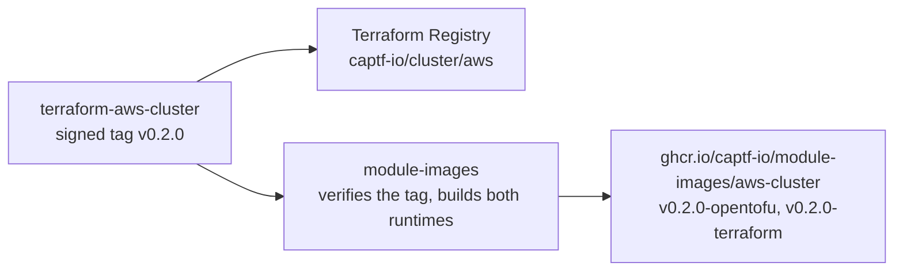

# Reference modules for five clouds

The CAPTF project now maintains reference modules for five clouds: AWS,
Google Cloud, Azure, Oracle Cloud Infrastructure (OCI) and OpenStack. Each
set implements the `v1alpha1` module contract and ships as module images you
reference from a `TerraformCluster`, `TerraformMachineTemplate` or
`TerraformMachinePool`. Use them as they are, or fork them as the starting
point for your own.

[Choose a cloud](../../docs/cloud-modules/README.md){ .md-button .md-button--primary }
[Try the no-op modules](../../docs/cloud-modules/noop/README.md){ .md-button }

<!-- more -->

*This post was expanded on October 6, 2026. The modules first shipped from
one repository per cloud; they now live in one repository per module, and
the post describes that layout.*

## What each cloud gets

Every cloud has a module for each CAPTF role: `cluster` for the shared
infrastructure and the API endpoint, `machine` for one node per `Machine`,
and `machinepool` for one scaling group per `MachinePool`. OpenStack has no
`machinepool`.

| Cloud | `cluster` | `machine` | `machinepool` |
| --- | --- | --- | --- |
| [AWS](../../docs/cloud-modules/aws/README.md) | Network Load Balancer, security groups, IAM roles and instance profiles, an S3 bucket for bootstrap data, in a VPC you bring | One EC2 instance | One Auto Scaling group and launch template |
| [Google Cloud](../../docs/cloud-modules/gcp/README.md) | Internal proxy Network Load Balancer by default, firewall rules, node service accounts | One Shielded VM | One regional managed instance group |
| [Azure](../../docs/cloud-modules/azure/README.md) | A resource group with a Standard load balancer, network and application security groups, managed identities | One Linux VM | One uniform virtual machine scale set |
| [OCI](../../docs/cloud-modules/oci/README.md) | Network load balancer, network security groups, a dynamic group and policy so the control plane runs the cloud controller manager and CSI controller as instance principals, on a VCN you bring | One compute instance | One instance pool, at a fixed size or autoscaled |
| [OpenStack](../../docs/cloud-modules/openstack/README.md) | Octavia load balancer, internal by default, security groups, a Nova server group that spreads the control plane | One Nova server | None |
| [No-op](../../docs/cloud-modules/noop/README.md) | One `terraform_data` | One `terraform_data` | One `terraform_data` |

The no-op set is the sixth, and it is for trying CAPTF without a cloud.
Every resource is a `terraform_data` holding the inputs it was given, so
the plans, the state and the outputs are real while no cloud is touched and
no credentials are read. A `Machine` reaches `Provisioned` but never gets a
`nodeRef`, since no node ever joins.

## One set of conventions

All five cloud sets follow the same rules wherever the cloud allows it, so
moving between clouds changes the resources, not the behavior. The
[Shared Behavior](../../docs/cloud-modules/shared-behavior.md) page
describes them once, and each cloud's pages describe only what differs:

<div class="grid cards" markdown>

-   :material-lock-outline:{ .lg .middle } __An internal API endpoint__

    ---

    Internal by default. Making it internet-facing requires a non-empty
    `api_allowed_cidrs`; since v0.2.0 the AWS, Azure and Google modules
    also refuse a `/0` in it.

    [:octicons-arrow-right-24: The API endpoint](../../docs/cloud-modules/shared-behavior.md#the-api-endpoint)

-   :material-lan:{ .lg .middle } __Traffic rules any CNI can use__

    ---

    Nodes accept all traffic from each other, scoped to the cluster, and
    nothing else is open but the API port. SSH stays closed unless you
    open it.

    [:octicons-arrow-right-24: Network traffic](../../docs/cloud-modules/shared-behavior.md#network-traffic)

-   :material-badge-account-outline:{ .lg .middle } __Node identities__

    ---

    The cluster role creates the identities the cloud controller manager
    and CSI driver need, or takes existing ones through variables.

    [:octicons-arrow-right-24: Node identities](../../docs/cloud-modules/shared-behavior.md#node-identities)

-   :material-key-chain:{ .lg .middle } __Bootstrap data kept out of reach__

    ---

    Bootstrap data carries the cluster's keys, so the modules stage it
    where the cloud allows, and document the clouds where it does not.

    [:octicons-arrow-right-24: Bootstrap data](../../docs/cloud-modules/shared-behavior.md#bootstrap-data)

-   :material-heart-pulse:{ .lg .middle } __Health from the cloud__

    ---

    Every role reports the contract's `health` output from cloud state,
    with a machine-readable reason such as `InstanceNotFound`.

    [:octicons-arrow-right-24: Health](../../docs/cloud-modules/shared-behavior.md#health)

-   :material-view-grid-outline:{ .lg .middle } __Pools that stay put__

    ---

    Bootstrap data rotates in place without replacing instances, a version
    change rolls the pool, and zones are pinned at the first apply.

    [:octicons-arrow-right-24: Machine pools](../../docs/cloud-modules/shared-behavior.md#machine-pools)

</div>

## From a module to an image

Each module has its own repository, `captf-io/terraform-<provider>-<role>`,
and its own release cycle: 14 cloud modules and the three no-op ones, 17 in
all. A release is a signed tag, and from there two things happen:



The Terraform Registry publishes the module, and
[`captf-io/module-images`](https://github.com/captf-io/module-images)
builds its image. That one repository builds all 17 images from the
released modules, on Terraform and on OpenTofu, for `linux/amd64` and
`linux/arm64`, and holds no module code of its own. It exists as a single
repository partly because of a GitHub limit: there is no API to give a
repository's workflows write access to a container package, while packages
a workflow creates are writable by that repository's token. One repository
creating every image means no package needs a hand-set permission.

## Using a module

=== "As a module image"

    Point the CAPTF object at the image, pinned to a release:

    ```yaml
    apiVersion: infrastructure.cluster.x-k8s.io/v1alpha1
    kind: TerraformCluster
    metadata:
      name: "${CLUSTER_NAME}"
    spec:
      source:
        image: ghcr.io/captf-io/module-images/aws-cluster:v0.2.0-opentofu
    ```

    `vX.Y.Z-<runtime>` is module release vX.Y.Z; a bare `<runtime>` tag is
    the newest. Both move to a new digest when the image is rebuilt without
    a module release, for example for a base image update, so pin a digest
    in production.

=== "From the Terraform Registry"

    Call it as an ordinary Terraform module:

    ```hcl
    module "cluster" {
      source  = "captf-io/cluster/aws"
      version = "~> 0.1"

      # The contract inputs the controller would render (captf_contract,
      # captf_cluster, captf_object, captf_tags, ...; see Inputs), and any
      # user variables.
    }
    ```

    Called directly, it is still a CAPTF root module first: it configures
    its own provider block, pins its providers exactly, and expects you to
    set the `captf_*` inputs yourself.

## Current versions

| Module | Version | What changed |
| --- | --- | --- |
| `cluster/aws`, `cluster/azure`, `cluster/google` | v0.2.0 | Reject a `/0` in `api_allowed_cidrs`; Azure also denies the kubelet ports to the rest of the VNet on workers |
| `machine/azure`, `machinepool/azure` | v0.2.0 | Boot diagnostics off by default: the serial console log can include the `kubeadm join` command |
| `machinepool/aws`, `machinepool/azure`, `machinepool/oci` | v0.1.1 | `autoscaler = "external"`, for the [Kubernetes Cluster Autoscaler](2026-10-06-cluster-autoscaler-pools.md) |
| Every other module | v0.1.0 | The first release |

## How they are tested

Each cloud module repository runs the same gate, `make verify`, on every
pull request:

- formatting, license headers and the module conventions
- `validate` on the current Terraform and OpenTofu, and on the oldest
  supported, Terraform 1.5.7 and OpenTofu 1.6.3
- unit tests with mocked providers on both runtimes, 47 to 64 `run` blocks
  per repository
- `tflint`, `shellcheck`, a Trivy configuration scan, and
  [`tfcapi-lint`](2026-10-06-tfcapi-lint-action.md) in strict mode against
  the contract

`module-images` then smoke-tests every image it builds, and applies and
destroys a test root for the no-op images.

## Status

!!! warning "None of the cloud modules has been applied to a real cloud yet"

    They pass static analysis, mocked unit tests on Terraform and OpenTofu,
    and image smoke tests. Each repository's `DESIGN.md` lists the facts the
    first real apply must confirm, under "Unverified". Read it before you
    rely on a module, and pin a release tag or digest.

The cloud module pages also call out individual features that have not
been tried yet, so you can tell what is inferred from the cloud's
documentation from what has been seen working.

<div class="grid cards" markdown>

-   :material-cloud-outline:{ .lg .middle } __Cloud Modules__

    ---

    Every set, its images and tags, and what you bring.

    [:octicons-arrow-right-24: Start here](../../docs/cloud-modules/README.md)

-   :material-source-repository-multiple:{ .lg .middle } __Repositories__

    ---

    Every repository in the organization, what it publishes, and where.

    [:octicons-arrow-right-24: See the map](../../docs/reference/repositories.md)

-   :material-folder-outline:{ .lg .middle } __Repository Layout__

    ---

    How a module repository is laid out, and how `module-images` builds
    from it.

    [:octicons-arrow-right-24: Read the page](../../docs/module-author/repository-layout.md)

</div>
