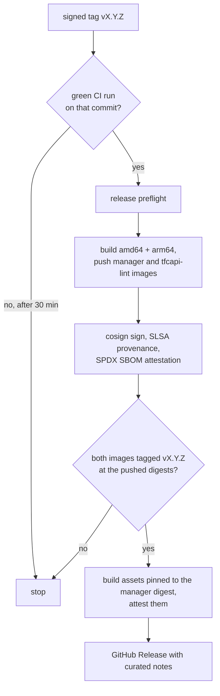
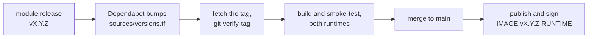

# CAPTF v0.1 is released

Cluster API Provider Terraform has its first releases. v0.1.0 was tagged on
October 5, and v0.1.1 followed a day later. Together they put every part of
the project into a versioned, installable form: the provider, the two
runtime base images, the 17 reference modules on the Terraform Registry, and
a module image for each of them, on both runtimes.

You can install it with `clusterctl` today and bring up a cluster with the
no-op modules on any management cluster. This post covers what shipped, why
it is 0.1 and not 1.0, and how every artifact is built, signed and checked,
so you can verify it yourself.

[Quick Start](../../docs/getting-started/quick-start.md){ .md-button .md-button--primary }
[Release notes](https://github.com/captf-io/cluster-api-provider-terraform/releases/tag/v0.1.1){ .md-button }

<!-- more -->

## At a glance

| | v0.1.1 |
| --- | --- |
| API | `infrastructure.cluster.x-k8s.io/v1alpha1` |
| Module image contract | `v1alpha1` |
| Cluster API contract | `v1beta2`, built against Cluster API v1.14.2 |
| Built with | Go 1.26, controller-runtime v0.24.1, Kubernetes libraries v0.36.5 |
| Runtimes in the base images | Terraform 1.16.5, OpenTofu 1.12.7 |
| Platforms | `linux/amd64`, `linux/arm64` |

## What shipped

| Artifact | Where |
| --- | --- |
| Provider image: the manager and the in-Job runner | `ghcr.io/captf-io/cluster-api-provider-terraform:v0.1.1` |
| clusterctl assets: components, metadata, templates, identity example | The [GitHub Release](https://github.com/captf-io/cluster-api-provider-terraform/releases/tag/v0.1.1) |
| `tfcapi-lint`, the module and image linter | `ghcr.io/captf-io/tfcapi-lint:v0.1.1`, plus binaries for Linux, macOS and Windows on the Release |
| `tfcapi-lint` GitHub Action | `captf-io/cluster-api-provider-terraform/actions/tfcapi-lint` |
| Runtime base images | `ghcr.io/captf-io/opentofu-base`, `ghcr.io/captf-io/terraform-base` |
| Reference modules | 17 on the Terraform Registry as `captf-io/<role>/<provider>` |
| Module images | `ghcr.io/captf-io/module-images/<cloud>-<role>:vX.Y.Z-<runtime>` |

v0.1.1 is v0.1.0 plus the linter's container image and GitHub Action, and
two release-pipeline fixes. The manager did not change. If you build or
maintain modules, the action is the reason to take it; it has a
[post of its own](2026-10-06-tfcapi-lint-action.md).

The modules move on their own schedule. All 17 started at v0.1.0, and the
first round of updates landed the next day:

- **v0.1.1 of the AWS, Azure and OCI machine pool modules** adds
  `autoscaler = "external"`, which hands a pool to the Kubernetes Cluster
  Autoscaler; see
  [The Cluster Autoscaler on CAPTF machine pools](2026-10-06-cluster-autoscaler-pools.md).
- **v0.2.0 of five modules** tightens defaults. The AWS, Azure and Google
  cluster modules reject a `/0` in `api_allowed_cidrs`, the Azure cluster
  denies the kubelet ports to the rest of the VNet on workers, and the
  Azure machine and machine pool modules turn boot diagnostics off by
  default, since the serial console log can include the `kubeadm join`
  command.

## Install it

Register the provider with `clusterctl` and initialize a management
cluster:

```yaml title="clusterctl.yaml"
providers:
- name: terraform
  type: InfrastructureProvider
  url: https://github.com/captf-io/cluster-api-provider-terraform/releases/download/v0.1.1/infrastructure-components.yaml
```

=== "Plain templates"

    ```sh
    clusterctl init --config clusterctl.yaml --infrastructure terraform:v0.1.1
    ```

=== "With ClusterClass"

    ```sh
    CLUSTER_TOPOLOGY=true clusterctl init --config clusterctl.yaml --infrastructure terraform:v0.1.1
    ```

`clusterctl init` also installs Cluster API's core, bootstrap and
control-plane providers, and cert-manager if it is not there yet. From
there the [Quick Start](../../docs/getting-started/quick-start.md) brings
up a `TerraformCluster` and a control-plane `TerraformMachine` with the
no-op modules, which need no cloud account.

## Why 0.1, not 1.0

The version says what has been proven, and what has not:

!!! warning "Nothing has been applied to a real cloud yet"

    The five cloud module sets pass static analysis, mocked unit tests on
    both runtimes, `tfcapi-lint` and image smoke tests. None has been
    applied to a real cloud account. Each module repository's `DESIGN.md`
    lists the facts its first real apply must confirm.

- **The API and the contract are `v1alpha1`.** Every kind and the module
  contract may still change, and the contract is provisional.
- **End-to-end testing is opt-in.** Two suites run on a local kind cluster:
  a foundation suite that installs and checks the stack, and a no-op suite
  that drives the published no-op modules through real Cluster API objects.
  They are not part of CI yet.
- **Some operations are unexercised.** `clusterctl upgrade` and
  `clusterctl move` have not been run against CAPTF.

[Known Limitations](../../docs/operator-guide/limitations.md) lists
everything else, with a workaround for each where one exists. If you try
CAPTF, that page is the one to read first.

## How a release is built

Releases are built in CI, and every step on the way refuses to go on when
the one before it did not finish cleanly. For the provider, as the pipeline
now stands on `main`:



Two of these gates are new since v0.1.0, and both came from looking at what
the first releases actually did:

- **Publish only what CI passed.** Publishing used to run on every push to
  `main` alongside CI, not after it. Images were published and signed for
  three commits in a row whose CI failed, and a tag published without
  checking CI at all. Publishing now runs from a successful CI run on
  `main`, builds that run's exact commit, and moves `:edge` only while that
  commit is still `main`'s head. A tag waits up to 30 minutes for a green
  run on its commit.
- **Check the release before creating it.** v0.1.0 shipped without a
  `tfcapi-lint` image. The release job now fails, before it creates the
  Release, unless both images carry `:vX.Y.Z` at the digests it pushed, and
  it refuses to build assets without the manager's digest.

The release notes are no longer a raw git log either: they open with the
API and contract versions, the install commands, the image digests and the
commands to verify them.

The module repositories release the same way, by tag. A release is a
signed, annotated `vX.Y.Z` tag on `main`. The Terraform Registry picks it
up within about a minute, and once the repository's checks pass, CI
creates the GitHub Release, refusing a lightweight tag, a tag that is not
on `main` and a tag whose signature GitHub cannot verify. Then
[`module-images`](https://github.com/captf-io/module-images) takes over:



The build fetches each module's release tag and checks it before using
it: it must be an annotated tag, signed by a key in the repository's
`hack/allowed_signers`, and pointing at the commit being built. An
unsigned or wrongly signed tag fails the build.

## Verify it yourself

Every signature is keyless cosign, issued through GitHub's OIDC token to
the workflow that built the artifact, so you check *which workflow* signed
it rather than holding a key:

=== "Provider image"

    ```sh
    cosign verify ghcr.io/captf-io/cluster-api-provider-terraform:vX.Y.Z \
      --certificate-identity https://github.com/captf-io/cluster-api-provider-terraform/.github/workflows/publish.yaml@refs/tags/vX.Y.Z \
      --certificate-oidc-issuer https://token.actions.githubusercontent.com
    gh attestation verify oci://ghcr.io/captf-io/cluster-api-provider-terraform:vX.Y.Z \
      -R captf-io/cluster-api-provider-terraform
    ```

    The same commands check `ghcr.io/captf-io/tfcapi-lint`.

=== "Release assets"

    ```sh
    gh release download vX.Y.Z -R captf-io/cluster-api-provider-terraform \
      -p infrastructure-components.yaml
    gh attestation verify infrastructure-components.yaml \
      -R captf-io/cluster-api-provider-terraform
    ```

=== "Module image"

    ```sh
    cosign verify ghcr.io/captf-io/module-images/aws-machine:v0.1.0-opentofu@sha256:<digest> \
      --certificate-identity-regexp '^https://github.com/captf-io/module-images/' \
      --certificate-oidc-issuer https://token.actions.githubusercontent.com
    ```

=== "Base image"

    ```sh
    cosign verify ghcr.io/captf-io/opentofu-base:<version>@sha256:<digest> \
      --certificate-identity-regexp '^https://github.com/captf-io/opentofu-base/' \
      --certificate-oidc-issuer https://token.actions.githubusercontent.com
    ```

    For Terraform, use `terraform-base` in both places.

!!! note "Signing started on October 6 for module and base images"

    The provider image has been signed since its first build. The module
    and base images gained signing on October 6, so a tag built before then
    stays unsigned until it is rebuilt. Module image tags move to a new
    digest on every rebuild anyway, so pin a digest you have verified.

<div class="grid cards" markdown>

-   :material-rocket-launch:{ .lg .middle } __Quick Start__

    ---

    Install CAPTF and bring up a cluster with the no-op modules, no cloud
    account needed.

    [:octicons-arrow-right-24: Start here](../../docs/getting-started/quick-start.md)

-   :material-download:{ .lg .middle } __Installation__

    ---

    Register the provider, what gets installed, and how to check it.

    [:octicons-arrow-right-24: Install](../../docs/operator-guide/installation.md)

-   :material-alert-circle-outline:{ .lg .middle } __Known Limitations__

    ---

    What CAPTF does not do yet, or does with a catch.

    [:octicons-arrow-right-24: Read before adopting](../../docs/operator-guide/limitations.md)

-   :material-source-branch:{ .lg .middle } __Releasing__

    ---

    The release pipeline, signatures and attestations, in full.

    [:octicons-arrow-right-24: Read the page](../../docs/developer-guide/releasing.md)

</div>
