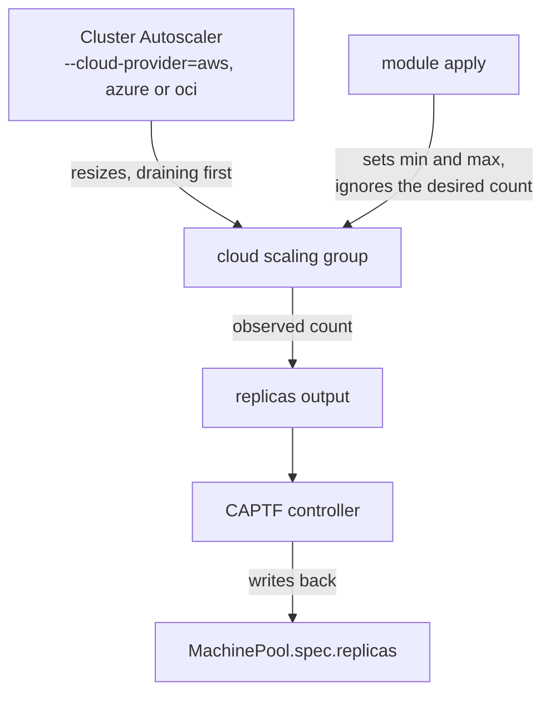

# The Cluster Autoscaler on CAPTF machine pools

Until this week the docs said the Kubernetes Cluster Autoscaler cannot
drive a CAPTF machine pool. That was true of one way of running it and
wrong about the rest. The Cluster Autoscaler's `clusterapi` provider cannot
drive a pool. Its `aws`, `azure` and `oci` cloud providers can, because they
never go through Cluster API at all: they resize the cloud's scaling group
directly, and a CAPTF pool already knows how to live with a group that
something else resizes.

The AWS, Azure and OCI machine pool modules gained one variable in v0.1.1
to make that safe: `autoscaler = "external"`. This post shows why the
`clusterapi` route is closed, how the cloud route works, and how to set it
up.

<!-- more -->

## Two ways to autoscale, and why one is closed

The Cluster Autoscaler can scale a node group in two ways. Through Cluster
API, its `clusterapi` provider changes `spec.replicas` and, to scale in,
deletes a chosen `Machine`. Through a cloud provider, it calls the cloud's
API and resizes the scaling group itself, draining each node it removes
first.

The first way needs MachinePool Machines: one `Machine` per member, so that
deleting one removes that instance and lowers the group's capacity by one.
CAPTF does not implement them, by design, and the
[contract page](../../docs/module-author/contract/v1alpha1/machinepool.md#machinepool-machines)
spells out why:

> **Terraform cannot remove a chosen member from a scaling group.** The
> group launches its members itself. They are not declared in the module,
> so no resource stands for one member and no plan can remove one.

CAPTF reaches a cloud only through the module's Terraform or OpenTofu run,
so a pool's lifecycle belongs to the cloud: the group picks its scale-in
victims, replaces failed instances and rolls out new launch configuration.
Anything that acts by deleting a `Machine` (drain before scale-down,
MachineHealthCheck remediation, `cluster.x-k8s.io/delete-machine`, and the
`clusterapi` provider) has nothing to delete.

The second way fits that model exactly. To CAPTF, the Cluster Autoscaler
resizing the group is one more cloud-side scale, and that is the case a
pool's autoscaling mode already exists for.

## How the pieces fit



- **The annotations** on the `MachinePool` turn autoscaling mode on. The
  module puts their min and max on the group and never resets its desired
  count again.
- **The Cluster Autoscaler** sets the desired count within those bounds.
- **The controller** reads the group's observed count from the module's
  `replicas` output and writes it back to `MachinePool.spec.replicas`,
  emitting a `ReplicasWrittenBack` event when it changes. It claims the
  `cluster.x-k8s.io/replicas-managed-by` annotation so Cluster API stops
  treating `spec.replicas` as authoritative.

That write-back is also why the `clusterapi` provider is unsupported
rather than merely untested: its `spec.replicas` patches would be
overwritten on the next reconcile.

## Set it up

### 1. Turn on autoscaling mode

Set both of the annotations Cluster API's autoscaler contract defines, and
leave `spec.replicas` unset:

```yaml hl_lines="7 8"
apiVersion: cluster.x-k8s.io/v1beta2
kind: MachinePool
metadata:
  name: my-cluster-workers
  namespace: team-a
  annotations:
    cluster.x-k8s.io/cluster-api-autoscaler-node-group-min-size: "3"
    cluster.x-k8s.io/cluster-api-autoscaler-node-group-max-size: "10"
spec:
  clusterName: my-cluster
  template:
    spec:
      clusterName: my-cluster
      version: v1.31.4
      bootstrap:
        configRef:
          apiGroup: bootstrap.cluster.x-k8s.io
          kind: KubeadmConfig
          name: my-cluster-workers
      infrastructureRef:
        apiGroup: infrastructure.cluster.x-k8s.io
        kind: TerraformMachinePool
        name: my-cluster-workers
```

Both must parse as non-negative integers with min ≤ max. Valid, the pool
reports `AutoscalingActive=True/ReplicasManagedByModule`. Otherwise it
reports `AutoscalingActive=False/AutoscalingAnnotationsInvalid` and applies
without autoscaling.

### 2. Hand the group to the Cluster Autoscaler

Set `autoscaler: external` in the `TerraformMachinePool`'s
`spec.variables`, and make the group discoverable. Each cloud does the
second part differently:

=== "AWS"

    The `aws` provider finds Auto Scaling groups by tag. Add the tags
    through `additional_tags`, which passes them to the group:

    ```yaml
    spec:
      variables:
        autoscaler: external
        additional_tags:
          k8s.io/cluster-autoscaler/enabled: "true"
          k8s.io/cluster-autoscaler/demo: "owned"
    ```

    `demo` is the cluster's name. The autoscaler reads the group's min and
    max, which come from the annotations, and sets its desired capacity;
    the module ignores that capacity afterwards.

=== "Azure"

    The `azure` provider resizes the uniform virtual machine scale set.
    Set `autoscaler: external`, then tag the scale set for auto-discovery
    through `additional_tags`: for example
    `k8s.io_cluster-autoscaler_enabled`,
    `k8s.io_cluster-autoscaler_<cluster name>`, and `min` and `max` tags
    matching the annotations. These keys pass the `additional_tags`
    validation (no reserved prefix, no `/`, at most 44 tags). The tag names
    are the Cluster Autoscaler's and have not been verified in the module
    repository.

    Prefer tags to a static scale set name: a Kubernetes version change
    creates a new scale set with a new name, and the tags move with it.

=== "OCI"

    The `oci` provider resizes an instance pool. Set `autoscaled` to match
    the annotations as well; it is a deliberate second switch, so a
    mistyped annotation fails the plan instead of rebuilding the pool:

    ```yaml
    spec:
      variables:
        autoscaled: true
        autoscaler: external
    ```

    Point the Cluster Autoscaler's `oci` provider at the pool's OCID, the
    `provider_id` output. A Kubernetes version change replaces the pool and
    changes that OCID, so the node-group configuration must follow it.

### 3. Run the Cluster Autoscaler

Run it in the workload cluster with the cloud's provider
(`--cloud-provider=aws`, `azure` or `oci`) and credentials allowed to
resize the group, and keep its bounds for the group equal to the
annotations.

!!! warning "Run one autoscaler per group"

    `autoscaler` defaults to `native`, and in that mode the module creates
    its own cloud autoscaler for the group. Next to the Cluster Autoscaler
    it can remove the nodes the Cluster Autoscaler added, without a drain.
    `external` exists to make sure only one of them is in charge.

## What `external` changes, per cloud

| Cloud | The Cluster Autoscaler resizes | `native` creates, `external` skips | Module release |
| --- | --- | --- | --- |
| [AWS](../../docs/cloud-modules/aws/machinepool.md#use-with-the-kubernetes-cluster-autoscaler) | The Auto Scaling group's desired capacity | A target-tracking CPU scaling policy | `captf-io/machinepool/aws` v0.1.1 |
| [Azure](../../docs/cloud-modules/azure/machinepool.md#use-with-the-kubernetes-cluster-autoscaler) | The scale set's capacity | An Azure Autoscale setting | `captf-io/machinepool/azure` v0.1.1 |
| [OCI](../../docs/cloud-modules/oci/machinepool.md#use-with-the-kubernetes-cluster-autoscaler) | The instance pool's size | An OCI autoscaling configuration | `captf-io/machinepool/oci` v0.1.1 |

Switching between `native` and `external` creates or deletes only that
scaler. The group itself stays: on all three clouds the module already
ignores the group's desired count (`desired_capacity`, `instances` or
`size`), so the switch neither replaces nor resizes the pool. The CPU
thresholds and cool-down variables of the native scaler are ignored in
`external` mode.

### And Google Cloud?

Not with this module. Its managed instance group is regional, and the
Cluster Autoscaler's `gce` provider resizes zonal groups only (its
[`autoscaling_gce_client.go`](https://github.com/kubernetes/autoscaler/blob/master/cluster-autoscaler/cloudprovider/gce/autoscaling_gce_client.go)
calls the zonal `InstanceGroupManagers` API). On Google Cloud, autoscale a
pool with the module's own regional autoscaler. Need the `clusterapi`
provider on any cloud? Use a `MachineDeployment` of `TerraformMachine`s,
which has real `Machine` objects for it to delete; see
[Pool or MachineDeployment](../../docs/user-guide/machine-pools.md#pool-or-machinedeployment).

## Before you rely on it

None of these setups has been run against a live cluster yet. The module
pages list what the first real run has to confirm:

- **Azure:** whether the scale set's capacity stays at its last value when
  `autoscaler` switches from `native` to `external`, which deletes the
  autoscale setting.
- **OCI:** whether an instance pool accepts size 0. `external` mode allows
  a minimum of 0, where the native configuration requires at least 1.
- **Drains:** CAPI never drains pool members. A drain comes only from the
  Cluster Autoscaler, for the nodes it removes, or from the cloud's
  lifecycle hooks or a termination handler, if the module sets one up.

If you try it, the project would like to hear how it went.

<div class="grid cards" markdown>

-   :material-arrow-expand-vertical:{ .lg .middle } __Machine Pools__

    ---

    Fixed or autoscaled replicas, the write-back, and the Cluster
    Autoscaler steps.

    [:octicons-arrow-right-24: Read the guide](../../docs/user-guide/machine-pools.md#autoscale-with-the-kubernetes-cluster-autoscaler)

-   :material-file-document-outline:{ .lg .middle } __MachinePool Machines__

    ---

    Why CAPTF pools have no `Machine` per member, in the contract's own
    words.

    [:octicons-arrow-right-24: Read the contract](../../docs/module-author/contract/v1alpha1/machinepool.md#machinepool-machines)

-   :material-list-status:{ .lg .middle } __`AutoscalingActive`__

    ---

    Every reason the condition reports and what to do about each.

    [:octicons-arrow-right-24: Look it up](../../docs/reference/conditions.md#autoscalingactive)

</div>
