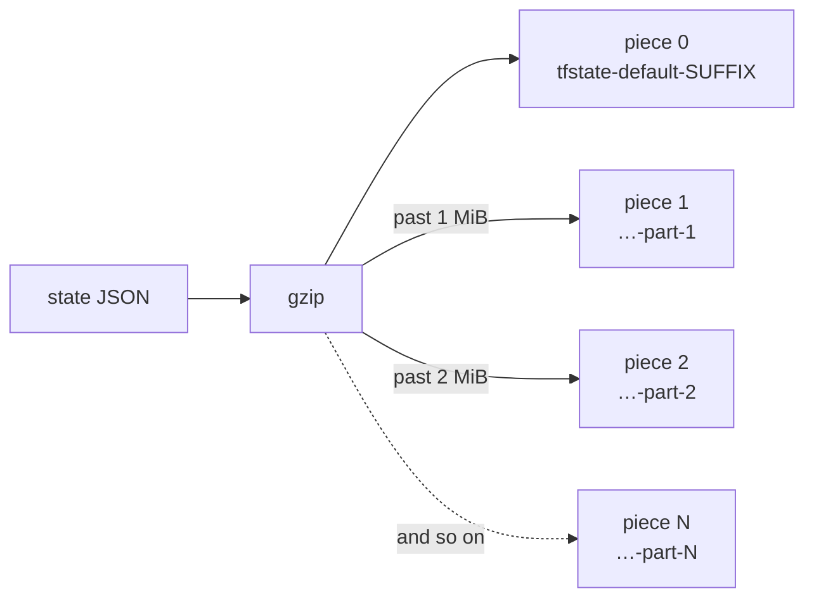
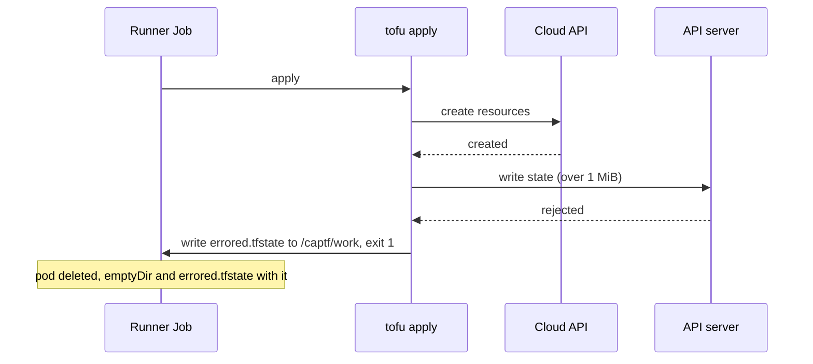

# Terraform, OpenTofu and the 1 MiB Secret

Every CAPTF module image carries one of two runtimes, Terraform or OpenTofu,
and both keep their state in Kubernetes Secrets through a backend with the
same name: `kubernetes`. Same labels, same lock, same gzip payload, and for
most objects the same bytes. The two part ways at one number: 1 MiB, the
most data the API server lets a Secret hold. Terraform splits state that
grows past it across more Secrets. OpenTofu does not, and an apply that
crosses the line loses the record of what it just created.

This post walks through both write paths, what CAPTF does with each, and
how to pick a runtime before the difference matters.

<!-- more -->

## At a glance

| | Terraform | OpenTofu |
| --- | --- | --- |
| Version in the CAPTF base image | 1.16.5 | 1.12.7 |
| Splits state across Secrets | Yes, since 1.6.0, in fixed 1 MiB pieces | No (checked through 1.12.7) |
| Largest state it can store | No backend limit; CAPTF reads up to 32 Secrets and 64 MiB decompressed | 1 MiB, compressed, in one Secret |
| Lock | Lease `lock-tfstate-default-<suffix>` | The same Lease |
| Past the limit | CAPTF stops reading: `StateReadable=False/StateCorrupt` | The final state write fails; `errored.tfstate` is lost with the pod |

## What both runtimes share

CAPTF never writes state itself. The runner renders a root module, points
the runtime's `kubernetes` backend at the object's namespace and suffix, and
lets Terraform or OpenTofu do the rest:

```text
init -backend-config=secret_suffix=<suffix> \
     -backend-config=namespace=<ns> \
     -backend-config=in_cluster_config=true \
     -backend-config=labels=<HCL map>
```

Below 1 MiB the result is identical on both runtimes:

- **One Secret**, `tfstate-default-<suffix>`, holding the gzipped state
  under the data key `tfstate`, annotated `encoding: gzip`.
- **The backend's labels**: `tfstate=true`, `tfstateSecretSuffix=<suffix>`,
  `tfstateWorkspace=default` and `app.kubernetes.io/managed-by=terraform`
  (OpenTofu keeps that value), plus CAPTF's own owner and cluster labels.
- **One Lease**, `lock-tfstate-default-<suffix>`, held for the whole run
  and released on a clean exit.

The suffix is the first 16 hex characters of a SHA-256 over
`<namespace>/<kind>/<name>`, with `-c`, `-m` or `-mp` appended. It is
built from names, not UIDs, so it survives `clusterctl move`. The
[Terraform State Secrets](../../docs/concepts/secret-management/state.md#names-and-the-suffix)
page has the details.

## Terraform: one state, many Secrets

Since Terraform 1.6.0
([hashicorp/terraform#29678](https://github.com/hashicorp/terraform/pull/29678)),
the backend gzips the state first and then cuts the compressed bytes into
pieces of exactly 1 MiB. The size is hard-coded.



Piece 0 goes in the base Secret. Every further piece goes in
`tfstate-default-<suffix>-part-N`, numbered from 1, with the same labels and
data key. Reading reverses it: list the Secrets by label, order them by the
number after the last hyphen, concatenate, gunzip. That ordering rule is why
a suffix must never end in `-<digits>`.

Writes span several Secrets and are not atomic; the Lease keeps writers
apart. When state shrinks, Terraform rewrites the lower pieces first and
then deletes the surplus `-part-N` Secrets.

The backend sets no upper bound on the number of pieces. CAPTF's state
reader does, because one shared manager reads every object's state:

```go title="internal/state/reader.go"
// Limits on what the reader accepts. A kubernetes-backend Secret holds at
// most 1 MiB of compressed state, and real states compress 10–20×, so 32
// chunks and 64 MiB decompressed are far beyond any plausible cluster or
// machine state; beyond them the state is reported corrupt, not read.
const (
	MaxChunks     = 32
	MaxStateBytes = 64 << 20 // (1)!
)
```

1.  The gunzip itself reads through an `io.LimitReader`, so a gzip bomb
    cannot exhaust the memory of the manager every object shares.

Real state compresses 10 to 20 times, so the 64 MiB decompressed limit
arrives long before 32 Secrets do. Past either one, CAPTF reports
`StateReadable=False` with reason `StateCorrupt` and reads nothing.

## OpenTofu: one Secret, and a hard stop

OpenTofu's backend, checked at v1.12.7, makes a single create or update of
the base Secret, reads only that Secret, and has no size setting. No
OpenTofu issue or pull request proposing chunking turned up as of October
2026.

So its state is capped at what Kubernetes allows in one Secret: 1 MiB
(1,048,576 bytes) of data, after compression. The backend never checks the
size; the API server rejects the write with its own validation error. What
happens next matters:



!!! danger "The resources outlive the record of them"

    When the final state write is rejected, OpenTofu saves
    `errored.tfstate` in its working directory and fails. In a CAPTF Job
    that directory is the `/captf/work` emptyDir. The runner does not
    collect the file, so it is deleted with the pod. The resources exist in
    the cloud, the Secret still holds the previous serial, and the next
    apply tries to create them again.

CAPTF has no condition of its own for this case. It surfaces as a failed
apply Job, and the [Job failures runbook](../../docs/operator-guide/runbooks/job-failures.md)
is where you start.

## See it coming

Both runtimes are measured the same way. The manager exports
`captf_state_bytes`, the compressed size summed over an object's Secrets,
and ships an alert for it:

```promql
topk(10, captf_state_bytes / (1024 * 1024))
```

`CAPTFStateNearSecretLimit` fires above 900 KiB by default. On Terraform
it means the state is about to need another Secret. On OpenTofu it means
the state is about to stop fitting, and that is the alert to act on.

To look at one object by hand, find its suffix and list its Secrets:

```sh
kubectl get <kind> -n <ns> <name> -o jsonpath='{.status.stateSecretSuffix}{"\n"}'
kubectl get secret -n <ns> -l tfstate=true,tfstateSecretSuffix=<suffix> -o name
```

More than one Secret means Terraform has already split the state. The
[size-limits runbook](../../docs/operator-guide/runbooks/size-limits.md#captfstatenearsecretlimit-the-state-is-approaching-a-secrets-size-cap)
shows how to sum the bytes and what makes state large: full attribute sets
of every resource, inline certificates, rendered cloud-init, and one entry
per `count` or `for_each` instance.

## Choosing a runtime

| Object | Typical state | Either runtime? |
| --- | --- | --- |
| `TerraformMachine` | One instance and its attachments: small | Yes |
| `TerraformCluster` | Networks, load balancers, certificates, rendered templates: grows | Use Terraform, or split the module across objects, if it may approach 1 MiB |
| `TerraformMachinePool` | One entry per pool instance: grows with the pool | As for clusters |

State size is not the only reason to pick a runtime, and other OpenTofu
features may matter more to you. One of them does not help here: CAPTF
cannot read state that uses OpenTofu's
[state encryption](../../docs/concepts/state.md#opentofu-state-encryption),
and reports it as `StateEncrypted`.

## Switching an existing object

`TerraformMachine.spec.source` is immutable, so a machine keeps its
runtime. A `TerraformCluster` or `TerraformMachinePool` can move to an image
with the other runtime, and the direction matters.

Going from Terraform to OpenTofu fails on chunked state: OpenTofu reads
only the base Secret, which then holds a truncated gzip stream. Before that
switch, check:

- [ ] The object's state is a single Secret.
- [ ] `captf_state_bytes` is comfortably below 1 MiB.
- [ ] If it was chunked, it has shrunk below 1 MiB compressed and Terraform
      has deleted its `-part-N` Secrets.

<div class="grid cards" markdown>

-   :material-scale-balance:{ .lg .middle } __State Storage: Terraform and OpenTofu__

    ---

    The full comparison, with the side-by-side table and the switching
    rules.

    [:octicons-arrow-right-24: Read the page](../../docs/concepts/secret-management/runtimes.md)

-   :material-database-lock:{ .lg .middle } __Terraform State Secrets__

    ---

    Names, labels, chunking, and exactly how the manager reads state.

    [:octicons-arrow-right-24: Read the page](../../docs/concepts/secret-management/state.md)

-   :material-alarm-light:{ .lg .middle } __State near a size limit__

    ---

    The runbook for `CAPTFStateNearSecretLimit`.

    [:octicons-arrow-right-24: Open the runbook](../../docs/operator-guide/runbooks/size-limits.md)

-   :material-layers-triple:{ .lg .middle } __Base Images__

    ---

    The Terraform and OpenTofu runtime images every module image builds
    from.

    [:octicons-arrow-right-24: Read the page](../../docs/module-author/base-images.md)

</div>
