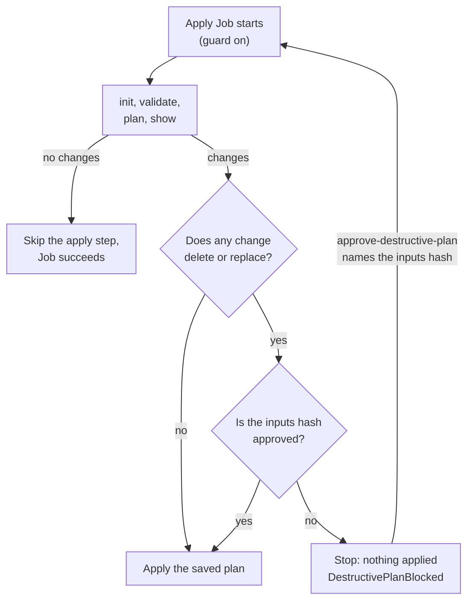

# The Destructive-Plan Guard

A `TerraformCluster` is mutable: a new image tag, an edited field or a drift
remediation re-applies its module. A module release that renames a
resource, or a different module pointed at the same state, can plan to
destroy infrastructure nobody meant to destroy. The guard stops that. It is
on for every `TerraformCluster` apply under `applyPolicy: Automatic`, and it
cannot be turned off. A `TerraformMachinePool` has a narrower form of the same
guard, for applies that render a change of the cluster's exports (see [Machine
pools](#machine-pools)). The command to approve is in [Plan
Approval](../../user-guide/plan-approval.md#the-destructive-plan-guard).

## The flow



The guarded apply runs `init`, `validate`, `plan -detailed-exitcode -out`,
`show -json` and then applies the saved plan, instead of applying directly.

- A change counts as destructive when its planned actions include a delete:
  a removal, or a replacement in either order. A `forget`, an `import` or a
  `move` is not destructive.
- If the plan has no changes, the apply step is skipped and the Job
  succeeds, adopting the inputs hash and pinning the image digest as a full
  apply would.
- If the plan only creates or updates in place, it applies without any
  approval.
- If it deletes or replaces anything and the current inputs hash is not
  approved, the Job stops before the apply step. Nothing changes and the
  state is untouched.

The guard applies to every reason for an apply on a `TerraformCluster`: the
first apply, changed inputs, a retry, a drift remediation and a state with
no inputs hash. Under `Manual` it is replaced by the plan approval: a plan
you approved is run as it is.

## What a block looks like

- `status.lastRun.error.kind` is `blocked`.
- `ApplyJobSucceeded` is `False`/`DestructivePlanBlocked`. The message names
  the affected addresses and actions (`<address> (delete)` or `(replace)`),
  says nothing was applied, and gives the inputs hash and the command to
  approve it.
- A `DestructivePlanBlocked` warning event is emitted once per blocked Job,
  in place of the generic failure event.
- The Job is annotated `captf.io/destructive-plan-blocked`.
- A blocked Job counts toward neither the retry backoff nor the
  remediation failure cap, and does not mark the last apply as failed.

While the newest apply of the current inputs hash is blocked, no apply of
that hash starts, and the controller re-checks at least every ten minutes.
What else pauses depends on why the apply was due:

- A blocked **input change** pauses drift and health checks too, since they
  would render the unapplied inputs.
- A blocked **drift remediation** leaves drift and health checks running.

A new inputs hash starts a new guarded apply at once, and so does approving
the blocked one. Editing the annotation re-triggers the reconcile at once.

## Approving

Read the plan first: `kubectl logs job/<name> -c source` has its
human-readable output, and the condition message lists what it deletes or
replaces. Then name the **inputs hash** from the message:

```sh
kubectl annotate terraformcluster <name> -n <namespace> \
  captf.io/approve-destructive-plan=<inputs-hash> --overwrite
```

The value is an inputs hash, not a plan hash. It is the hash of everything
the apply renders (the image reference and every module input; see [Job
Inputs](../inputs.md)), so it approves exactly those inputs, never the
object. Any later change produces a new hash that the annotation does not
name, and the next destructive plan is blocked again without anyone removing
the approval.

Two things follow from approving inputs rather than a plan:

- The approval covers the plan computed when the approved apply runs, not
  the plan you read. Something that changed in the meantime is covered too.
  If that matters, use `applyPolicy: Manual`, which binds the plan.
- The controller passes the approval to the runner only when the annotation
  equals the hash it rendered, and the runner compares it again. Any other
  value approves nothing and is not an error.

### Consumption

After any successful apply of the approved inputs hash, the controller
removes the annotation, in its own patch with an optimistic lock, emits a
`DestructivePlanApprovalConsumed` event and counts it in
`captf_destructive_plan_approvals_consumed_total`. 

!!! warning "An approval is consumed even when the plan was not destructive"

    A drift remediation re-applies the inputs the state already records,
    so an approval left behind would also cover a later destructive
    remediation of the same inputs. After consumption that remediation is
    blocked again and needs its own approval.

## Machine pools

A `TerraformMachinePool` has no `applyPolicy`, but its apply is guarded in one
case: when it renders cluster exports (`captf_cluster_outputs`) that **differ
from those of the pool's last successful apply**. The guard is the same: the
apply stops before a plan that deletes or replaces anything. Nothing else
about a pool is guarded on its own: the first apply, bootstrap rotations,
version rolls, replica changes and spec edits all apply as before while the
exports are unchanged. Machines are never guarded. See [Limits](limits.md#cluster-outputs-reach-pools-and-machines).

The controller keeps a record of the exports of each successful apply in the
pool's durable inputs Secret, and compares the current exports with it. A pool
with no record is covered in [Pools that applied before the record
existed](#pools-that-applied-before-the-record-existed).

### The approval hash

A pool's approval names its **approval hash**: the inputs hash without
`bootstrap_data`. It survives bootstrap rotations, which change
`bootstrap_data` roughly every few minutes, and changes on any other input
change. `ApplyJobSucceeded` shows the current hash and the command:

```sh
kubectl annotate terraformmachinepool <name> -n <namespace> \
  captf.io/approve-destructive-plan=<approval-hash> --overwrite
```

Approval is RBAC only: whoever may `patch` the pool may set it. It is removed
after the successful apply it approved.

### When it is blocked: the change is held

A blocked apply of a change of the exports is **held**, not retried:

- The pool **keeps applying everything else** (rotations, upgrades, edits)
  with the exports of its last successful apply, so it keeps working.
- **Refresh and drift render the held exports**, so the waiting change does
  not read as drift.
- `ApplyJobSucceeded` stays `False`/`DestructivePlanBlocked`, with what the
  plan would delete or replace and the approval hash, so the pool's `Ready` is
  `False` while a change is held.
- One `Warning` event, `DestructivePlanBlocked`, is emitted per blocked Job.
- The change is recorded in the durable Secret
  (`captf.io/pending-cluster-outputs`).

### Withdrawn and superseded

- **Withdrawn.** If the exports return to the applied ones, nothing waits. The
  condition reports the last apply's real outcome and names the withdrawn Job,
  and an approval of that change is removed. If the change comes back, it is
  held again and needs a fresh approval.
- **Superseded.** If the exports move to a different change, the old change's
  approval is removed. An approval is for one change.

### Partly applied

If a guarded apply fails after it started, or its Job vanishes mid-run, the
state may hold part of the change. The controller records it
(`captf.io/partial-cluster-outputs`).

!!! warning "Until an apply succeeds, a partly applied pool holds nothing"

    **Until an apply succeeds, the pool holds nothing**: it cannot fall back to
    the last successful apply's exports, and every apply is guarded by its own
    approval hash, rotations included. A destructive one waits for approval.
    This matters most for modules whose rotations replace resources, such as an
    instance configuration.

### Unrecorded

The record of the applied exports shares the durable Secret's budget (about
1,000,000 bytes) with the rendered inputs. If it did not fit while a change is
pending, the pool cannot hold the change and waits, like a cluster, until it
is approved or an input other than `bootstrap_data` changes. A hash annotation
(`captf.io/applied-cluster-outputs-hash`) survives the record being dropped, so
a later change is still guarded.

### Pools that applied before the record existed

A pool that applied before CAPTF recorded applied exports has no baseline. On
its first reconcile after the upgrade, CAPTF records the exports it can **prove**
the pool applied:

- its newest successful apply's exports, when the durable inputs still hash to
  the state's inputs hash; or
- its current exports, when no apply Job is retained and the current inputs
  hash to the state's.

Without that proof (an apply Job was recorded as gone, or the Secret does not
match the state), **every apply of the pool is guarded until one succeeds**. A
plan that deletes or replaces nothing applies and records the baseline. A
destructive plan waits for approval like a cluster's, and `ApplyJobSucceeded`
says the exports of the last successful apply are unknown and gives the approve
command. See [Upgrades](../../operator-guide/upgrades.md).

### An apply Job deleted while it ran

This applies to `TerraformCluster` and `TerraformMachinePool`, not to
`TerraformMachine`. If an apply Job is deleted while it runs (for example
`kubectl delete job`), the Job may have applied part of its change. CAPTF
confirms with live reads that the Job is gone and that the object's live
status still names it, then records it in the durable inputs Secret
(`captf.io/interrupted-apply=<job>`). Then:

- **An apply of the current inputs stays due**, even if the inputs equal the
  state's.
- **That apply is guarded** wherever the destructive guard applies: every
  cluster apply, and pool applies that change exports. A plan that would undo
  the lost Job's work waits for approval. Under `applyPolicy: Manual` the due
  apply plans first and waits for plan approval as usual.
- `ApplyJobSucceeded` is `False`/`ApplyFailed` with the message `Job <name>:
  disappeared while it ran and may have applied part of its change; an apply
  of the current inputs is due`, followed by whether that apply is guarded.
  This condition takes precedence over an older blocked or plan-changed apply:
  it names the vanished Job until an apply started after it (one carrying
  `captf.io/after-interrupted-apply`) reports its own outcome, so an earlier
  "approve hash …" message no longer hides it.
- It clears when an apply started afterwards succeeds (those Jobs carry
  `captf.io/after-interrupted-apply`).

Nothing is recorded for a stuck Job that CAPTF deleted itself, and a
`TerraformMachine` records nothing. For a pool whose lost Job rendered a change
of the cluster's exports, the change is also recorded as partly applied (see
above).

### Limits

- A deleting pool applies nothing: its condition says no apply runs.
- `clusterctl move` does not carry Jobs or status, so the move re-runs the
  blocked plan once.

## Blocked after a failed apply

For clusters and pools, an apply that was blocked after an earlier apply
**failed** now waits for its approval, and the approval applies it. Before, such
a blocked apply sat idle and the earlier failure was forgotten.

## Prevent destroy

!!! tip "Use prevent_destroy for a resource that must never be replaced"

    `lifecycle { prevent_destroy = true }` in the module is the stronger
    control: it fails even an approved plan, under either policy.

!!! related "See also"

    - [Manual plan approval](manual-approval.md), which binds a plan instead of
      the inputs.
    - [Operating the gates](operating.md).
    - [Drift](../../user-guide/drift.md), whose `Remediate` action the guard
      also covers.
    - [Conditions](../../reference/conditions.md#applyjobsucceeded).
