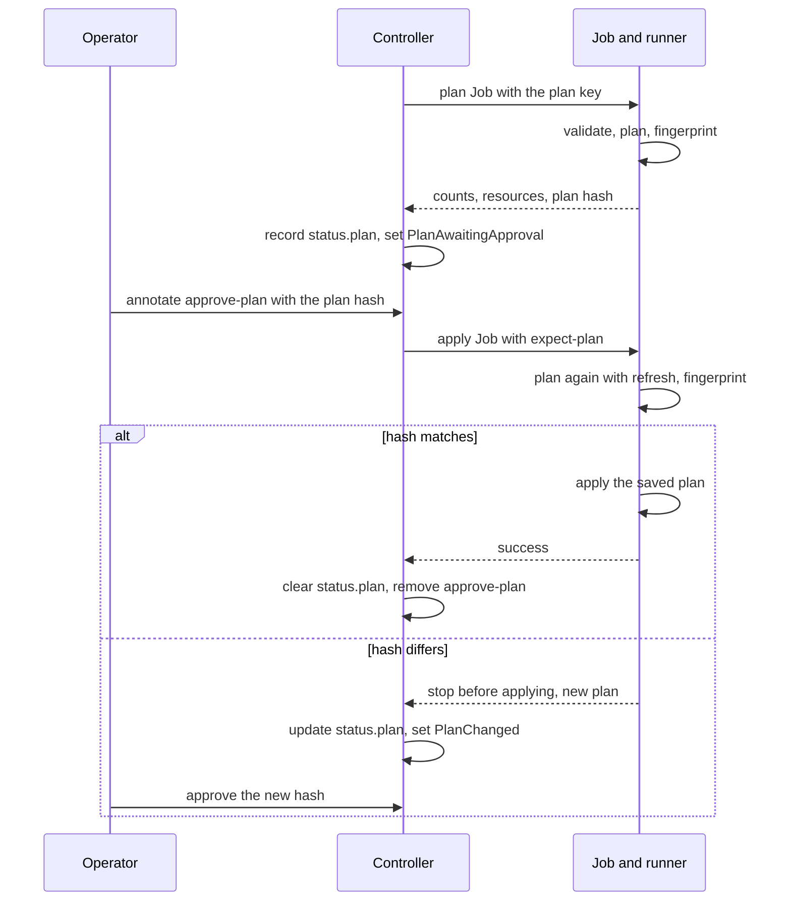

# Manual Plan Approval

With `spec.applyPolicy: Manual` on a `TerraformCluster` (or on its
`TerraformClusterTemplate`), the controller plans every change first and
applies it only after a person approves that plan. `Automatic` is the
default. `applyPolicy` is mutable: switching back to `Automatic` applies
whatever was waiting and clears `status.plan`. The first apply of a new
cluster is not gated, since there is no state yet to damage. This page
describes the flow; the commands are in [Plan
Approval](../../user-guide/plan-approval.md).

## The flow

1. **Plan.** When an apply is due, the controller starts a plan Job
   (`status.activeJob.operation: plan`) instead. Before the Job, it ensures
   the plan key Secret exists, and the Job mounts it at `/captf/plan-key`.
   The runner runs `init`, `validate` and `plan -out`, then `show -json`
   with the output held in memory only. It never writes the plan JSON to
   disk or to a log; only the binary plan file exists in the working
   directory.
2. **Record.** The runner reports counts, a list of changed resources and
   the plan hash. The controller records them in `status.plan` (below), sets
   `ApplyJobSucceeded` to `Unknown`/`PlanAwaitingApproval` with a message
   that contains the exact `kubectl annotate` command, and emits one
   `PlanReady` event.
3. **Wait.** Nothing applies. The condition is `Unknown`, not `False`, so
   waiting never makes `Ready` false. The controller re-checks at least
   every ten minutes, and a changed annotation or new inputs trigger it at
   once. Drift and health checks continue while a plan waits.
4. **Approve.** You set `captf.io/approve-plan` to
   `status.plan.planHash`.
5. **Apply.** The controller starts the apply Job with
   `--expect-plan=<hash>`, the same plan key mount, and the Job annotation
   `captf.io/approved-plan`, and emits `PlanApproved`. The runner plans
   again, this time including the refresh, and computes the hash of that
   fresh plan.
    - If it equals the approved hash, the runner applies exactly the saved
      plan file.
    - If it differs, the runner stops before changing anything and reports
      the new plan. See [When the plan changes](#when-the-plan-changes).
6. **Done.** After the approved apply succeeds, the controller removes
   `captf.io/approve-plan`, clears `status.plan` and emits `PlanApplied`.
   The removal is its own patch with an optimistic lock, so a newer value
   that someone wrote in the meantime survives; on a conflict the
   reconcile requeues and tries again.

## What `status.plan` holds

| Field | Meaning |
| --- | --- |
| `inputsHash` | The inputs hash the plan was made for. A plan is bound to it: new inputs make a new plan |
| `job` | The plan Job |
| `planHash` | The `p2:` hash to approve (see [What the plan hash binds](fingerprint.md)) |
| `add`, `change`, `destroy` | Counts of planned resource changes; a replacement counts as both an add and a destroy |
| `outputChanges` | How many outputs change |
| `resources` | Up to 50 entries of `<address> (<labels>)`, sorted by address, never a value |
| `truncated` | Set when more than 50 resources changed |
| `createdAt` | When the controller recorded the plan |

The labels in a `resources` entry are the action (`create`, `update`,
`delete`, `replace`, `read` or `forget`), followed by `import` and then
`move` where they apply: `aws_lb.x (import)`, `aws_instance.b (update,
move)`. Imports and moves are not counted in `add`, `change` or `destroy`,
so an entry is the way to see them.

!!! note "Plan values never reach status, events or logs"

    They carry counts, addresses and the keyed hash only. The values are in
    the plan Job's own log, which the `source` container prints in
    human-readable form.

## When approval is needed

- **Everything except the first apply**, when `Manual` is set: changed
  inputs, a retry after a failed apply, a drift remediation and a state
  with no inputs hash.
- **Output changes.** A plan that changes only outputs, or only imports or
  moves, is not an empty plan and waits for approval.
- **Not an empty plan.** A plan with no resource, output, import or move
  change has a fixed hash, and the apply proceeds without approval (no
  `PlanApproved` event). It still plans again first, and stops if the plan
  is no longer empty.

!!! warning "Approving a plan also approves the deletes and replacements it lists"

    You saw them in `status.plan.resources`, and the apply runs only that
    plan. `captf.io/approve-destructive-plan` is not needed under
    `Manual`. `lifecycle { prevent_destroy = true }` in the module still
    fails an approved plan.

## When the plan changes

If the plan the apply Job computes does not hash to the approved value,
because the world moved since you reviewed it or because a partial earlier
apply changed things, the Job stops before the apply step:

- `status.lastRun.error.kind` is `plan-changed` and the Job is annotated
  `captf.io/plan-changed`;
- `status.plan` is replaced by the new plan;
- `ApplyJobSucceeded` becomes `Unknown`/`PlanChanged`, with the new
  command, and a `PlanChanged` warning event is emitted;
- the change counts toward neither retry backoff nor the remediation failure
  cap, and the apply waits for approval of the new hash.

A plan that comes back empty after you approved a non-empty one is a changed
plan too.

## Retries and stale approvals

An approval is consumed only when the approved apply succeeds. After a
failed apply the annotation stays, so a retry whose new plan hashes the
same runs without another approval, with the usual retry backoff. If the
failed apply changed something, the plan differs and needs a new approval.

!!! warning "A leftover approval still approves a later plan with the same hash"

    This covers, for example, a plan that changed again or inputs that
    changed before the apply ran. Remove a stale one with
    `kubectl annotate terraformcluster <name> -n <ns> captf.io/approve-plan-`.
    Because the hash binds values, a leftover approval matches only a plan
    that changes the same attributes to the same values.

!!! related "See also"

    - [What the plan hash binds](fingerprint.md).
    - [Operating the gates](operating.md).
    - [Plan Approval](../../user-guide/plan-approval.md).
    - [Run inputs and the plan key](../secret-management/run-inputs.md#the-plan-key).
