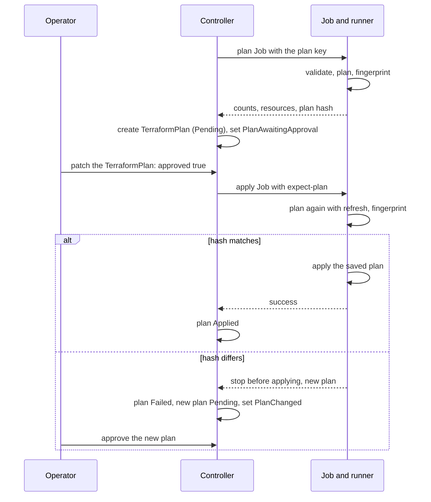

# Manual Plan Approval

With `spec.applyPolicy: Manual` on a `TerraformCluster` (or on its
`TerraformClusterTemplate`), the controller plans every change first and
applies it only after a person approves that plan. `Automatic` is the
default. `applyPolicy` is mutable: switching back to `Automatic` makes a
waiting `Manual` plan moot, so it is superseded and the apply runs. The first
apply of a new cluster is not gated, since there is no state yet to damage.
This page describes the flow; the commands are in [Plan
Approval](../../user-guide/plan-approval.md).

## The flow

1. **Plan.** When an apply is due, the controller starts a plan Job
   (`status.activeJob.operation: plan`) instead. Before the Job, it ensures
   the plan key Secret exists, and the Job mounts it at `/captf/plan-key`.
   The runner runs `init`, `validate` and `plan -out`, then `show -json`
   with the output held in memory only. It never writes the plan JSON to
   disk or to a log; only the binary plan file exists in the working
   directory.
2. **Record.** The runner reports counts, a list of changed resources and
   the plan hash. For a non-empty plan, the manager creates a
   [`TerraformPlan`](../../reference/resources/terraformplan.md) with the
   reason `Manual` in the phase `Pending` and names it in
   `status.pendingPlanRef`. It sets `ApplyJobSucceeded` to
   `Unknown`/`PlanAwaitingApproval`, with a message that names the plan, its
   counts and the exact `kubectl patch` command, and emits one `PlanReady`
   event.
3. **Wait.** Nothing applies. The condition is `Unknown`, not `False`, so
   waiting never makes `Ready` false. The controller re-checks at least
   every ten minutes, and an approval or new inputs trigger it at once.
   Drift and health checks continue while a plan waits.
4. **Approve.** You set `spec.approved` and `spec.approvedBy` on the plan.
   It becomes `Approved`, and the controller emits `PlanApproved` on the
   target, naming `approvedBy`, when bookkeeping first sees the approval.
5. **Apply.** The controller starts the apply Job with
   `--expect-plan=<spec.planHash>`, the same plan key mount, and the Job
   annotations `captf.io/approved-plan` and `captf.io/plan` (the plan's
   name). The runner plans again, this time including the refresh, and
   computes the hash of that fresh plan.
    - If it equals the approved hash, the runner applies exactly the saved
      plan file.
    - If it differs, the runner stops before changing anything and reports
      the new plan. See [When the plan changes](#when-the-plan-changes).
6. **Done.** After the approved apply succeeds, the plan becomes `Applied`
   and the controller emits `PlanApplied`. Bookkeeping finds the plan
   through the Job's `captf.io/plan` annotation.

## What the plan holds

The counts and resources are in the plan's `spec.summary`, not in the
target's status:

| Field | Meaning |
| --- | --- |
| `spec.inputsHash` | The inputs hash the plan was made for. A plan is bound to it: new inputs make the plan moot |
| `spec.planHash` | The `p2:` hash the apply must reproduce (see [What the plan hash binds](fingerprint.md)) |
| `spec.summary.create`, `update`, `replace`, `delete`, `import`, `move`, `forget` | Counts of planned resource changes; a replacement counts only in `replace` |
| `spec.summary.outputChanges` | How many outputs change |
| `spec.summary.resources` | Up to 50 entries of `<address> (<labels>)`, sorted by address, never a value |
| `spec.summary.truncated` | Set when more than 50 resources changed |

The labels in a `resources` entry are the action (`create`, `update`,
`delete`, `replace`, `read` or `forget`), followed by `import` and then
`move` where they apply: `aws_lb.x (import)`, `aws_instance.b (update,
move)`. Imports, moves and forgets are not counted in `create`, `update`, `replace`
or `delete`.

!!! note "Plan values never reach the plan object, events or logs"

    They carry counts, addresses and the keyed hash only. The values are in
    the plan Job's own log, which the `source` container prints in
    human-readable form.

## When approval is needed

- **Everything except the first apply**, when `Manual` is set: changed
  inputs, a retry after a failed apply, a drift remediation and a state
  with no inputs hash.
- **Output changes.** A plan that changes only outputs, or only imports or
  moves, is not an empty plan and waits for approval.
- **Not an empty plan.** A plan with no resource, output, import or move
  change creates no `TerraformPlan`, and the apply runs at once with
  `--expect-plan` of the empty plan (no `PlanApproved` event, but a `PlanReady` event that says there are no changes). It still plans
  again first, and stops if the plan is no longer empty.

!!! warning "Approving a plan also approves the deletes and replacements it lists"

    You saw them in `spec.summary.resources`, and the apply runs only that
    plan. A `Manual` target needs no separate destructive approval.
    `lifecycle { prevent_destroy = true }` in the module still fails an
    approved plan.

## When the plan changes

If the plan the apply Job computes does not hash to the approved value,
because the world moved since you reviewed it or because a partial earlier
apply changed things, the Job stops before the apply step:

- `status.lastRun.error.kind` is `plan-changed` and the Job is annotated
  `captf.io/plan-changed`;
- the approved plan becomes `Failed`, and the new plan becomes a new
  `Manual` `TerraformPlan` in the phase `Pending`;
- `ApplyJobSucceeded` becomes `Unknown`/`PlanChanged`, with the failed
  plan, the new plan and the approve command, and a `PlanChanged` warning
  event is emitted;
- the change counts toward neither retry backoff nor the remediation failure
  cap, and the apply waits for approval of the new plan.

A plan that comes back empty after you approved a non-empty one is a changed
plan too. `Failed` happens only in this case.

## Retries and stale approvals

A failed step of the approved apply, or a deadline, does not fail the plan:
it stays `Approved`, and the apply is retried with the same expected plan
after the usual retry backoff. It runs without another approval if the new
plan hashes the same. If the failed apply changed something, the plan
differs: the plan becomes `Failed` and the new plan needs its own approval.

An approval cannot outlive its plan. A plan is superseded when it becomes
moot, and a superseded plan can no longer be approved or applied; see [Operating
the gates](operating.md#the-terraformplan-lifecycle). Because the plan hash
binds values, a new approval matches only a plan that changes the same
attributes to the same values.

!!! related "See also"

    - [What the plan hash binds](fingerprint.md).
    - [Operating the gates](operating.md).
    - [Plan Approval](../../user-guide/plan-approval.md).
    - [TerraformPlan](../../reference/resources/terraformplan.md).
    - [Run inputs and the plan key](../secret-management/run-inputs.md#the-plan-key).
