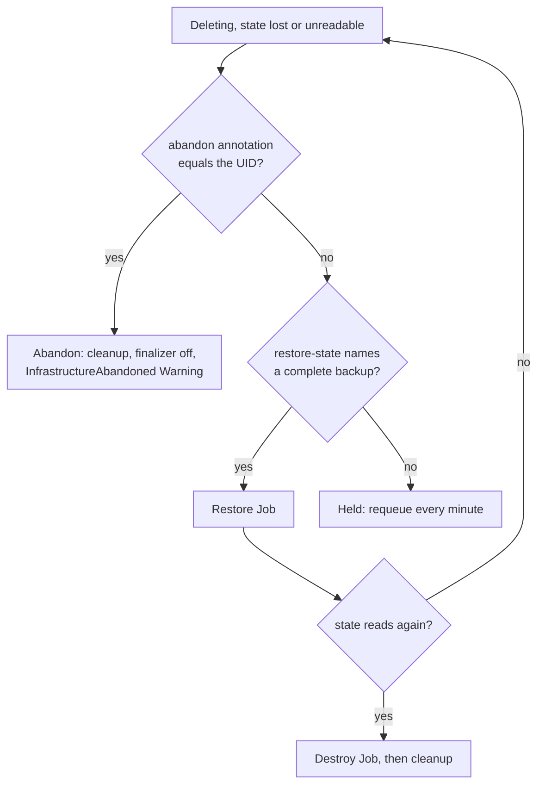

# Held Deletions

A destroy needs the state. When the state is missing or unreadable, the
controller cannot tell what the module created, and removing the finalizer
would leave that infrastructure running with nothing tracking it. So it
holds the deletion instead: no destroy runs, the finalizer stays, and the
state backups stay with it. This page covers what triggers a hold, what
ends one, and the abandon annotation, which ends it without a destroy.

## Ever applied

A missing state means two different things. For an object that never applied
there is nothing to destroy, and the finalizer comes off at once. For one
that did, the state was lost. The controller tells them apart with
`everApplied`, which is true when **any** of these holds:

| Signal | Where it lives | Survives `clusterctl move` |
| --- | --- | --- |
| `status.initialization.provisioned` is true | The object's status | No |
| The `captf.io/applied: "true"` marker | The durable inputs Secret `captf-inputs-*`, set at the first successful apply or restore, never cleared | Yes, it moves with the Secret |
| A pinned image digest | The same Secret; only a successful apply pins one, but an image change clears it | Yes |
| Any state backup exists | The `captf-state-backup-*` Secrets | Yes (owned by the object) |

With `--state-backups=0` no backup is ever taken, so the last signal is
absent; the other three still hold. The marker exists because status does
not move: see [`clusterctl move`](move.md#what-does-not-move).

The same test guards the [ownerless
release](order.md#the-cluster-waits-for-its-machines): a deleting object
with no owner is dropped without a look at the state only if it never
applied.

## What holds a deletion

`StateReadable` becomes `False` and the deletion is held for these reasons:

| Reason | State | Notes |
| --- | --- | --- |
| `StateLost` | No state Secret, and the object applied before | The Secret was deleted by hand, or the namespace was |
| `StateCorrupt` | The payload cannot be decoded, exceeds the reader's caps, or has an unsupported version | Restore a backup taken before it broke |
| `StateEncrypted` | The state carries OpenTofu's client-side encryption envelope; CAPTF cannot read it | No backup exists (an unreadable state is never backed up) |
| `StateInconsistent` | The chunks do not form one complete state | A missing or duplicated chunk, or a stray Secret in the set |

The condition message adds how to leave the hold: the restore annotation,
and the abandon annotation with this object's UID. Each reason's cause and
repair are in [Unreadable State](../../operator-guide/runbooks/state-unreadable.md).

`StateLocked` is **not** a hold. The state reads, so the destroy starts, and
its Job waits `lockTimeoutSeconds` for a lock someone else holds and then
fails. See [Stale State Lock](../../operator-guide/runbooks/stale-lock.md).

## What ends a hold



The order inside one pass matters: the controller checks the abandon
annotation **before** the restore and the destroy decisions, so a pending
restore that cannot start does not hide it.

### Restore, then destroy

Setting `captf.io/restore-state=<serial>` to a serial in
`status.stateBackups` during a hold starts a restore Job. Once the state
reads again, the normal destroy follows. This is the only time a restore
runs on a deleting object: with readable state the annotation is ignored
and the destroy goes ahead. The restore takes the same leases as any other,
is never gated, and is not retried for the same serial after a failure.
See [Backups and restore](../secret-management/backups.md#restore) and the
[State Restore runbook](../../operator-guide/runbooks/state-restore.md).

### Abandon

`captf.io/abandon-infrastructure=<metadata.uid>` removes the finalizer
without a destroy. The value must equal the object's UID exactly; any other
value is ignored, and a held object says so in its `StateReadable` message.
The annotation releases a deletion in these cases, and the controller
records which one in the event:

| Case | How the controller sees it | Cause in the event |
| --- | --- | --- |
| Held on the state | `StateReadable` is `False` | `StateReadable <reason>` |
| The last destroy failed | `status.lastRun` is a destroy and `ApplyJobSucceeded` is `False` (also after a restore) | `the last destroy failed: ApplyJobSucceeded <reason>` |
| The durable inputs are gone | `ApplyJobSucceeded=False`/`DestroyFailed` with no Job, because the destroy cannot be rendered | `the destroy cannot start: …` |
| The identity does not allow the namespace | `ApplyJobSucceeded=False`/`IdentityNotAllowed` | `the destroy cannot start: …` |
| The credentials cannot be prepared | The `Deleting` message says the destroy waits for its credentials | `the destroy cannot start: it waits for its credentials: …` |

!!! warning "An object whose state reads and whose destroy can start is destroyed anyway"

    Even with the annotation set. The annotation would only skip a teardown that may well succeed. It takes effect once that destroy fails or turns out unable to start. The cases that are decided only when the destroy is about to start (the last three) are checked where it stops, not up front.


What the abandon does:

- Runs the same [cleanup](cleanup.md) as a successful destroy: the state
  Secrets, the lock Lease, the durable inputs, the plan key, the leases and
  the mirror ownership go. **Back up the state first** if you need it: the
  [stuck destroy runbook](../../operator-guide/runbooks/stuck-destroy.md#2-back-up-the-state-and-inputs-secrets)
  shows how. The backups are not deleted by cleanup but are garbage
  collected with the object.
- Waits while a Job still holds a live run lease (five-second retries),
  like every other release.
- Emits a `Warning` event `InfrastructureAbandoned`: `Removed finalizer <name>
  without a destroy (<cause>): captf.io/abandon-infrastructure names this
  object's uid. Whatever the module created keeps running and is no longer
  managed; the state backups go with the object`.
- Leaves the infrastructure running and untracked. Clean it up through the
  cloud provider.

!!! danger "Abandoning leaves the infrastructure running and untracked"

    Whatever the module created keeps running and is no longer managed, and the state backups go with the object. Back up the state first if you need it.

```sh
uid=$(kubectl get <kind> -n <ns> <name> -o jsonpath='{.metadata.uid}')
kubectl annotate <kind> -n <ns> <name> captf.io/abandon-infrastructure="$uid"
```

!!! related "See also"

    - [Unreadable State](../../operator-guide/runbooks/state-unreadable.md#deleting-while-state-is-unreadable).
    - [Stuck Destroy: abandon instead](../../operator-guide/runbooks/stuck-destroy.md#abandon-instead).
    - [Other manual actions](../approvals/other-manual-actions.md#abandon-an-object).
