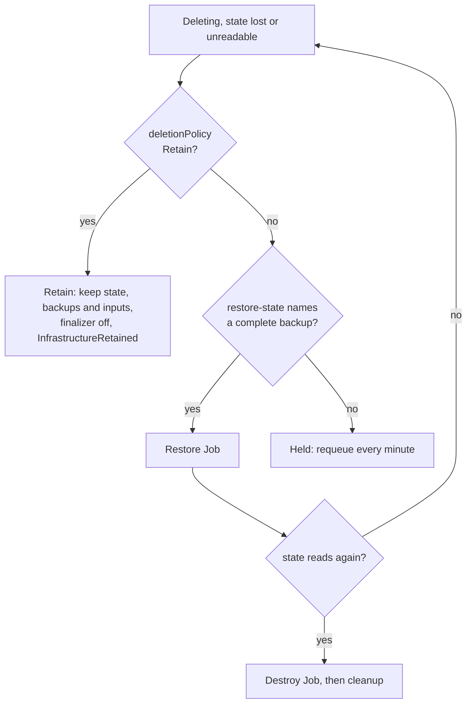

# Held Deletions

A destroy needs the state. When the state is missing or unreadable, the
controller cannot tell what the module created, and removing the finalizer
would leave that infrastructure running with nothing tracking it. So it
holds the deletion instead: no destroy runs, the finalizer stays, and the
state backups stay with it. This page covers what triggers a hold, what
ends one, and `spec.deletionPolicy: Retain`, which ends it without a
destroy and without losing anything.

## Ever applied

A missing state means two different things. For an object that never applied
there is nothing to destroy, and the finalizer comes off at once. For one
that did, the state was lost. The controller tells them apart with
`everApplied`, which is true when **any** of these holds:

| Signal | Where it lives | Survives `clusterctl move` |
| --- | --- | --- |
| `status.initialization.provisioned` is true | The object's status | No |
| The `captf.io/applied: "true"` marker | The durable inputs Secret `captf-inputs-*`, set at the first successful apply or restore, never cleared | Yes, it moves with the Secret |
| A pinned image digest | The same Secret; only a successful apply pins one, but an image change clears it | Yes |
| Any state backup exists | The `captf-state-backup-*` Secrets | Yes (owned by the object) |

With `--state-backups=0` no backup is ever taken, so the last signal is
absent; the other three still hold. The marker exists because status does
not move: see [`clusterctl move`](move.md#what-does-not-move).

The same test guards the [ownerless
release](order.md#the-cluster-waits-for-its-machines): a deleting object
with no owner is dropped without a look at the state only if it never
applied.

## What holds a deletion

`StateReadable` becomes `False` and the deletion is held for these reasons:

| Reason | State | Notes |
| --- | --- | --- |
| `StateLost` | No state Secret, and the object applied before | The Secret was deleted by hand, or the namespace was |
| `StateCorrupt` | The payload cannot be decoded, exceeds the reader's caps, or has an unsupported version | Restore a backup taken before it broke |
| `StateEncrypted` | The state carries OpenTofu's client-side encryption envelope; CAPTF cannot read it | No backup exists (an unreadable state is never backed up) |
| `StateInconsistent` | The chunks do not form one complete state | A missing or duplicated chunk, or a stray Secret in the set |

The condition message adds how to leave the hold: the restore annotation,
or `spec.deletionPolicy: Retain`. Each reason's cause and
repair are in [Unreadable State](../../operator-guide/runbooks/state-unreadable.md).

`StateLocked` is **not** a hold. The state reads, so the destroy starts, and
its Job waits `lockTimeoutSeconds` for a lock someone else holds and then
fails. See [Stale State Lock](../../operator-guide/runbooks/stale-lock.md).

## What ends a hold



The order inside one pass matters: the controller checks the deletion
policy **before** the restore and the destroy decisions, right after
waiting for a Job that still runs, so neither a pending restore that
cannot start nor a destroy that keeps failing hides it.

### Restore, then destroy

Setting `captf.io/restore-state=<serial>` to a serial in
`status.stateBackups` during a hold starts a restore Job. Once the state
reads again, the normal destroy follows. This is the only time a restore
runs on a deleting object: with readable state the annotation is ignored
and the destroy goes ahead. The restore takes the same leases as any other,
is never gated, and is not retried for the same serial after a failure.
See [Backups and restore](../secret-management/backups.md#restore) and the
[State Restore runbook](../../operator-guide/runbooks/state-restore.md).

### Retain

Setting `spec.deletionPolicy: Retain` on the deleting object removes the
finalizer without a destroy. Unlike a restore it needs no backup, and
unlike stripping the finalizer by hand it loses nothing: the state Secrets
that exist, the state backups and the durable inputs are kept, without
owner references, labeled `captf.io/retained-from-uid` with the object's
UID, for a later object of the same name to adopt. See [Retain and
Adopt](retain.md).

```sh
kubectl patch <kind> <name> -n <ns> --type merge -p '{"spec":{"deletionPolicy":"Retain"}}'
```

It releases more than a hold on the state:

| Case | How the controller sees it |
| --- | --- |
| Held on the state | `StateReadable` is `False` |
| The last destroy failed | `status.lastRun` is a destroy and `ApplyJobSucceeded` is `False` (also after a restore) |
| The durable inputs are gone | `ApplyJobSucceeded=False`/`DestroyFailed` with no Job, because the destroy cannot be rendered |
| The identity does not allow the namespace | `ApplyJobSucceeded=False`/`IdentityNotAllowed` |
| The credentials cannot be prepared | The `Deleting` message says the destroy waits for its credentials |

The messages of all five name `spec.deletionPolicy: Retain`. Retain waits
while a Job still holds a live run lease (five-second retries), like every
other release, then emits a `Normal` event `InfrastructureRetained`
counting what it kept.

!!! warning "Retain leaves the infrastructure running"

    Nothing is destroyed. Whatever the module created keeps running and
    costing money until an object adopts it, or you delete it through the
    cloud provider.

!!! related "See also"

    - [Unreadable State](../../operator-guide/runbooks/state-unreadable.md#deleting-while-state-is-unreadable).
    - [Retain and Adopt](retain.md).
    - [Stuck Destroy: retain instead](../../operator-guide/runbooks/stuck-destroy.md#retain-instead).
    - [Other manual actions](../approvals/other-manual-actions.md#retain-an-object).
