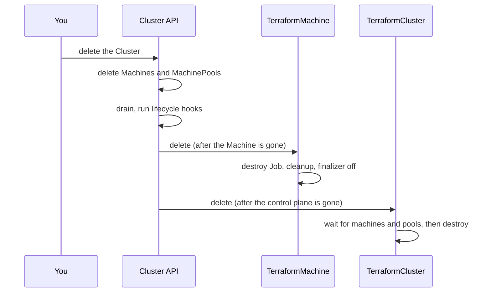

# Order and Finalizers

Three parties delete things in a fixed order: Cluster API, the admission
webhook that guards the order, and the controller's own delete pass. This
page walks through each.

## The order

- **Machines first.** Cluster API deletes the `Machine`, drains the node and
  runs the lifecycle hooks it owns (pre-drain, pre-terminate), and only then
  deletes the `TerraformMachine` the Machine's `spec.infrastructureRef`
  names. CAPTF registers no hook of its own; the order comes from Cluster
  API and the webhook below.
- **Machine pools** follow their `MachinePool` through the owner reference.
  Nothing refuses a direct delete of a `TerraformMachinePool`.
- **The cluster last.** The `TerraformCluster` is deleted once the
  Cluster's machines are gone, and its destroy waits for any that are left
  (see [below](#the-cluster-waits-for-its-machines)).

## The webhook refuses a direct machine delete

Deleting a `TerraformMachine` directly would skip the drain and the hooks,
so the validating webhook refuses it while a `Machine` that is not itself
deleting references the object. The check lists the Machines in the
namespace and compares each `spec.infrastructureRef` (API group, kind and
name) with the object. It does not use the machine's owner references or
labels, because anyone who may update the object can change those.

- The error names the Machine: `delete the Machine <name> instead`.
- A `TerraformMachine` that nothing references, such as one whose Machine is
  already gone, can always be deleted.
- A `Machine` that is already deleting does not count, so the delete
  Cluster API issues after the drain goes through.
- **The one exception is `clusterctl move`.** The
  `clusterctl.cluster.x-k8s.io/delete-for-move` annotation is honored only
  while the Cluster named by the machine's `cluster.x-k8s.io/cluster-name`
  label has `spec.paused=true`. The annotation alone can be set by anyone
  who can update the object. See [clusterctl move](move.md).

!!! note "This is the only delete guard on the three kinds"

    A `TerraformCluster`, `TerraformMachinePool` and the template kinds
    allow every delete. A `TerraformClusterIdentity` is refused while any
    object uses it or while its credentials are still mirrored into a
    namespace.

## The cluster waits for its machines

A `TerraformCluster` that is deleting lists, through the uncached reader,
the `TerraformMachine` and `TerraformMachinePool` objects in its namespace
that carry its cluster name in the `cluster.x-k8s.io/cluster-name` label.
While any exist it sets `DeletionBlocked=True`/`DependentsExist` with a
count and the names of up to three Machines and three Pools, sorted (then "and N more"), and requeues every 30 seconds, and starts no destroy. When none are
left it sets `DeletionBlocked=False`/`NotBlocked` and carries on.

- Use `kubectl get terraformmachines,terraformmachinepools -l cluster.x-k8s.io/cluster-name=<name>` for the full list.
- The lists are unfiltered by `--watch-filter`: machines of another manager
  instance count too.
- The cluster name is the object's own label, else its owning Cluster's
  name. With neither, nothing can reference the cluster and nothing blocks.
- Machines and pools have no such wait: their `DeletionBlocked` never
  applies.

The ownerless path runs the same check. A deleting object with no owner
reference of the expected kind is released at once only when all of these
hold: it has no state Secret, no Job and no live run lease, nothing blocks
its deletion, and it never applied. If any fails, the full delete pass
takes over: it waits for the dependents, holds on a lost state, or
destroys. An owner reference whose target is gone, or a forged or stale
one, does not get an object stuck either: while deleting, an owner gate
falls through like a missing owner, so the destroy still runs from the
durable inputs.

## The finalizer

Each kind carries one finalizer (`terraformcluster.infrastructure.cluster.x-k8s.io`
and its machine and pool counterparts; see [Annotations, Labels and
Finalizers](../../reference/annotations-labels.md#finalizers)). The
controller removes it only in three cases:

1. **After a successful destroy.**
2. **On a deletion with nothing to destroy:** no state and the object never
   applied (see [ever applied](held.md#ever-applied)).
3. **On Retain:** `spec.deletionPolicy` resolves to `Retain` (see
   [Retain](held.md#retain)).

And only once no Job of the object runs. Two checks guard that, because the
Job list comes from the manager's cache, which can lag a Job the controller
just created:

- `status.activeJob` names a Job the cached list lacks but the API server
  still has. The pass waits five seconds and looks again.
- A **live run lease** is held by a Job the cache has not shown. The
  cleanup defers by five seconds too. The lease is read live only when it
  matters, which includes every deleting object. See [Run leases and the
  cluster operation gate](../lifecycle.md#run-leases-and-the-cluster-operation-gate).

The first reconcile with a deletion timestamp sets the `Deleting`
condition to `True`/`Deleting` and emits a `DeletionStarted` event. `Deleting`
has no other `True` reason.

## Pause stops a deletion

!!! warning "A deletion under a paused Cluster waits until it is unpaused"

    A paused object (its own `cluster.x-k8s.io/paused` annotation or a
    paused Cluster) runs only the paused branch: Job bookkeeping and the
    block-move clear. That branch never destroys and never removes the
    finalizer. The object keeps its finalizer, starts no Job, and
    `Deleting` reads `True`/`Deleting` with the message `Deletion waits
    until the object is unpaused (Cluster spec.paused or the
    cluster.x-k8s.io/paused annotation); a paused object never runs a
    destroy`.

The reason is `clusterctl move`. It pauses the Cluster, then deletes the
source objects with their finalizers stripped. Those deletes must not run a
destroy, or the move would tear down infrastructure the target is taking
over. Pause is the signal that makes the controller leave them alone.

The exception is the ownerless release above, which runs before the pause
check.

!!! related "See also"

    - [The destroy Job](destroy-job.md).
    - [The Reconcile Lifecycle](../lifecycle.md#the-paused-branch).
    - [My object will not delete](troubleshooting.md).
