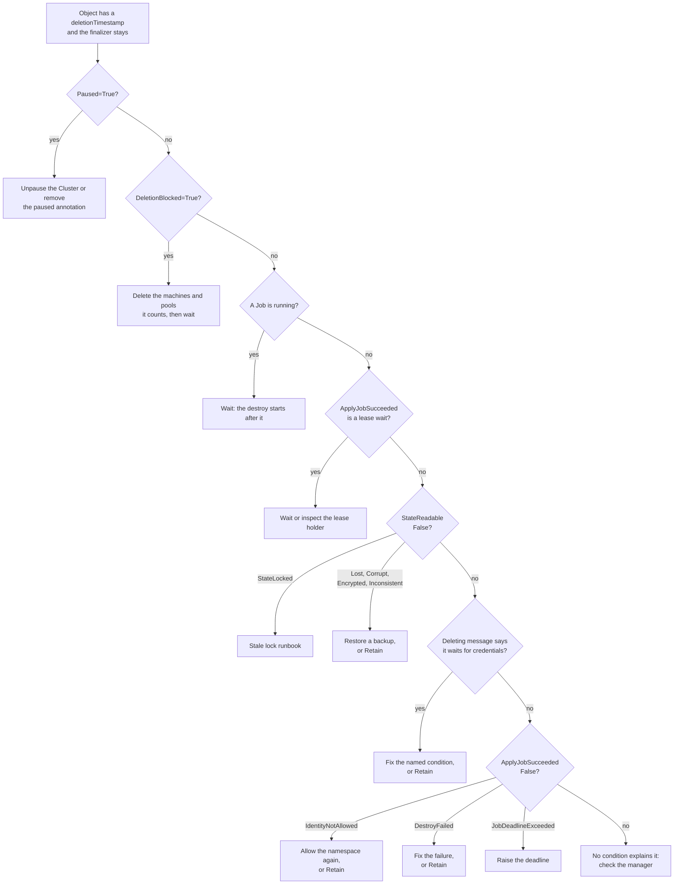

# My Object Will Not Delete

An object with a `deletionTimestamp` that does not go away is waiting on
one of a short list of things. Read the object first:

```sh
kubectl get <kind> -n <ns> <name> -o yaml
```

Look at `metadata.finalizers` (CAPTF's must be the one holding it), the
`Deleting` condition's message, `DeletionBlocked`, `StateReadable` and
`ApplyJobSucceeded`, then follow the chart.



## Symptom to action

| What you see | Meaning | Action |
| --- | --- | --- |
| `Paused=True`, or the Cluster has `spec.paused: true`; `Deleting` says `Deletion waits until the object is unpaused` | A paused object runs only bookkeeping, so it never destroys; `clusterctl move` relies on this | Unpause. See [Order](order.md#pause-stops-a-deletion) |
| `kubectl delete terraformmachine` is refused: `delete the Machine <name> instead` | A live Machine references it | Delete the Machine; see [Order](order.md#the-webhook-refuses-a-direct-machine-delete) |
| `DeletionBlocked=True`/`DependentsExist` on a `TerraformCluster` | Machines or pools with its cluster label still exist | List them with `-l cluster.x-k8s.io/cluster-name=<name>`; they delete through their Machines. If one is stuck, work on that object first |
| A Job is running (`status.activeJob`) | The destroy waits for it | Wait; see [Slow Jobs](../../operator-guide/runbooks/slow-jobs.md) |
| `ApplyJobSucceeded=Unknown`/`WaitingForRunLease`, `WaitingForClusterOperation` or `WaitingForMachineOperations` | The destroy waits for a lease | Wait; see [Leases](../lifecycle.md#run-leases-and-the-cluster-operation-gate) |
| `StateReadable=False`/`StateLost`, `StateCorrupt`, `StateEncrypted` or `StateInconsistent` | Held on the state | [Restore](held.md#restore-then-destroy) or [Retain](held.md#retain). See [Unreadable State](../../operator-guide/runbooks/state-unreadable.md) |
| `StateReadable=False`/`StateLocked` | A foreign holder has the state lock; the destroy Job will wait and fail | [Stale State Lock](../../operator-guide/runbooks/stale-lock.md) |
| `Deleting` message `The destroy Job waits for its credentials: …` | Credentials cannot be prepared, often in a terminating namespace | Fix the named condition ([identities](../../operator-guide/runbooks/identity-and-credentials.md)), or [Retain](held.md#retain). See [Terminating namespaces](namespaces.md) |
| `ApplyJobSucceeded=False`/`IdentityNotAllowed` | The identity no longer allows the namespace, or is gone | Allow the namespace again, or [Retain](held.md#retain) |
| `ApplyJobSucceeded=False`/`DestroyFailed` with a Job | The destroy failed; it retries with backoff forever | [Failing Jobs](../../operator-guide/runbooks/job-failures.md), then [Stuck Destroy](../../operator-guide/runbooks/stuck-destroy.md) |
| `DestroyFailed`, message `The inputs Secrets (durable and applied) are missing` | The destroy cannot be rendered | [Restore the Secrets](../../operator-guide/runbooks/stuck-destroy.md#the-inputs-secrets-are-missing), or [Retain](held.md#retain) |
| Warning event `DestroyInputsMismatch` | The destroy renders a record whose inputs hash is not the state's: an apply that failed partway, or no record carries the state's hash | Usually nothing: see [Which record a destroy renders](destroy-job.md#which-record-a-destroy-renders). Check the infrastructure after it ran |
| `StateReadable=False`/`ApplyOutcomeUnknown` | An apply ended without a result before any state was written, and the deletion is held | [Held deletions](held.md#apply-outcome-unknown) |
| `ApplyJobSucceeded=False`/`JobDeadlineExceeded` | The destroy ran out of time | Raise `activeDeadlineSeconds`; see [Tuning Jobs](../../user-guide/job-tuning.md#deadlines-and-lock-waits) |
| `ApplyJobSucceeded=False`/`ImagePullFailed` or `ImageInvalid` | The pinned image cannot run | [Failing Jobs](../../operator-guide/runbooks/job-failures.md) |
| Nothing explains it | The manager is not reconciling | [Reconcile Errors](../../operator-guide/runbooks/reconcile-errors.md), [Webhook Unavailable](../../operator-guide/runbooks/webhook-unavailable.md) |

!!! note "A message that names `spec.deletionPolicy: Retain`"

    It tells you the controller sees no way to proceed alone. [Retain](held.md#retain) releases every case in this table without a destroy, and keeps the state, backups and inputs Secrets for a later [adoption](retain.md#adopting-retained-state). Set on an object whose destroy could succeed, it also skips that destroy.

!!! danger "Retaining or stripping leaves cloud resources running"

    A destroy that cannot be completed and an object that must go anyway end the same way: clean up the cloud resources, then either [Retain](held.md#retain) (which keeps the state) or [strip the finalizer](manual-finalizer.md) (which loses it; back up what you need first).


!!! related "See also"

    - [Stuck Destroy](../../operator-guide/runbooks/stuck-destroy.md).
    - [Runbooks](../../operator-guide/runbooks/README.md).
