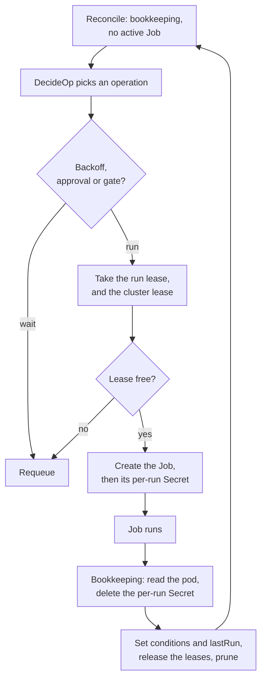

# Jobs, Retries and Concurrency

Every Terraform or OpenTofu run CAPTF does is one Kubernetes Job, started by
the controller, watched to the end and counted. This chapter follows a Job
from the decision to run it to the bookkeeping after it finishes, and
explains the machinery that keeps those Jobs from colliding: the names that
make creation idempotent, the retry rules, the deadlines, the leases, the
cache-lag checks, the state lock and leader election. It is the model behind
the "nothing is happening" questions that
[Slow Jobs](../../operator-guide/runbooks/slow-jobs.md) and
[Failing Jobs](../../operator-guide/runbooks/job-failures.md) answer one
symptom at a time, and it goes deeper than [The Reconcile
Lifecycle](../lifecycle.md), which it extends.

The pages:

-   :material-tag-text-outline:{ .lg .middle } __Job names, attempts and history__

    ---

    Deterministic names, adoption and pruning.

    [:octicons-arrow-right-24: Job names, attempts and history](naming.md)

-   :material-format-list-numbered:{ .lg .middle } __Choosing the Operation__

    ---

    The priority order of `DecideOp`.

    [:octicons-arrow-right-24: Choosing the Operation](operations.md)

-   :material-restart:{ .lg .middle } __Retries and backoff__

    ---

    What counts as a failure and what does not.

    [:octicons-arrow-right-24: Retries and backoff](retries.md)

-   :material-timer-outline:{ .lg .middle } __Deadlines and lock timeouts__

    ---

    The two clocks on a Job.

    [:octicons-arrow-right-24: Deadlines and lock timeouts](deadlines.md)

-   :material-lock-clock:{ .lg .middle } __Leases and the operation gate__

    ---

    Who may run when.

    [:octicons-arrow-right-24: Leases and the operation gate](leases.md)

-   :material-database-sync-outline:{ .lg .middle } __Cache lag__

    ---

    The live checks that cover a stale cache.

    [:octicons-arrow-right-24: Cache lag](cache-lag.md)

-   :material-lock-outline:{ .lg .middle } __The state lock and stale locks__

    ---

    Terraform's lock against CAPTF's leases.

    [:octicons-arrow-right-24: The state lock and stale locks](state-lock.md)

-   :material-account-switch-outline:{ .lg .middle } __Leader election and failover__

    ---

    One active manager, and what a failover does to Jobs in flight.

    [:octicons-arrow-right-24: Leader election and failover](leader-election.md)

Two more pages sit alongside them:

- [Requeue intervals and schedules](schedules.md).
- [Nothing is happening](troubleshooting.md): from a wait reason to the
  action.

This page covers the life of a Job, the operations and the flags.

## The life of a Job

Four rules shape the diagram:

- **At most one Job per object.** The reconcile does nothing else while a
  Job of the object runs, except to watch it. The run lease makes that hold
  across managers and across crashes.
- **Creation is idempotent.** Names are deterministic, so a retry after a
  crash or a stale read finds the Job it already created.
- **The controller owns retries.** A Job has `backoffLimit: 0`, a pod
  `restartPolicy: Never` and no TTL; every retry is a new Job, named with a
  new attempt number, started only after the backoff.
- **Results are read once.** After a Job finishes, one pass reads its pod,
  deletes its per-run Secret, records the outcome on the object and marks
  the Job as bookkept. Later passes read the Job's annotations, not its pod.

## The operations

| Operation | What it runs | Chosen when |
| --- | --- | --- |
| `apply` | `validate`, then `apply` of the rendered inputs | No state, state without an inputs hash, changed inputs, a failed last apply, or drift remediation |
| `plan` | `validate`, then `plan` for review | A `TerraformCluster` under `applyPolicy: Manual` needs a plan to approve |
| `destroy` | `destroy` of the durable inputs | The object is deleting |
| `refresh` | `apply -refresh-only` | Once after an apply, and on the health, membership and pending schedules |
| `drift` | `apply -refresh-only`, then a plan without refresh | The drift interval is due |
| `restore` | `state push` of a backup, then `state list` | `captf.io/restore-state` names a complete backup |

Which of these wins when several are possible is [the priority
order](operations.md). Every op is a Job of the same shape, differing in
the runner's `--op`.

## Manager flags and where the rest lives

The manager has no flags for backoff or for the failure limit. The retry
timing is compiled in, and the limit is the per-object
`spec.jobs.failedJobsHistoryLimit`. The flags that matter here:

| Flag | Default | What it does | Page |
| --- | --- | --- | --- |
| `--cluster-operation-gate` | `true` | A `TerraformCluster`'s apply, destroy or restore and its machines' operations exclude each other | [Leases](leases.md) |
| `--sync-period` | `10m` | The informers' resync, and the orphan sweep's interval | [Schedules](schedules.md) |
| `--drift-default-interval` | `30m` | Drift interval for objects that set none | [Schedules](schedules.md) |
| `--terraformcluster-concurrency` and the machine, template and pool counterparts | `10` each | Reconciles in flight per kind | [Leader election](leader-election.md) |
| `--leader-elect` and its lease, renew and retry flags | `false`; `15s`, `10s`, `2s` | One active manager | [Leader election](leader-election.md) |
| `--runner-events` | `true` | Runner progress events | [Events](../../reference/events.md) |
| `--state-backups` | `5` | Backups kept per object | [Backups](../secret-management/backups.md) |

The per-object knobs are in `spec.jobs`: `activeDeadlineSeconds`,
`lockTimeoutSeconds`, `successfulJobsHistoryLimit` and
`failedJobsHistoryLimit`. See [Tuning Jobs](../../user-guide/job-tuning.md).
The full flag list is [Manager Flags](../../reference/manager-flags.md).

!!! related "See also"

    - [The Reconcile Lifecycle](../lifecycle.md).
    - [Deletion and Teardown](../deletion/README.md) for the destroy path.
    - [Approvals and Gates](../approvals/README.md) for the plan flow.
    - [Drift and Health](../drift-and-health.md).
