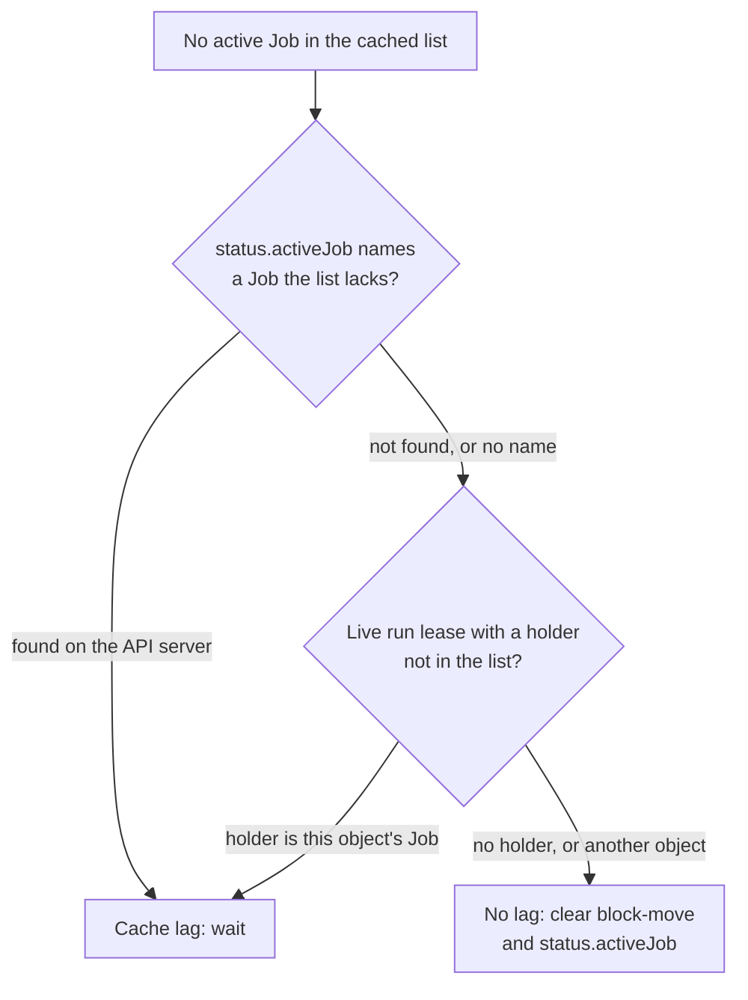

# Cache Lag

The controller lists an object's Jobs through the manager's informer cache.
That cache can trail the API server by a moment, in particular behind a Job
this controller created a second ago. A pass that reads "no Job runs" from
a stale list would do harm:

- clear the `clusterctl.cluster.x-k8s.io/block-move` annotation, letting
  `clusterctl move` start while a Job runs;
- clear `status.activeJob`;
- drop a deleting object's finalizer while a Job still runs.

So before any of those, the controller asks the API server directly. This
page explains what it checks, when, and what it does on a mismatch.

## What is cached and what is not

| Read | Through |
| --- | --- |
| The object's Jobs (`List`) | The cache, scoped to the managed Jobs |
| A single Job, to confirm `status.activeJob` or a lease holder | The uncached API reader |
| The run and cluster leases | The uncached API reader |
| Pods of a Job | The uncached API reader; pods are never cached |
| Secrets (state, durable inputs, per-run, backups) | The API server: every `Get` or `List` of a Secret is a live read. The cache holds only the metadata of managed Secrets |
| The state lock Lease | The uncached API reader |

## The two checks

Both run when the pass found no active Job in the cached list, before it
clears block-move and `status.activeJob`. Both run on the paused branch too.

**`status.activeJob` against the list.** If `status.activeJob` names a Job
the cached list lacks, the controller reads that Job from the API server.
Found means the cache has not caught up: the pass waits. Not found means the
Job is gone, and clearing it is right.

**The live run lease.** Block-move is written to the object before a Job
exists, and `status.activeJob` in a later patch, so a pass can see the
first and not the second. The run lease is written before the Job is
created and read live, so its holder is the evidence. If the lease is live
and its holder Job is **not** in the cached list, the controller reads the
holder from the API server and asks whether it belongs to this object (its
owner-kind and owner-name labels). Yes means a running Job the caches have
not shown: wait. A holder the API server does not have, or one of another
object, is no lag: that wait is the lease gate's own, and starting a Job is
refused there.

## When the lease is read

Two reads per reconcile for every idle object would be wasteful, so the
lease check runs only when its answer can change what the pass does
(`leaseMatters`):

- the cached object carries block-move (which "no lag" would clear);
- `status.activeJob` names a Job (which "no lag" would clear);
- the object is deleting (a pass may drop the finalizer).

An idle object with none of these reads neither. If it then wants to start
a Job, the [run lease](leases.md) is the gate: a Job the cache has not shown
yet holds the lease, so the new one waits for it.

## What a lag does

The pass ends with a requeue after **5 seconds** (`LagRequeue`) and changes
nothing else. The Job watch normally triggers the next reconcile as soon as
the cache catches up. The same 5 seconds is used when removing a consumed
annotation conflicts with a concurrent change, and when a deleting object's
[cleanup](../deletion/cleanup.md) finds a live Job holding the run lease.

The ownerless delete path uses the same evidence: an object with no owner
reference is dropped only if there is no state Secret, no active Job, no lag
on `status.activeJob` and no live run lease. See
[Order and finalizers](../deletion/order.md#the-finalizer).

!!! related "See also"

    - [The Reconcile Lifecycle: the clusterctl move block](../lifecycle.md#the-clusterctl-move-block).
    - [Leases and the operation gate](leases.md).
