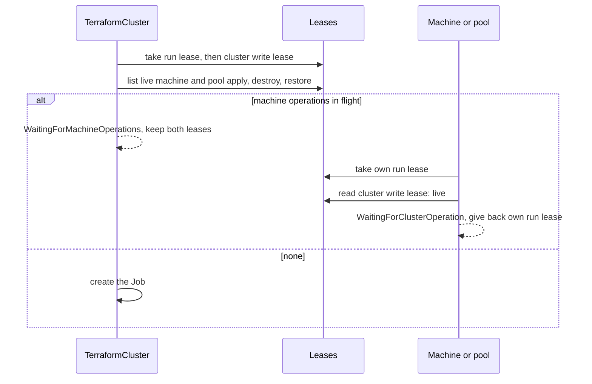

# Leases and the Operation Gate

Two Kubernetes Leases decide who may start a Job. They are CAPTF's own
locks, separate from the [Terraform state lock](state-lock.md), and they are
taken **before** a Job exists, so a wait costs no pod and no failure. This
page covers what each lease is, how a lease is taken and freed, the writer
preference between a cluster and its machines, the wait reasons, and the
one known gap.

## The two leases

| Lease | Name | Taken by | When |
| --- | --- | --- | --- |
| **Run lease** | `captf-run-<suffix>` | Every object, for every op | Always; no flag turns it off |
| **Cluster write lease** | `captf-cluster-<hash>` | A `TerraformCluster` only | `--cluster-operation-gate` on, the op is `apply`, `destroy` or `restore`, and the cluster name is known |

The run lease makes "one Job at a time per object" hold across managers and
across a crash between taking the lease and creating the Job. `<suffix>` is
the object's state suffix, so the name is the same length whatever the
object is called. The cluster lease is keyed by a hash of
`<namespace>/<cluster>`: there is one per Cluster.

A lease is a `coordination.k8s.io` Lease with the labels
`captf.io/lease=run` or `cluster`, `captf.io/managed=true`, the owner kind
and name and the cluster name, and the annotations `captf.io/lease-op` and
`captf.io/lease-acquired-at`. Its `spec.holderIdentity` is **the name of the
Job about to be created**. Names are deterministic ([Job
names](naming.md)), so the holder is known before the Job exists.

```sh
kubectl get lease -n <ns> -l captf.io/lease=run
kubectl get lease -n <ns> -l captf.io/lease=cluster
```

## Taking a lease

The controller takes a lease by creating it, or, when it exists, by
updating it with the `resourceVersion` it just read from the API server
(never a cache):

1. If the holder is this Job already, it refreshes the acquire time.
2. If the lease is **free**, it takes it over.
3. Otherwise it is not acquired, and the operation waits.

A conflict or a concurrent create means another writer won; the loser
waits for the next reconcile, never retrying in the same one.

### Free

A lease may be taken over when any of these holds:

- it has no holder;
- its holder Job has finished (a read through the API server);
- its holder Job does not exist and the lease is older than the **grace**,
  one minute: this covers a manager that crashed between taking the lease
  and creating the Job, and a reader racing the create;
- it is older than its **backstop**, whatever its holder.

### Grace and backstop

The backstop is the holder's `activeDeadlineSeconds` plus 600 seconds
(the pod's termination grace period) plus five minutes: with the default
deadline of one hour, 4500 seconds. The lease records it as
`leaseDurationSeconds`. It frees a lease whose Job is stuck in a way
Kubernetes did not end, for example a pod that cannot terminate.

## The operation gate

A cluster's apply, destroy or restore and its machines' and pools' applies,
destroys and restores must not overlap: a cluster apply can change what the
machines read, and a machine apply can run against a cluster in flux. Plans,
refreshes and drift checks mutate nothing, so they take the run lease only.

The two sides wait for each other in a fixed order, with **writer
preference**: the cluster is not starved by a stream of machine creates.



- **A cluster** takes its run lease, then the cluster write lease, then
  lists the live run leases of its machines and pools that are applying,
  destroying or restoring. If any are live, it **keeps both leases** and
  waits (`WaitingForMachineOperations`, naming up to five Jobs). Keeping the
  cluster lease is what makes new machine operations wait behind it.
- **A machine or pool** takes its own run lease, then reads the cluster
  lease. If a live Job holds it, the machine gives its run lease back and
  waits (`WaitingForClusterOperation`).

The write precedes the read on both sides, so on a linearizable store at
least one of the two sees the other: they cannot both proceed. A machine
that sees the cluster gives its lease back, so the cluster is not held up by
an operation that never started.

With `--cluster-operation-gate=false`, only the run lease is taken, and the
cluster and its machines may run at once. See [Configuration](../../operator-guide/configuration.md#--cluster-operation-gate).

## The wait reasons

A wait sets a condition to `Unknown`, requeues in 30 seconds, creates no
Job, and counts toward no backoff or remediation cap. The event is `Normal`
and is emitted once per wait, not on every requeue.

| Reason | Meaning | Holder named in the message |
| --- | --- | --- |
| `WaitingForRunLease` | Another live Job holds this object's run lease, or the Cluster's write lease (a second cluster operation) | The Job; or "another manager took it first" when a concurrent writer won the race |
| `WaitingForClusterOperation` | A machine's or pool's op waits for its cluster's op | The cluster's Job |
| `WaitingForMachineOperations` | A cluster's op waits for machine and pool ops in flight | Up to five Jobs and a count |

The condition depends on the op: `ApplyJobSucceeded` for apply, destroy and
plan; `DriftJobSucceeded` for refresh and drift (which can only wait for the
run lease); `RestoreJobSucceeded` for restore. A wait that outlasts the
holder's deadline means the holder cannot finish. Look at that Job.

## Release

A lease is given back at these points, always by checking the holder first
and deleting with the UID and `resourceVersion` it read, so a lease another
Job took in the meantime stays:

- **When its Job finishes.** The pass that counts a finished Job (deletes its
  per-run Secret, once per Job) releases the run lease and, for a cluster,
  the cluster lease that Job held.
- **When a create was rejected and no Job exists.** The create, or a pass that
  waited at the gate, proves no Job holds the lease only if the API server has
  no Job of that name. A rejection (invalid, forbidden, unauthorized, too
  large, namespace gone) releases both leases at once. A timeout or a server
  error may hide a create that went through, so the leases stay. Job names
  are deterministic, so a pass with a lagging cache can rebuild the name of
  a Job an earlier pass created, which is why the controller reads the Job
  live before it releases.
- **When a machine sees the cluster operation,** its own run lease is given
  back at once (see above). The reverse is deliberate: a cluster that waits
  for machines keeps its leases.
- **When the object is cleaned up** after a destroy, every run and cluster
  lease carrying its owner labels is deleted. See [Cleanup](../deletion/cleanup.md).

A failure to release is only logged: a lease whose Job finished is free
anyway, and the next Job takes it over.

## The known gap

A cluster that waits for machine operations holds both leases under the name
of the Job it intends to create. That name embeds the inputs hash. If the
inputs change **while it waits**, the next pass computes a different Job
name and cannot refresh the old holder: its leases are held by a Job that
does not exist. The new name waits for the grace, up to a minute after the
last pass that refreshed them, before it takes the lease over. The
cluster's machines see the cluster lease as live for the same time.

!!! warning "Do not delete the Leases by hand"

    It resolves itself; no manual step is needed, and **do not delete the
    Leases by hand**.

!!! related "See also"

    - [The Reconcile Lifecycle: run leases](../lifecycle.md#run-leases-and-the-cluster-operation-gate).
    - [Slow Jobs: waiting for a lease](../../operator-guide/runbooks/slow-jobs.md#waiting-for-a-lease).
    - [Cache lag](cache-lag.md): the lease as evidence of a Job the cache has not
      shown yet.
