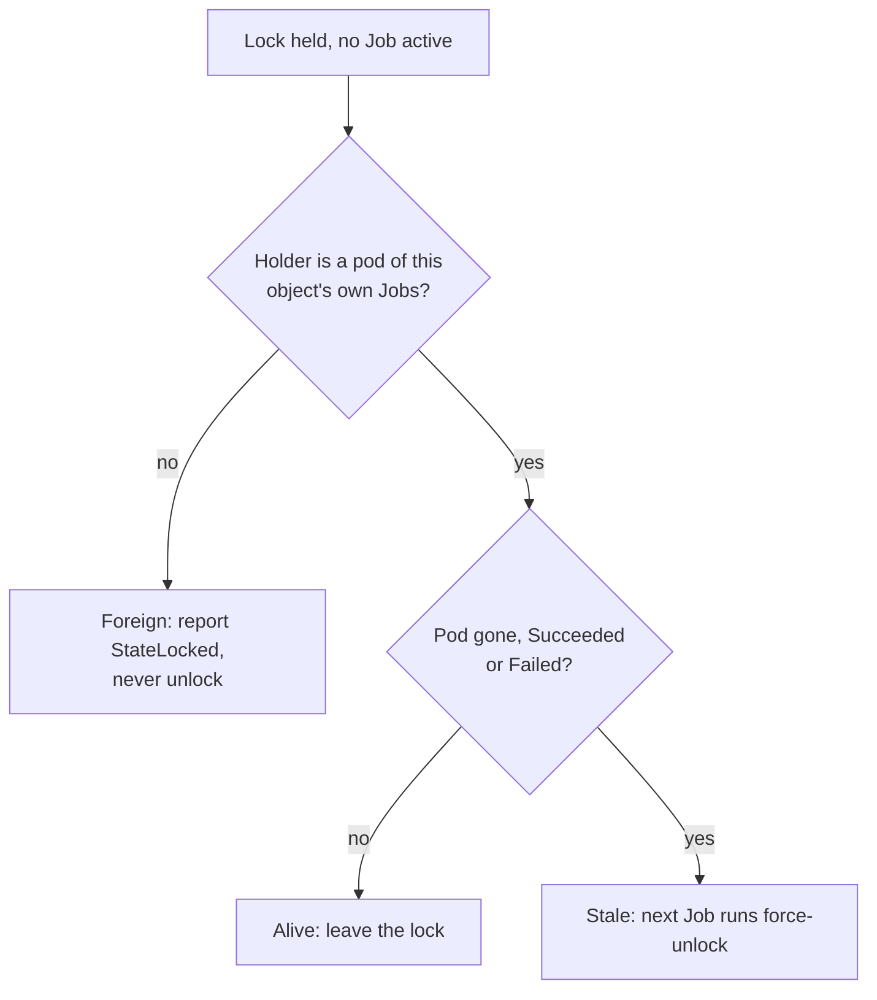

# The State Lock and Stale Locks

CAPTF has two kinds of lock, and they answer different questions.

| | CAPTF's leases | The Terraform state lock |
| --- | --- | --- |
| Question | May this object start a Job? | May this runner step read and write the state? |
| Taken | Before the Job exists | By Terraform or OpenTofu, per step |
| Held by | The name of the Job about to run | The runner's pod, by hostname |
| Objects | `captf-run-<suffix>`, `captf-cluster-<hash>` | `lock-tfstate-default-<suffix>` |
| Released by | The controller | The runtime, or the next Job's `force-unlock` |
| Waiting costs | Nothing: no Job exists | A pod, and `lockTimeoutSeconds` |

Because the run lease allows one Job per object, two CAPTF Jobs never
contend for one object's state lock. What can hold it is a **leftover** of a
runner that died, or a **foreign** holder such as a workstation. This page
covers how the controller tells those apart and what it does about each.

## Where the lock lives

The Kubernetes backend keeps the state in `tfstate-default-<suffix>` Secrets
and the lock in the Lease `lock-tfstate-default-<suffix>`. The lock's
details are in the annotation `app.terraform.io/lock-info`, a JSON document
with `ID`, `Operation`, `Who`, `Version` and `Created`. `Who` is
`user@hostname`, and inside a Job the hostname is the pod's name.

A Job's pod name is `<job>-<5 characters>`, and Job names are capped at 57
characters, so the hostname is the **whole** pod name and never truncated.
That is what lets the controller recognize its own runner.

## The stale-lock rules

The controller checks the lock only when no Job of the object is active, in
the same bookkeeping pass that reads the finished Jobs. A held lock is
**stale** only when all of these hold:

1. The Lease has a holder, and the lock info parses.
2. The part of `Who` after the last `@` names a pod of **this object's own
   Jobs**: it matches the Job-name pattern for this kind and object, for
   any op and attempt, followed by five characters. Any other holder is
   "unknown" and is never stale.
3. That pod, read live from the API server, does not exist, or has reached a
   terminal phase (`Succeeded` or `Failed`). A finished Job keeps its pod
   object until pruned, and its containers have exited, so an OOM-killed or
   evicted runner leaves exactly this. A pod that is only terminating still
   counts as alive, because it may be running the runtime inside its grace
   period.

The lock ID to release is `ID` from the lock info, else the Lease's holder
identity.

## What happens to a stale lock

The controller does not unlock it itself. It hands the ID to the **next Job**
it starts, which runs `init` and then `force-unlock -force <id>` before its
own operation:

- A stale lock that is already gone by then, or one a different holder took
  since (`state is already unlocked`, `does not match existing lock`), is
  not an error.
- The controller emits a `ForceUnlocked` Warning event naming the Job when
  it starts it, and counts the force unlock in its metrics.

So a stale lock is cleared by whichever Job runs next: an apply, a refresh,
a drift check or a destroy. If nothing is due to run (an apply waiting for
approval, for example), the lock stays until something does. See
[Stale State Lock](../../operator-guide/runbooks/stale-lock.md).

## A foreign lock

If the lock is held and its holder is **not** one of the object's own
runner pods, the controller never unlocks it.

!!! warning "A foreign lock may be mid-write"

    A lock held from a workstation running `terraform state rm` could be
    mid-write, and the controller cannot know.

It sets `StateReadable=False`/`StateLocked` with the
holder, the operation and the time from the lock info, emits `StateLocked`,
and keeps starting Jobs as usual. Every such Job waits `lockTimeoutSeconds`
for the lock, then fails, and the failures back off. Release the lock with
`force-unlock` once the holder is gone, and the next Job proceeds.

`StateLocked` is not a deletion hold: the state reads, so the destroy
starts and waits like any other Job. See [Held
deletions](../deletion/held.md#what-holds-a-deletion).

## Where the deadline fits

The lock wait is bounded by `lockTimeoutSeconds`, which must be less than
the Job's deadline so a wait alone cannot consume it. See [Deadlines and
lock timeouts](deadlines.md#the-lock-timeout).

!!! related "See also"

    - [Terraform State: locks](../state.md#locks).
    - [Slow Jobs](../../operator-guide/runbooks/slow-jobs.md).
    - [Unreadable State](../../operator-guide/runbooks/state-unreadable.md#statelocked).
