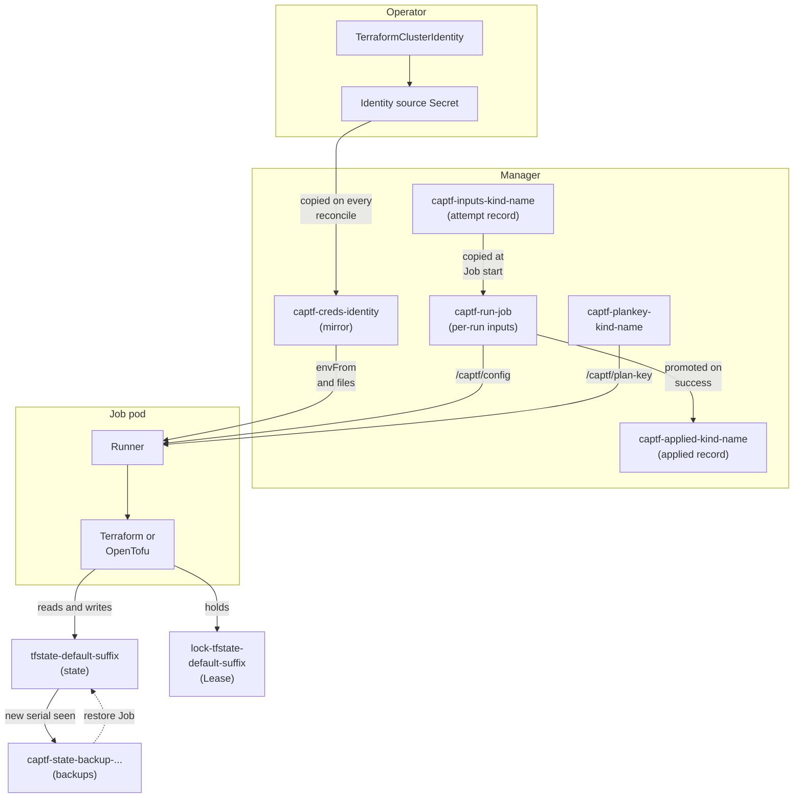

# Secret Management

CAPTF keeps everything it needs between Jobs in Kubernetes Secrets and
Leases: the Terraform state, the backups of it, the rendered inputs of each
run, the cloud credentials, and a key for the plan approval. This chapter
follows each of them from creation to deletion. It explains how they
connect, how they reach the Terraform runtime inside a Job, and what an
operator needs to provide, protect and back up.

The chapter has these pages:

-   :material-database-lock:{ .lg .middle } __Terraform State Secrets__

    ---

    Storage, naming, chunking, the integrity checks, the inputs hash and
    adoption.

    [:octicons-arrow-right-24: Terraform State Secrets](state.md)

-   :material-scale-balance:{ .lg .middle } __Terraform vs OpenTofu Storage__

    ---

    Why Terraform state can grow past 1 MiB and OpenTofu state cannot,
    and switching runtimes.

    [:octicons-arrow-right-24: Terraform vs OpenTofu Storage](runtimes.md)

-   :material-backup-restore:{ .lg .middle } __Backups and Restore__

    ---

    When a backup is taken, how many are kept, and how a restore runs.

    [:octicons-arrow-right-24: Backups and Restore](backups.md)

-   :material-key-chain:{ .lg .middle } __Credentials__

    ---

    An identity's source Secret, the per-namespace mirror, rotation and
    revocation.

    [:octicons-arrow-right-24: Credentials](credentials.md)

-   :material-file-lock:{ .lg .middle } __Run Inputs and the Plan Key__

    ---

    The durable and per-run inputs Secrets and the key behind the plan
    hash.

    [:octicons-arrow-right-24: Run Inputs and the Plan Key](run-inputs.md)

-   :material-cube-outline:{ .lg .middle } __Inside the Job__

    ---

    Volumes, environment, RBAC, the runner's steps and lock handling.

    [:octicons-arrow-right-24: Inside the Job](job.md)

-   :material-timeline-text-outline:{ .lg .middle } __Lifecycle Walkthroughs__

    ---

    Create, apply, drift, change, delete, `clusterctl move`, namespace
    deletion and lost state.

    [:octicons-arrow-right-24: Lifecycle Walkthroughs](lifecycle.md)

-   :material-file-cog-outline:{ .lg .middle } __Operator Files and Settings__

    ---

    The manifests, flags and backups you own.

    [:octicons-arrow-right-24: Operator Files and Settings](operator-files.md)

-   :material-shield-alert-outline:{ .lg .middle } __Security Considerations__

    ---

    The trust boundaries, stated plainly.

    [:octicons-arrow-right-24: Security Considerations](security.md)

This page is the inventory of every Secret and Lease, and how they relate.

Existing pages cover parts of this ground from other angles, and are
linked rather than repeated: [Terraform State](../state.md),
[Job Inputs](../inputs.md), [Identities and
Credentials](../../user-guide/identities.md), [Plan
Approval](../../user-guide/plan-approval.md), the [Security
Model](../security-model.md), [Secrets](../../operator-guide/secrets.md)
(which also lists the Secrets CAPTF only reads, such as bootstrap data) and
the [runbooks](../../operator-guide/runbooks/README.md).

## The objects at a glance

`<suffix>` is the state suffix: the first 16 hex characters of
`sha256(<namespace>/<kind>/<name>)`, a hyphen and `c`, `m` or `mp` (see
[Terraform state](state.md#names-and-the-suffix)). `<kindshort>` is `c`,
`m` or `mp` for a `TerraformCluster`, `TerraformMachine` or
`TerraformMachinePool`. "The object" below is that `Terraform*` object.

| Name pattern | Kind | Created by | Owner | Contents | Moves with `clusterctl move` | Deleted when |
| --- | --- | --- | --- | --- | --- | --- |
| `tfstate-default-<suffix>` and `-part-N` | Secret | The Terraform or OpenTofu `kubernetes` backend, inside the Job | The object, as a non-blocking owner reference, set after the first successful apply. A chunk without one (written by a refresh or drift Job, or restored without references) or naming an earlier UID is owned again on the next reconcile | Gzipped state under the key `tfstate` | Yes: it carries the move label | Cleanup after a destroy or a delete with no state; kept, with the owner reference removed and a `captf.io/retained-from-uid` label, by a Retain |
| `lock-tfstate-default-<suffix>` | Lease | The backend, when a run takes the lock | None | The lock holder's information | No: a Lease is not discovered; the backend recreates it | Cleanup, with the state |
| `captf-state-backup-<suffix>-<serial>` and `-part-N` | Secret | The manager, after it sees a new serial | The object (non-controller reference); re-owned after a restore | A verbatim copy of the state chunks | Yes: it carries the move label | With the object, by garbage collection; pruned beyond `--state-backups`. A Retain removes the owner reference and keeps them |
| `captf-inputs-<kindshort>-<name>` | Secret | The manager, after it creates an apply Job (the attempt record) | The object; re-owned after a restore | The rendered root module and tfvars of the newest attempt, plus the image, identity, inputs hash, Job, applied marker and bookkeeping annotations | Yes, by following the owner reference | Cleanup; kept, with the owner reference removed, by a Retain |
| `captf-applied-<kindshort>-<name>` | Secret | The manager, when it reads a newly finished successful apply (the applied record) | The object; re-owned after a restore | The rendered root module and tfvars of the newest successful apply, plus its image, digest, identity, inputs hash and Job | Yes, by following the owner reference | Cleanup; kept, with the owner reference removed, by a Retain |
| `captf-run-<job>` | Secret | The manager, right after it creates the Job | The Job | The same two rendered files, plus the image, identity and inputs hash | Not applicable: it lives only while the Job does | After the manager promotes it to the applied record, not when it first sees the Job finished |
| `captf-plankey-<kindshort>-<name>` | Secret | The manager, before a plan or approved apply Job | The object; re-owned after a restore | 32 random bytes under the key `key` | Yes, by following the owner reference | Cleanup |
| `captf-creds-<identity>` (the mirror) | Secret | The manager, on a reconcile of an object that uses the identity | Each object that uses it (non-controller references); a using object's reference to its earlier UID is replaced | A copy of the identity's source Secret data | Yes, and it is rewritten from the source on the target | When its last user is gone, or when the namespace stops being allowed |
| The identity's source Secret (any name) | Secret | The operator | None | Cloud credentials | No: copy it to the target yourself | By the operator |
| `captf-run-<suffix>` | Lease | The manager, before it starts a Job | None | The run lease: one Job at a time per object | No: a Lease is not discovered | When the Job finishes, at cleanup, and by the namespace sweep |
| `captf-cluster-<hash>` | Lease | The manager, for a `TerraformCluster`'s apply, destroy or restore | None | The cluster write lease: machines and pools wait on it | No | When the Job finishes, at cleanup, and by the namespace sweep |

The labels and annotations on each are in [Annotations, Labels and
Finalizers](../../reference/annotations-labels.md); this chapter names the
ones that matter to the behavior it describes. Every Secret the manager
creates carries `captf.io/managed=true`, which is also what its cache
selects on (see [What the manager caches](../../operator-guide/secrets.md#what-the-manager-caches)).

## How they connect

The flow, in words. An operator creates the identity's source Secret and
the `TerraformClusterIdentity` that names it. When an object runs, the
manager mirrors the source into the object's namespace and renders the
object's inputs into a per-run Secret that belongs to one Job, and records
them in the durable Secret. When the Job succeeds, the per-run copy is
promoted into the applied Secret. The Job's runner receives the per-run
Secret, the mirror and, for a plan, the plan key; it runs Terraform, which
reads and writes the state Secrets and holds the lock Lease through the
cluster API. The manager reads the state back, takes a backup when the
serial is new, and records the outcome in status.

Two rules explain most of what follows:

- **State is the source of truth for what exists.** Status is rebuilt from
  state, which is why status is not restored by `clusterctl move`, and why
  a [marker on the durable inputs Secret](lifecycle.md#lost-state) is
  needed to remember that an object ever applied.
- **Everything a Job reads is a copy.** The per-run Secret is written once
  and never rewritten, so a Job never sees inputs change under it, and the
  mirror is rewritten only by the manager, never by the Job.

!!! related "See also"

    - [Secrets](../../operator-guide/secrets.md), the inventory including the
      Secrets CAPTF only reads.
    - [Terraform State](../state.md) and [Job Inputs](../inputs.md).
    - [Security Model](../security-model.md).
