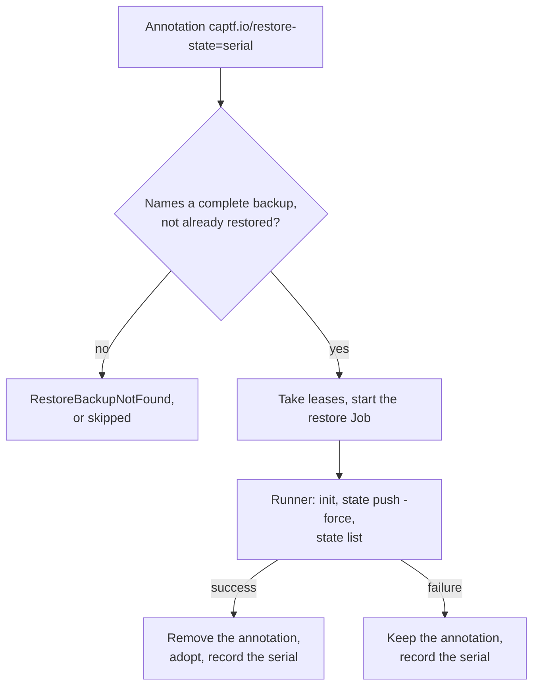

# Backups and Restore

The backend keeps only the latest state. To let you recover from a lost or
damaged state Secret, the manager copies the state aside whenever it
changes. This page covers when a backup is taken, how backups are named,
labeled and pruned, and how a restore moves one back. The procedure is the
[state restore runbook](../../operator-guide/runbooks/state-restore.md);
this page explains what happens underneath it.

## When a backup is taken

The manager takes a backup when a reconcile reads a state serial it has not
seen for the object, which happens after an apply, a refresh, a drift Job
or a restore. It does not take one before an operation, so a backup is
always a snapshot of something that already happened, never a safeguard in
front of a change.

No backup is taken when:

- `--state-backups` is `0` (existing backups stay restorable);
- the object is being deleted;
- the state is unreadable (encrypted, corrupt, inconsistent or of an
  unsupported version);
- the serial is below 1.

A copy that fails on a transient API error is retried on the next
reconcile, since that serial is not yet recorded as seen. Each outcome is
counted in `captf_state_backups_total` (see
[Metrics](../../reference/metrics.md)).

## What a backup looks like

A backup is a set of Secrets, one per state chunk, copied verbatim:

- **Name:** `captf-state-backup-<suffix>-<serial>`, with `-part-N` for
  further chunks. If a Secret for the same serial already exists with
  different content, as happens after a restore, the name gains
  `-<digest8>`, the first eight characters of the digest.
- **Labels:** the five backend labels (see [Terraform state
  Secrets](state.md#labels)) plus `captf.io/state-backup=true` and
  `captf.io/state-backup-suffix=<suffix>`. It carries none of the `tfstate*`
  labels, so Terraform never mistakes a backup for live state.
- **Annotations:** `captf.io/state-backup-serial`, `-lineage`, `-taken-at`,
  `-source-job` (when known), `-digest` (SHA-256 of the concatenated
  compressed payload), `-resources` (managed resource count), `-set` (the
  base name), `-chunk` (this chunk's index) and `-chunks` (the count), and
  `captf.io/inputs-hash` on the first chunk.
- **Owner:** the `Terraform*` object, through a non-controller reference
  with `blockOwnerDeletion` unset. The state Secret is never the owner,
  which is why a backup survives the state being deleted by hand. After a
  restore, the next reconcile of the object replaces a missing or earlier-UID
  reference.

A set is **complete** when it has between 1 and 32 chunks, every index is
present and the serial is at least 1. Only complete sets are listed or
restorable.

## Retention

`--state-backups` (default 5) is how many complete sets the manager keeps
per object. After each backup it prunes the rest, newest first:

- Only complete sets count toward the number kept.
- An incomplete set is deleted, except the newest set overall, which may
  still be written.
- A set whose serial is named by a pending `captf.io/restore-state`
  annotation is never pruned and does not count toward the limit.

`status.stateBackups` lists the complete sets, newest first, at most 16.
Each entry has the `serial`, the `takenAt` time and the `bytes`, the
compressed size summed over the chunks.

!!! warning "Backups are a convenience, not disaster recovery"

    A run of failed or wrong applies writes a new serial each time, so
    five backups can hold five bad states and no good one. See
    [Security considerations](security.md#backups-are-not-disaster-recovery).

## Restore

A restore pushes a backup into the backend through a Job.

The sequence:

1. You set `captf.io/restore-state=<serial>` on the object.
2. The controller re-reads the annotation and `status.lastRestoredSerial`
   from the API server, not from its cache. A value that is not a serial,
   or that names no complete backup, sets
   `RestoreJobSucceeded=False`/`RestoreBackupNotFound` and starts nothing.
   A serial equal to `status.lastRestoredSerial` is skipped.
3. The controller takes the object's run lease (and the cluster write lease
   for a `TerraformCluster`) and starts a restore Job. Its root module
   declares only the backend, and its `captf-run-<job>` Secret carries an
   empty tfvars file. Its config volume is a projection of that Secret plus
   each backup chunk, mapped to `restore/<i>`.
4. The runner reassembles the chunks under the reader's caps, checks that
   the result is valid JSON, and writes `restore.tfstate` with mode `0600`.
5. It runs `init`, a force-unlock only if the controller handed it a stale
   lock's ID, `state push -force`, then `state list`. The Job fails if
   `state list` shows no managed resource although the backup recorded
   some.
6. Success or failure records the serial in `status.lastRestoredSerial`. On
   success the controller removes the annotation, the restored state is
   adopted with the backup's inputs hash, and the next reconcile reads it.
   A restore Job always carries `captf.io/inputs-hash`, empty for a backup
   taken without one; after such a restore the controller removes the hash
   from the state, which then reads as `StateWithoutInputsHash` (a mutable
   kind applies again; an immutable provisioned kind gets `StateLost`).
   On failure the annotation stays.

To retry the same serial after a failure, remove the annotation, wait until
`status.lastRestoredSerial` clears, then set the annotation again;
deleting the failed Job does not retry.

A deleting object does not restore, with one exception: when the deletion
is held because the state is lost or unreadable, the restore runs first
and the destroy follows (see [lost state](lifecycle.md#lost-state)).

Restoring writes back exactly the backup's serial, which is already backed
up, so it adds no new backup.

!!! warning "Resources created after the restored serial are orphaned"

    Resources created after that serial remain in the cloud and are no
    longer in the state.

!!! related "See also"

    - [State restore runbook](../../operator-guide/runbooks/state-restore.md).
    - [Terraform State](../state.md#state-backups).
    - [`--state-backups`](../../reference/manager-flags.md).
