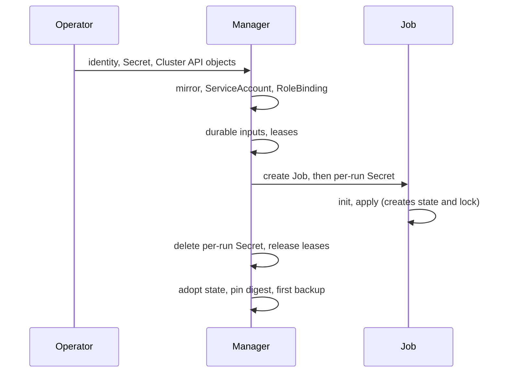

# Lifecycle Walkthroughs

This page follows the Secrets and Leases through the events of an object's
life. It uses a `TerraformMachine` as the running example; a
`TerraformCluster` and a `TerraformMachinePool` differ only where noted.
Each section names the page that covers the detail.

## Create and first apply

1. You create the identity's source Secret and the
   `TerraformClusterIdentity` (see [Credentials](credentials.md)), then the
   Cluster API objects. Cluster API creates the `TerraformMachine` and
   makes the `Machine` its owner.
2. The manager's reconcile resolves the identity, makes sure the mirror
   `captf-creds-<identity>` is current, and creates the `captf-runner`
   ServiceAccount and RoleBinding in the namespace if they are missing.
3. It renders the inputs, writes the durable `captf-inputs-<kindshort>-<name>`
   Secret, takes the run lease (and, for a `TerraformCluster`, the cluster
   write lease), creates the Job, and creates the per-run `captf-run-<job>`
   Secret for it.
4. The Job's runner runs `init` and `apply`. Terraform creates
   `tfstate-default-<suffix>` and the lock Lease `lock-tfstate-default-<suffix>`.
   Neither is owned by anything yet.
5. When the Job finishes, the manager deletes the per-run Secret and
   releases the leases, reads the state, and adopts it: it adds the owner
   reference to every chunk and sets `captf.io/inputs-hash`. It pins the
   image digest and sets `captf.io/applied` on the durable Secret, and
   takes the first backup, `captf-state-backup-<suffix>-<serial>`.

## Refresh and drift

A refresh or drift Job runs against the existing state: it takes the run
lease, gets a new per-run Secret, and holds the state lock while it runs.
If it writes a new serial, the manager sees it on the next reconcile and
takes a backup. A refresh does not change the inputs hash, so it does not
adopt the state again; any chunk it creates has no owner reference until
the next adoption.

## A change

For a mutable object, a change in the image or the inputs produces a new
inputs hash. The manager rewrites the durable Secret (an image change also
clears the pinned digest), starts an apply Job with a new per-run Secret,
and adopts the state with the new hash when it succeeds. With
`applyPolicy: Manual`, a plan Job runs first with the plan key mounted, and
the apply waits for your approval (see [Run inputs and the plan
key](run-inputs.md#the-plan-key)). Each new serial adds a backup, and the
oldest complete set beyond `--state-backups` is pruned.

An immutable `TerraformMachine` never re-renders after it is provisioned: a
change means a new object, and the durable Secret keeps what the old one
needs for its destroy.

## Delete

1. You delete the object, or Cluster API deletes it with its `Machine`. The
   manager refreshes the mirror just before it creates the destroy Job, so
   the Job has credentials, and takes the leases.
2. The Job's runner runs `init` and `destroy`.
3. When the destroy succeeds, cleanup deletes the state Secrets one by
   one and the lock Lease, the durable inputs Secret, the plan key and the
   leases, removes the object's reference from the mirror (the mirror is
   deleted if it was the last), and removes the finalizer.
4. The state backups are not deleted by cleanup. They are owned by the
   object, so Kubernetes garbage-collects them when the object is gone.
5. When the namespace has no `Terraform*` objects left, the manager deletes
   the managed ServiceAccounts, RoleBindings and Leases in it.

An object that never applied has no state, so it is deleted at once, with
the same cleanup.

## `clusterctl move`

`clusterctl move` copies the objects it discovers to the target, then
deletes them from the source with their finalizers stripped, so the
manager's own delete path never runs on the source. What arrives:

- The state chunks, the backups and the durable inputs Secret, which carry
  the move label or an owner reference to a moved object. The plan key and
  the mirror also follow their owners.
- Not the identity's source Secret: you copy it yourself.
- Not the Leases. The backend recreates the lock Lease at the target's next
  `init`, and the manager takes new run leases.
- Not status. The target rebuilds it from the state on its first
  reconcile, which is what `captf.io/applied` on the durable Secret is for.

The procedure is the [`clusterctl move` runbook](../../operator-guide/runbooks/move.md).

## Namespace deletion

Every Secret CAPTF keeps is namespaced, so deleting a namespace removes
the state, the backups and the durable inputs together with the objects.

!!! danger "Deleting a namespace orphans the cloud resources"

    The cloud resources are not touched by that.

Two consequences follow:

- An object whose namespace is terminating that never applied finishes at
  once. One that applied is held, and you can [abandon
  it](../../operator-guide/runbooks/stuck-destroy.md#abandon-instead). A
  destroy or restore that waits on credentials shows that in the
  `Deleting` condition and retries.
- After a move, an object in a namespace that is then deleted cannot be told
  apart from one that never applied, because the marker went with the
  Secret. Move first, then delete the source namespace only when the target
  has taken over.

## Lost state

If the state Secrets disappear (someone deletes them by hand, or an
etcd restore brings back an older cluster state without them), the manager
decides from what remains whether the object ever applied. It counts it as
applied when any of these is true:

- the object is provisioned;
- the durable inputs Secret carries `captf.io/applied: "true"`;
- the durable inputs Secret pins an image digest;
- a state backup exists.

An applied object with no state reports `StateReadable=False`/`StateLost`.
No Job runs.

!!! warning "Applying again would duplicate live resources"

    Applying again would create a second set of resources next to the live
    ones.

A deleting object is held: its finalizer stays and the
backups are preserved. You choose:

- **Restore**, with `captf.io/restore-state=<serial>` from
  `status.stateBackups`. The restore runs first, then the normal destroy
  (see [Backups and restore](backups.md#restore)).
- **Abandon**, with `captf.io/abandon-infrastructure=<uid>`. The finalizer
  is removed without a destroy, the infrastructure stays running untracked,
  and the backups go with the object.

An object that never applied has nothing to lose, so it is deleted
immediately. The runbooks are [unreadable
state](../../operator-guide/runbooks/state-unreadable.md#deleting-while-state-is-unreadable)
and [state restore](../../operator-guide/runbooks/state-restore.md).

!!! related "See also"

    - [The reconcile lifecycle](../lifecycle.md).
    - [Terraform State](../state.md#state-on-deletion).
    - [Runbooks](../../operator-guide/runbooks/README.md).
