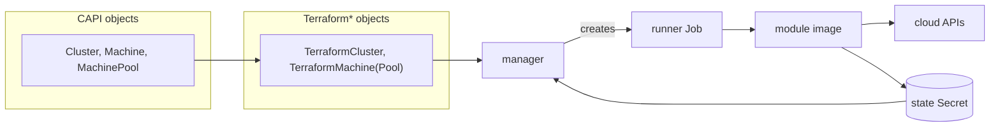

# Your modules are the provider

Cluster API Provider Terraform (CAPTF) is a Cluster API infrastructure
provider that provisions cluster infrastructure by running Terraform or
OpenTofu modules as Kubernetes Jobs, instead of implementing
cloud-specific logic in Go.

[Quick Start](getting-started/quick-start.md){ .md-button .md-button--primary }
[Choose a cloud](cloud-modules/README.md){ .md-button }
[Write a module](getting-started/first-module.md){ .md-button }

## Why CAPTF exists

Cluster API needs one infrastructure provider per cloud, and most teams
already have Terraform or OpenTofu modules that provision that cloud's
infrastructure. CAPTF turns a module written to its contract into a Cluster
API infrastructure provider directly: you package the module as an OCI
image, and CAPTF runs it, reads its outputs back from state, and reconciles
`Cluster`, `Machine` and `MachinePool` objects against them.

There is no Go controller to write for a new cloud, and no second copy of
infrastructure logic to keep in sync with the module that already exists.

## Find your path

-   :material-rocket-launch:{ .lg .middle } __Try it__

    ---

    Install the provider and bring up a cluster with the no-op modules,
    on any Kubernetes cluster and with no cloud account.

    [:octicons-arrow-right-24: Quick Start](getting-started/quick-start.md)

-   :material-kubernetes:{ .lg .middle } __Run clusters__

    ---

    Credentials, module variables, ClusterClass templates, machine pools,
    drift, plan approval and teardown.

    [:octicons-arrow-right-24: User Guide](user-guide/identities.md)

-   :material-cloud-outline:{ .lg .middle } __Use a cloud module__

    ---

    Reference modules for AWS, Google Cloud, Azure, OCI and OpenStack,
    and what each one creates.

    [:octicons-arrow-right-24: Cloud Modules](cloud-modules/README.md)

-   :material-puzzle-outline:{ .lg .middle } __Write a module__

    ---

    Write, lint and package a module to the `v1alpha1` contract, then
    integrate it with a control plane.

    [:octicons-arrow-right-24: Module Authors](getting-started/first-module.md)

-   :material-cog-outline:{ .lg .middle } __Operate the manager__

    ---

    Install, configure, secure, observe, upgrade and recover the CAPTF
    manager.

    [:octicons-arrow-right-24: Operations](operator-guide/installation.md)

-   :material-lifebuoy:{ .lg .middle } __Fix something__

    ---

    Start from a condition, an event, an alert or a symptom, and follow
    the runbook.

    [:octicons-arrow-right-24: Troubleshooting](operator-guide/troubleshooting/README.md)

## How it fits together

Cluster API's core objects (`Cluster`, `Machine`, `MachinePool`) reference
CAPTF's own objects (`TerraformCluster`, `TerraformMachine`,
`TerraformMachinePool`) as their infrastructure. The CAPTF manager
reconciles those objects, renders their inputs, and runs a Kubernetes Job
for each operation. The Job's runner executes a Terraform or OpenTofu module
image against those inputs, calling the cloud's own APIs, and its state —
including the outputs the manager reads back — lives in a Kubernetes Secret.
See [Architecture](concepts/architecture.md) for the components behind this
diagram and how one apply flows through them.

## Project status

!!! warning "Pre-release: `v1alpha1`"

    Every kind — `TerraformCluster`, `TerraformClusterTemplate`,
    `TerraformMachine`, `TerraformMachineTemplate`, `TerraformMachinePool`,
    `TerraformMachinePoolTemplate` and `TerraformClusterIdentity` — is at
    API version `v1alpha1`. The module contract they implement is also
    `v1alpha1` and provisional: it is frozen for implementation, but may
    still change before the first real module has provisioned a cluster
    with it (see the contract's
    [changelog](module-author/contract/v1alpha1/CHANGELOG.md)).

    CAPTF's end-to-end coverage is narrow and opt-in: two suites run on a
    local kind cluster, one against the installed components and one driving
    the noop modules, and neither runs in CI. No real cloud has been
    exercised. See [Testing](developer-guide/testing.md) for how the test
    suite is organized, and [Known Limitations](operator-guide/limitations.md)
    for everything CAPTF does not do yet.
