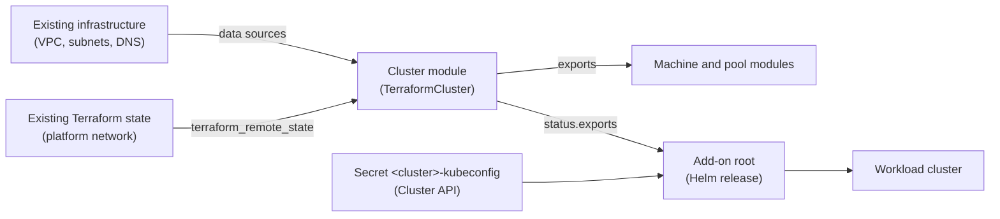

# Building on Existing State

A Cluster API provider written in Go reads only what its CRD fields express.
A CAPTF module is ordinary Terraform, so it can read anything Terraform can
read: the network a platform team already built, another team's Terraform
state, the exports of the cluster module itself. This guide shows what that
allows, with working examples: adopting infrastructure that exists, handing
values forward to machines and pools, and running a later Terraform root
(here a Helm add-on) that builds on what CAPTF created.



## What this gives you

- **Adopt what exists instead of describing it in manifests.** A module
  looks up the VPC, subnets or images you already run, so a manifest carries
  an ID or a name, not a copy of the network. See [Read infrastructure that
  already exists](#read-infrastructure-that-already-exists).
- **One dependency graph from network to add-ons.** The values a module needs
  come from the thing that owns them, so there are no copied IDs and no tag
  lookups to keep in step. See [Read another Terraform
  state](#read-another-terraform-state).
- **Values flow forward through `exports`.** What the cluster module learns
  or creates reaches every machine and pool as an input. See [Hand values
  forward with exports](#hand-values-forward-with-exports).
- **The same language, state and review workflow for day-2 add-ons.** A later
  Terraform root reads the cluster's `status.exports` and installs software
  into the workload cluster. See [Build on CAPTF's state in later
  runs](#build-on-captfs-state-in-later-runs).
- **Drift checks notice when the world under a cluster changes.** A changed
  upstream value shows up as drift on the next check. See [When upstream
  state changes](#when-upstream-state-changes).

## Read infrastructure that already exists

A module reads infrastructure it does not own with data sources. The
reference modules do this for the network you bring: the VPC, the subnets and
their zones are inputs by ID, and the module looks each one up. This is the
VPC read in [`aws-modules/cluster/data_cluster_vpcs.tf`](https://github.com/captf-io/aws-modules/blob/main/cluster/data_cluster_vpcs.tf):

```hcl
# The VPC named by vpc_id, as a listing: it returns no ID, rather than
# failing, once the VPC is gone, so a destroy (which reads data sources too)
# still runs after the network was deleted.
data "aws_vpcs" "cluster_vpcs" {
  filter {
    name   = "vpc-id"
    values = [coalesce(var.vpc_id, "-")]
  }
}
```

The subnets are read the same way, one listing per availability zone, in
[`data_node_subnets.tf`](https://github.com/captf-io/aws-modules/blob/main/cluster/data_node_subnets.tf).
The other clouds follow the pattern:
[`azure-modules/cluster/data_node_virtual_network.tf`](https://github.com/captf-io/azure-modules/blob/main/cluster/data_node_virtual_network.tf),
[`openstack-modules/cluster/data_node_subnet.tf`](https://github.com/captf-io/openstack-modules/blob/main/cluster/data_node_subnet.tf)
and
[`oci-modules/cluster/data_network_vcns.tf`](https://github.com/captf-io/oci-modules/blob/main/cluster/data_network_vcns.tf).

The IDs reach the module as user variables: set `vpc_id` and `subnets` on the
object, as [Module Variables](../user-guide/variables.md) describes. The
[Cloud Modules](../cloud-modules/README.md#what-you-bring) page lists what
you bring for each cloud.

!!! note "Advice from the reference modules"

    The reference modules' `CONVENTIONS.md` (section 9, Outputs) asks that a
    data source must not fail once a brought resource is gone, because
    `destroy` refreshes data sources too. They prefer listing reads, which
    return an empty result, over singular reads, which error, and they report
    a missing resource with a `precondition` at plan time. A module that
    follows this still destroys cleanly after someone deleted the network
    first. This is the reference modules' rule, not a requirement of the
    contract.

## Read another Terraform state

When another team publishes its infrastructure as Terraform outputs, a module
can read them with `terraform_remote_state`. This sketch reads an S3 network
state and feeds the cluster module's subnets and VPC. It is an example, not
code from the reference modules:

```hcl
data "terraform_remote_state" "network" {
  backend = "s3"
  config = {
    bucket = "acme-platform-tfstate"
    key    = "network/prod.tfstate"
    region = "us-east-1"
  }
}

locals {
  vpc_id             = data.terraform_remote_state.network.outputs.vpc_id
  private_subnet_ids = data.terraform_remote_state.network.outputs.private_subnet_ids
}
```

Nothing in the contract restricts this: it is ordinary Terraform.
[tfcapi-lint](tfcapi-lint.md) treats `terraform_remote_state` as a built-in
data source, so no provider needs to be in the mirror for it. A module must
still not declare its own `backend` block, because CAPTF supplies the
backend; the `backend` argument above is a data source setting, not a backend
for the module.

Three practical points:

- **Credentials.** The Job gets the identity's credentials as environment
  variables and as files under `/var/run/captf/credentials`
  ([Job Environment](../reference/environment.md#identity-credentials)). The
  runner removes `HOME`, every `TF_*` and every `KUBE_*` variable (except
  `TF_IN_AUTOMATION`, `TF_INPUT` and `KUBE_NAMESPACE`), but `AWS_*`,
  `GOOGLE_*` and `ARM_*` stay. An S3, GCS or `azurerm` state read therefore
  uses the identity's credentials, and the identity must be allowed to read
  that state bucket.
- **Network.** CAPTF applies no `NetworkPolicy` to Job pods by default. If
  your operator applies one, such as the
  [`job-egress-sample.yaml`](https://github.com/captf-io/cluster-api-provider-terraform/blob/main/config/network-policy/job-egress-sample.yaml),
  it must allow the state backend's endpoint.
- **Which to choose.** Prefer data sources when the thing exists on its own,
  such as a VPC that has an ID and tags. Prefer remote state when the other
  root's outputs are the agreed interface between teams.

A module can also read the state of another CAPTF object, for example a
second cluster's, because a Job can read Secrets in its namespace. That
couples the two objects and widens what a module touches; see [The runner can
reach every Secret in its
namespace](../concepts/secret-management/security.md#the-runner-can-reach-every-secret-in-its-namespace)
and [What the runner can
read](../concepts/security-model.md#what-the-runner-can-read-and-why). Pass
values between CAPTF objects with `exports` instead.

## When upstream state changes

A drift Job runs `apply -refresh-only`, then `plan -refresh=false`; any change
in that plan is drift
([Drift and Health](../concepts/drift-and-health.md)). Data sources and
remote state are read again on every drift check. What follows from the
mechanics:

- A changed upstream data source or remote state does not start an apply by
  itself. Only a change to the inputs hash does. If the new value would
  change resources, the next drift check's plan shows it as drift.
- With `Report`, the default, the check only sets `DriftDetected`.
- With `Remediate`, which only a `TerraformCluster` or a
  `TerraformMachinePool` can select (machines are always `Report`), CAPTF
  re-applies. A cluster's remediation goes through the destructive-plan
  guard, or the approval flow under `Manual`. A pool's remediation is not
  guarded. See [Report or
  remediate](../concepts/drift-and-health.md#report-or-remediate).

So keep the upstream outputs a module reads stable, and add
`precondition` blocks that fail loudly when a value is missing or malformed,
rather than letting a plan quietly propose a replacement:

```hcl
resource "terraform_data" "network_check" {
  lifecycle {
    precondition {
      condition     = length(local.private_subnet_ids) >= 2
      error_message = "The platform network must publish at least two private subnets."
    }
  }
}
```

## Hand values forward with exports

The cluster's `exports` output is the only handoff from the cluster module to
its machines and pools. CAPTF renders it into `captf_cluster_outputs` for
each of them ([What a cluster hands to its machines and
pools](../concepts/inputs.md#5-what-a-cluster-hands-to-its-machines-and-pools)).
Put in it what they need: the network, the failure domains with their
subnets, security groups, instance profiles. This is the `exports` of
[`aws-modules/cluster/locals_exports.tf`](https://github.com/captf-io/aws-modules/blob/main/cluster/locals_exports.tf),
trimmed:

```hcl
exports = {
  schema                = "captf.io/aws-cluster/v1"
  region                = data.aws_region.current_region.region
  vpc_id                = local.vpc_id
  kubernetes_cluster_id = local.kubernetes_cluster_id
  failure_domains       = { for z, d in local.failure_domains : z => { subnet_id = d.subnet_id } }
  security_group_ids    = { ... }
  instance_profiles     = local.node_instance_profile_names
  api                   = { host = ..., port = ..., target_groups = { ... } }
  bootstrap_bucket      = try(aws_s3_bucket.bootstrap_bucket[0].bucket, null)
}
```

A machine module then reads `var.captf_cluster_outputs` instead of looking the
network up again, so a machine lands in the subnets and groups the cluster
chose.

Rules that matter here:

- **No secrets.** The contract says to put secrets in the identity, not in
  `exports` ([`exports` output](contract/v1alpha1/cluster.md#exports-output)).
- **Timing differs by kind.** A machine latches the exports at its first
  apply. A pool reads them on each reconcile, and a change re-applies it
  under the destructive-plan guard ([Cluster outputs reach pools and
  machines](../concepts/approvals/limits.md#cluster-outputs-reach-pools-and-machines)).
  A changed export does not reach machines that already exist.
- **Keep it stable.** Adding a key keeps the schema; renaming or removing one
  needs a new schema version. See [Design exports for
  stability](design-patterns.md#design-exports-for-stability).

## Build on CAPTF's state in later runs

The supported way for a later run to read what the cluster module
published is `status.exports` on the `TerraformCluster`. The controller
copies the module's `exports` output there, so any client that can `get`
the object through the Kubernetes API can read it: a script, a CI job or
another Terraform root.

```sh
kubectl get terraformcluster <name> -n <ns> -o jsonpath='{.status.exports}'
```

`exports` is the deliberate interface for downstream consumers: put in it
what add-ons need. A non-contract output of your module is not published
anywhere.

`status.exports` is readable by anyone who can `get` the `TerraformCluster`,
and the published copy ignores the `sensitive` marking, so `exports` must
never hold secrets. It is at most 64 KiB of compact JSON.

!!! note "Reading the state directly"

    Reading CAPTF's state from another root, the way earlier versions of
    this page did, still works, but it depends on the `v1alpha1` state
    layout (the Secret names, labels and suffix rule in [Secret names and
    the suffix](../concepts/state.md#secret-names-and-the-suffix)), which
    may change before the first release. Prefer `status.exports`. The field
    is absent when `exports` exceed 64 KiB (the manager emits a Warning
    event, `ExportsNotPublished`) and for an externally managed cluster.

### Example: the AWS Load Balancer Controller

This root runs from a workstation or CI with a kubeconfig for the management
cluster. It reads the cluster's exports from `status.exports`, fetches the
workload cluster's kubeconfig from the Secret Cluster API writes, and
installs the AWS Load Balancer Controller chart with values from the exports.
The provider syntax is for the Kubernetes and Helm providers' 3.x major
versions (`kubernetes_resource` returns the object as `object`; the Helm
provider takes `kubernetes` as an attribute, and `set` as a list of
objects).

```hcl
terraform {
  required_providers {
    kubernetes = { source = "hashicorp/kubernetes", version = "~> 3.0" }
    helm       = { source = "hashicorp/helm", version = "~> 3.0" }
  }
}

variable "management_kubeconfig" {
  type        = string
  description = "Path to a kubeconfig for the management cluster."
}

variable "namespace" {
  type        = string
  description = "Namespace of the Cluster and the TerraformCluster."
}

variable "cluster_name" {
  type        = string
  description = "Name of the Cluster object."
}

variable "terraform_cluster_name" {
  type        = string
  description = "Name of the TerraformCluster object."
}

provider "kubernetes" {
  config_path = var.management_kubeconfig
}

# The TerraformCluster, read through the Kubernetes API. Its status.exports
# is a copy of the cluster module's exports output.
data "kubernetes_resource" "cluster" {
  api_version = "infrastructure.cluster.x-k8s.io/v1alpha1"
  kind        = "TerraformCluster"

  metadata {
    name      = var.terraform_cluster_name
    namespace = var.namespace
  }
}

locals {
  exports = data.kubernetes_resource.cluster.object.status.exports
}

# Written by Cluster API, not CAPTF: "<cluster-name>-kubeconfig", key "value".
data "kubernetes_secret_v1" "workload_kubeconfig" {
  metadata {
    name      = "${var.cluster_name}-kubeconfig"
    namespace = var.namespace
  }
}

locals {
  kubeconfig = yamldecode(data.kubernetes_secret_v1.workload_kubeconfig.data["value"])
  cluster    = local.kubeconfig.clusters[0].cluster
  user       = local.kubeconfig.users[0].user
}

provider "helm" {
  kubernetes = {
    host                   = local.cluster.server
    cluster_ca_certificate = base64decode(local.cluster["certificate-authority-data"])
    client_certificate     = base64decode(local.user["client-certificate-data"])
    client_key             = base64decode(local.user["client-key-data"])
  }
}

resource "helm_release" "aws_load_balancer_controller" {
  name       = "aws-load-balancer-controller"
  namespace  = "kube-system"
  repository = "https://aws.github.io/eks-charts"
  chart      = "aws-load-balancer-controller"

  set = [
    { name = "clusterName", value = local.exports.kubernetes_cluster_id },
    { name = "region", value = local.exports.region },
    { name = "vpcId", value = local.exports.vpc_id },
  ]
}
```

Points to check before you run it:

- **`clusterName`.** The value is `kubernetes_cluster_id` from the exports.
  The AWS README gives it as the `<id>` in the `kubernetes.io/cluster/<id>`
  tag that the reference modules put on the cluster's resources
  ([`aws-modules/cluster/README.md`](https://github.com/captf-io/aws-modules/blob/main/cluster/README.md#exports)).
  Whether the controller expects exactly this value as `clusterName` is the
  chart's behaviour, not something these docs verify: check the chart's
  documentation, and make `clusterName` match the ID in that tag. It is not
  the `Cluster` object's name unless you made the two equal.
- **IAM permissions.** The reference modules install and grant nothing for
  this controller: their instance-profile policies cover the cloud controller
  manager and the node roles, and they do not install any controller. The
  permissions the load balancer controller needs are yours to grant, for
  example on the nodes' instance profile (`exports.instance_profiles`).
- **Reachability.** The workload kubeconfig's `server` is the cluster's API
  endpoint. The machine that runs this root must be able to reach it; the AWS
  load balancer is internal by default.
- **Kubeconfig contents.** The example assumes the Cluster API kubeconfig
  that carries a client certificate and key, with one cluster and one user.

To run it, wait for the control plane, then apply:

```sh
kubectl wait --for=condition=ControlPlaneInitialized cluster/<cluster-name> \
  -n <namespace> --timeout=30m
terraform init
terraform apply \
  -var management_kubeconfig=$HOME/.kube/management.yaml \
  -var namespace=<namespace> \
  -var cluster_name=<cluster-name> \
  -var terraform_cluster_name=<terraform-cluster-name>
```

`ControlPlaneInitialized` is the Cluster API v1beta2 condition that turns
true once the workload API server answers. Use `ControlPlaneAvailable` to
wait for a fully available control plane instead.

Run this root in CI the same way: state for the add-ons lives in this root's
own backend, reviewed like any other Terraform.

## Add-ons from inside the cluster module

The other option is to install add-ons from the cluster module itself. The
contract's `control_plane_initialized` input turns true when the control
plane comes up, and the cluster re-applies once; the contract names in-cluster
add-ons as a use, gated with `count = var.control_plane_initialized ? 1 : 0`
([`control_plane_initialized`](contract/v1alpha1/cluster.md#control_plane_initialized-input)).
The first cluster apply runs before any control plane exists, so nothing
reaches the workload cluster then.

The caveats:

- The Job's ServiceAccount can read Secrets in its namespace, including
  `<cluster>-kubeconfig`, but whether the Job pod can reach the workload API
  server is not determined by CAPTF; it depends on your network.
- The add-on becomes part of the cluster's apply, so an add-on failure fails
  the cluster apply.
- The add-on's resources share the cluster's state, approvals and drift
  settings.

This fits a small, tightly coupled piece, such as a secret the cloud
controller manager needs. For most add-ons, prefer the separate root above.

## Other add-on routes

Cluster API has its own routes for installing software into workload
clusters, which work with any infrastructure provider. They are not CAPTF
features.

`ClusterResourceSet` applies a set of manifests to every cluster that
matches a label selector. The OpenStack reference set uses it in
[`examples/cloud-controller-manager.yaml`](https://github.com/captf-io/openstack-modules/blob/main/examples/cloud-controller-manager.yaml).

The Cluster API Add-on Provider for Helm installs Helm charts into clusters
selected by label, from objects in the management cluster. Choose it if you
want add-ons managed by controllers rather than by Terraform runs.

## Caveats

- `status.exports` is at most 64 KiB of compact JSON. Above that it is
  absent and the manager emits the `ExportsNotPublished` Warning event.
- It is absent for an externally managed cluster.
- It is readable by anyone who can `get` the `TerraformCluster`, and the
  published copy ignores the `sensitive` marking: never put secrets in
  `exports`.
- Credentials and egress: a remote-state or data-source read in a Job uses
  the identity's credentials and the pod's network path.

!!! related "See also"

    - [Module Design Patterns](design-patterns.md)
    - [Cluster Role](contract/v1alpha1/cluster.md)
    - [Terraform State](../concepts/state.md)
    - [Drift and Health](../concepts/drift-and-health.md)
    - [Job Environment](../reference/environment.md)
    - [Cloud Modules](../cloud-modules/README.md)
    - [tfcapi-lint](tfcapi-lint.md)
