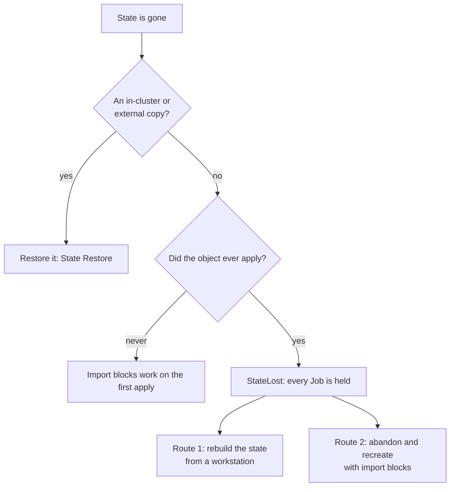

# Total State Loss and Import

An object's Terraform state is gone, and there is no backup to restore. The
infrastructure still exists in the cloud. This runbook says what works today,
in the order to try it, and how `import` blocks in a module fit in.

!!! warning "This flow has not been exercised against a live cluster"

    **None of this flow has been exercised end to end against a live management
    cluster.** Each step is derived from the controller's code and marked where it
    depends on behavior outside CAPTF (Terraform, Cluster API, `kubectl`). Rehearse
    it on a scratch cluster first; the [recovery
    drill](../disaster-recovery.md#a-recovery-drill) is the place.

!!! info "Before you begin"

    - Replace `<ns>`, `<kind>` and `<name>` with the object's namespace, Kind
      (`terraformcluster`, `terraformmachine` or `terraformmachinepool`) and name.
    - You need `kubectl` access to the management cluster, and Terraform or
      OpenTofu with the module and its providers, usually through the module's
      own image (see [step 1 of route 1](#route-1-rebuild-the-state-from-a-workstation)).

## Which case is it



"Ever applied" means **any** of: `status.initialization.provisioned`, the
`captf.io/applied` marker on the durable inputs Secret, a pinned image digest
on it, or any state backup Secret of the object. With any of them, a missing
state reads as `StateReadable=False`/`StateLost` and **no Job runs**: not an
apply, not a refresh, not a drift check. So an `import` block in the module
cannot run, because nothing runs the module. No annotation clears the marker.

## A copy exists

Restore it. With an in-cluster backup, annotate
`captf.io/restore-state=<serial>`; see [State Restore](state-restore.md). With
an external copy of the state Secrets, restore them without their
`ownerReferences`; see [Disaster Recovery](../disaster-recovery.md).

## The object never applied

A new object, or one that never reached a successful apply and has no durable
inputs, backup or pinned digest, has no state and reads `StateNotFound`. Its
first apply runs the module, so `import` blocks run on it. Two properties of
that first apply:

- The first apply of an object with no state is **not gated** by
  `applyPolicy: Manual`. It runs at once, so a wrong import id adopts the wrong
  resource without a prompt. Under `Automatic` the destructive-plan guard runs
  but imports are not deletions, so it does not stop them.
- Read the plan before you create the object: run the module locally with the
  same variables and look for `(import)` lines.

## Route 1: rebuild the state from a workstation

This keeps the object, its name and its Cluster API links as they are. You
re-create the state with Terraform, push it to the backend CAPTF reads, and
CAPTF carries on.

The object has no Job running while `StateLost` holds, so nothing contends for
the state. If it is a pool or cluster, pause its Cluster
(`spec.paused: true`) as an extra guard: a paused object starts no Job.

1. **Get what you need.**

    ```sh
    kubectl get <kind> -n <ns> <name> -o jsonpath='{.status.stateSecretSuffix}{"\n"}'
    kubectl get <kind> -n <ns> <name> -o jsonpath='{.metadata.labels.cluster\.x-k8s\.io/cluster-name}{"\n"}'
    mkdir root
    for f in main.tf.json terraform.tfvars.json; do
      kubectl get secret -n <ns> captf-inputs-<kindshort>-<name> \
        -o go-template='{{index .data "'$f'" | base64decode}}' > root/$f
    done
    ```

    `<kindshort>` is `c`, `m` or `mp`. The first two commands give the suffix and
    the cluster name. The durable inputs Secret holds the rendered root module
    (`main.tf.json`) and variables (`terraform.tfvars.json`) of the last
    successful apply, if it still exists. If it is gone too, you must
    reconstruct the root and variables yourself; see [Runtime
    Environment](../../module-author/runtime-environment.md). The rendered root
    declares an empty `kubernetes` backend, which `init` completes from
    `-backend-config` flags; you do not write a backend block.

2. **Build the backend flags**, exactly as CAPTF's Jobs pass them. A label map
    that differs does not fail: the backend lists the object's chunks by it and
    finds none. The labels are:

    ```text
    {"captf.infrastructure.cluster.x-k8s.io/owner-kind"="<TerraformCluster|TerraformMachine|TerraformMachinePool>",
     "captf.infrastructure.cluster.x-k8s.io/owner-name"="<name>",
     "cluster.x-k8s.io/cluster-name"="<cluster-name>",
     "captf.io/managed"="true",
     "clusterctl.cluster.x-k8s.io/move"=""}
    ```

    The owner and cluster names are used verbatim up to 63 characters, and
    otherwise as the first 16 hex characters of their SHA-256. See
    [Terraform State](../../concepts/secret-management/state.md#labels). Do not
    change the workspace: it is `default`.

3. **Initialize in the module's image**, so the runtime, providers and module
    are the ones CAPTF uses. The image's own binary is at `/captf/runtime`, and
    the module at `/captf/module` (see the [Image
    Contract](../../module-author/image-contract.md#fixed-paths)). Mount the
    root files and a kubeconfig for the management cluster, and point the
    backend at it with `in_cluster_config=false`:

    ```sh
    run() {
      docker run --rm -it --entrypoint /captf/runtime \
        -v "$PWD/root:/captf/work/root" -v "$KUBECONFIG:/kube/config:ro" \
        -w /captf/work/root <image>@<digest> "$@"
    }
    run init -input=false \
      -backend-config=secret_suffix=<suffix> -backend-config=namespace=<ns> \
      -backend-config=in_cluster_config=false -backend-config=config_path=/kube/config \
      -backend-config='labels={"captf.infrastructure.cluster.x-k8s.io/owner-kind"="<kind>",...}'
    ```

    The `<image>@<digest>` is `captf.io/image` and `captf.io/image-digest` from
    the durable inputs Secret, or `status.source` on the object. This follows
    [Stuck Destroy](stuck-destroy.md#4-clean-up-the-cloud-resources), which runs
    the same binary this way; only the backend arguments differ (a kubeconfig
    instead of the pod's own token).

4. **Import each resource** the cloud inventory shows, in the same container:

    ```sh
    run import -var-file=terraform.tfvars.json '<address>' '<id>'
    run state list
    ```

    Repeat per resource. Imports write the state to the backend, which creates
    the `tfstate-default-<suffix>` Secret with its own labels.

5. **Plan it locally**, with `run plan -var-file=terraform.tfvars.json`, until
    it shows no changes or only changes you intend. This is the safest moment to
    find what you missed: CAPTF will apply next.

6. **Let CAPTF read it.** On the next reconcile the state reads, and
    `StateReadable` turns `True`/`StateRead`. The state has no
    `captf.io/inputs-hash` annotation yet, so what follows depends on the kind:

    | Kind | What CAPTF does |
    | --- | --- |
    | `TerraformCluster`, `Automatic` | Reason `StateWithoutInputsHash`: an apply of the current inputs starts, guarded by the destructive-plan guard |
    | `TerraformCluster`, `Manual` | A plan Job runs and the apply waits for approval, unless the plan has no changes |
    | `TerraformMachinePool` | An apply starts (pools are not gated) |
    | `TerraformMachine`, provisioned | **StateLost stays**: "the state carries no inputs hash although the object is provisioned". See below |

    The apply writes the inputs hash, and CAPTF then owns the state Secrets. If
    your local plan was clean, that apply changes nothing.

    For a provisioned **`TerraformMachine`**, which never re-applies, the state
    must carry a hash to be accepted.

    !!! warning "Setting the inputs hash by hand is guidance, not a supported procedure"

        Setting any non-empty value on the base Secret works in the code, but
        is guidance, not a supported procedure:

        ```sh
        kubectl annotate secret -n <ns> tfstate-default-<suffix> captf.io/inputs-hash=restored
        ```

    Replacing the machine instead (delete its Machine; the MachineDeployment or
    control-plane provider creates a new one) is the supported route, and leaves
    the old instance to clean up by hand. Prefer it for machines.

7. **Unpause** the Cluster, if you paused it, and confirm: see [Confirm it
    worked](#confirm-it-worked).

## Route 2: abandon and recreate

Use this when you cannot rebuild the state, or the object cannot continue. It
releases the object without a destroy, recreates it, and has the new object's
**first apply adopt the existing infrastructure through `import` blocks**. It
needs a module written for it; see [Write import blocks that are safe to leave
in](#write-import-blocks-that-are-safe-to-leave-in).

!!! danger "Abandoning deletes the state and leaves the infrastructure running"

    The abandon deletes the state, the durable inputs and the plan key, and
    the infrastructure keeps running with nothing managing it until the new
    object adopts it. A wrong import id adopts the wrong resource.

1. **Unpause the Cluster.** A paused object never runs a delete, so an
    abandon does nothing while the Cluster is paused.
2. **Delete the dependents first** where there are any. A `TerraformCluster`
    with machines or pools of its own waits at `DeletionBlocked` and is not
    released until they are gone, even with the abandon annotation. See [Order
    and finalizers](../../concepts/deletion/order.md#the-cluster-waits-for-its-machines).
3. **Delete the object and abandon it.** The annotation is honored for a
    deletion held on `StateLost`:

    ```sh
    kubectl delete <kind> -n <ns> <name> --wait=false
    uid=$(kubectl get <kind> -n <ns> <name> -o jsonpath='{.metadata.uid}')
    kubectl annotate <kind> -n <ns> <name> captf.io/abandon-infrastructure="$uid"
    ```

    The controller removes the finalizer, runs its cleanup and emits an
    `InfrastructureAbandoned` event. The infrastructure keeps running. See
    [Held deletions](../../concepts/deletion/held.md#abandon).
4. **Wait for the leftovers to go**, before you reuse the name. The abandon
    deletes the state, the durable inputs and the plan key. The state backups
    are removed by garbage collection once the old object is gone:

    ```sh
    kubectl get secret -n <ns> -l captf.io/state-backup=true
    ```

    Wait until none of the old object's backups remain. This matters because
    the state suffix depends on the namespace, kind and name, **not on the UID**,
    so a new object with the same name has the same suffix and finds the old
    object's backups. Any backup still present makes the new object read as
    "ever applied" with no state, so it is held on `StateLost` again. Delete any
    such backup by hand.
5. **Recreate the object** with the same spec plus the variables that drive the
    imports (below). Reusing the name keeps the Cluster API links; a new name
    needs the links changed. See [Cluster API objects](#cluster-api-objects).
6. **The first apply imports.** With no state and no marker, the object reads
    `StateNotFound` and the apply of the new object runs at once (not gated
    under `Manual`, see above). The plan lists resources as `(import)`. A wrong
    id adopts the wrong resource, so check the variables before you create.

### Cluster API objects

The right action depends on the kind. Everything in this table is guidance,
based on how the objects reference each other, and has not been run.

| Kind | Owned by | What to do |
| --- | --- | --- |
| `TerraformCluster` | The `Cluster`, through `spec.infrastructureRef` | Delete the `TerraformCluster` and create one with the **same name**. The Cluster's reference is by name, so it points at the new object, and Cluster API sets itself as owner again. The new object waits at `DependenciesReady`/`WaitingForOwner` until it does |
| `TerraformMachine` | A `Machine`, through its `infrastructureRef` | The webhook refuses to delete it while a live Machine references it. **Replace the machine**: delete the `Machine`, and let the `MachineDeployment` or control-plane provider create a new one with a new name and a new instance. The old instance must be cleaned up by hand. Importing is not practical: a machine's variables are fixed by its template, so they cannot name one instance's id |
| `TerraformMachinePool` | A `MachinePool`, through its `infrastructureRef` | Delete it and create one with the same name. The new object waits at `WaitingForOwnerMachinePool` until Cluster API sets the owner |

## Write import blocks that are safe to leave in

Route 2 and the never-applied case depend on the module. Terraform's `import`
block is declarative: it runs on every apply, so write it so that leaving it in
is harmless.

- **Drive the ids from a variable.** Declare a map, default empty, set by
    `spec.variables` only when adopting:

    ```hcl
    variable "adopt_ids" {
      type    = map(string)
      default = {}
    }

    import {
      for_each = var.adopt_ids
      to       = aws_lb.api
      id       = each.value
    }
    ```

    `for_each` on an `import` block needs Terraform 1.7 or OpenTofu 1.7 or
    later; the reference modules only require 1.5. The example's address and
    resource type are placeholders. With the default empty map the block does
    nothing, so it can stay in the module.
- **After the adoption has applied, empty the map.** An `import` block for a
    resource already in the state at that id is a no-op, but an old id that no
    longer matches fails the plan. Clear the variable once the adoption is done.
- **One id per resource.** Name each resource's id in the map, not a list, so a
    reordering cannot swap them.
- **Pair with `prevent_destroy`** on what an adoption must never remove.
- **Imports are not deletes.** The destructive-plan guard does not stop them,
    and on a `TerraformCluster` under `Manual` an import-only plan after the first
    apply waits for approval. The plan shows `(import)`.

See [Module Design Patterns](../../module-author/design-patterns.md#import-and-moved-blocks).

## Confirm it worked

!!! success ""

    ```sh
    kubectl get <kind> -n <ns> <name> -o jsonpath='{range .status.conditions[?(@.type=="StateReadable")]}{.status}/{.reason}{"\n"}{end}'
    kubectl get <kind> -n <ns> <name> -o jsonpath='{.status.stateSecretSuffix}{"\n"}'
    kubectl events -n <ns> --for <kind>/<name>
    ```

    Expect `StateReadable` `True`/`StateRead`, no unexpected `JobFailed`, and for a
    cluster or pool an apply that changed nothing. Run a drift check before you let
    anything change the infrastructure.

!!! related "See also"

    - [Disaster Recovery](../disaster-recovery.md).
    - [State Restore](state-restore.md) and [Unreadable
      State](state-unreadable.md#statelost).
    - [Held deletions](../../concepts/deletion/held.md).
    - [Module Design Patterns](../../module-author/design-patterns.md).
