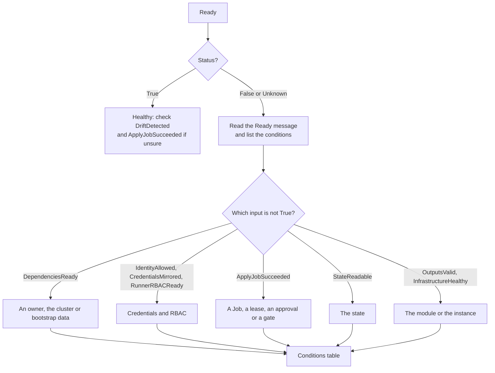

# Troubleshooting by Condition

Every CAPTF object tells you what it is waiting for in its status
conditions. This chapter is the lookup: given a condition and a reason,
what it means, what usually causes it and what to do. It is organized as
one page per kind of lookup, not per symptom, so use it when you already see
a reason. When you only have a symptom, start from the
[runbooks](../runbooks/README.md).

## Choose a starting point

<div class="grid cards" markdown>

-   :material-lifebuoy:{ .lg .middle } __Runbooks by Symptom__

    ---

    You only have a symptom or an alert. Each runbook goes from
    diagnosis to fix.

    [:octicons-arrow-right-24: Runbooks](../runbooks/README.md)

-   :material-sleep:{ .lg .middle } __Nothing Is Happening__

    ---

    An object has no Job and is waiting.

    [:octicons-arrow-right-24: Nothing Is Happening](../../concepts/jobs/troubleshooting.md)

-   :material-format-list-checks:{ .lg .middle } __Every Condition__

    ---

    Every condition type and reason, with status, meaning, likely cause,
    action and a link.

    [:octicons-arrow-right-24: Conditions](conditions.md)

-   :material-bell-outline:{ .lg .middle } __Every Event__

    ---

    The `Warning` events, with what to do, and the informational ones.

    [:octicons-arrow-right-24: Events](events.md)

-   :material-cog-sync:{ .lg .middle } __Jobs__

    ---

    Jobs that keep failing.

    [:octicons-arrow-right-24: Failing Jobs](../runbooks/job-failures.md)

-   :material-database-alert:{ .lg .middle } __State__

    ---

    State that is lost, corrupt or locked.

    [:octicons-arrow-right-24: Unreadable State](../runbooks/state-unreadable.md)

-   :material-delete-alert:{ .lg .middle } __Deletion__

    ---

    A deletion that does not finish.

    [:octicons-arrow-right-24: My object will not delete](../../concepts/deletion/troubleshooting.md)

-   :material-key-alert:{ .lg .middle } __Access__

    ---

    Identities, credentials and RBAC that block an object.

    [:octicons-arrow-right-24: Identities and Credentials](../runbooks/identity-and-credentials.md)

</div>

This page covers where to start and how Ready is built.

## Start here

Work from the top level down. Each step narrows the search.

1. **Read `Ready`.** `kubectl get <kind> -n <ns> <name>` shows it. If it is
   `True` and nothing seems wrong, you are done. If it is `False` or
   `Unknown`, go on.
2. **Read its inputs.** `Ready` summarizes other conditions, and its message
   names the ones that decide it. Which ones count depends on the kind and
   on whether the object has been provisioned (see
   [below](#what-feeds-ready)).
3. **Find the `False` or `Unknown` condition.** List them:

    ```sh
    kubectl get <kind> -n <ns> <name> -o jsonpath='{range .status.conditions[*]}{.type}{"\t"}{.status}{"\t"}{.reason}{"\t"}{.message}{"\n"}{end}'
    ```

    Three conditions have **negative polarity**, where `True` is the
    problem: `Deleting`, `DriftDetected` and `DeletionBlocked`. Every other
    condition is healthy when `True`.
4. **Read its reason and message.** The reason is what the table keys on.
   The message adds the specifics: a Job name, a key, an annotation to set.
5. **Look it up** in the [conditions table](conditions.md),
   under the condition's type. The row gives the cause, the action and the
   page that goes deeper.
6. **Check the events.** `kubectl events -n <ns> --for <kind>/<name>` shows
   what the controller did and when. The [events page](events.md) explains
   each `Warning`.



## What feeds Ready

| Phase | `TerraformCluster` and `TerraformMachine` | `TerraformMachinePool` |
| --- | --- | --- |
| Before provisioned | `DependenciesReady`, `IdentityAllowed`, `CredentialsMirrored`, `RunnerRBACReady`, `ApplyJobSucceeded`, `StateReadable`, `OutputsValid`, `InfrastructureHealthy`, `Deleting` | The same nine |
| After provisioned | `InfrastructureHealthy`, `Deleting` | `InfrastructureHealthy`, `ApplyJobSucceeded`, `Deleting` |

Two consequences follow:

- **After provisioning, a failing apply does not turn a cluster's or
  machine's `Ready` false.** A failed re-apply of a cluster must not flip
  the Cluster's `InfrastructureReady`, which would suspend every
  MachineHealthCheck. Check `ApplyJobSucceeded`, `StateReadable` and
  `DriftDetected` yourself when the object looks healthy but is not
  changing.
- **These conditions never feed `Ready`**, so check them by symptom:
  `Paused`, `RestoreJobSucceeded`, `DriftJobSucceeded`, `DriftDetected`,
  `DeletionBlocked`, `EndpointAvailable` and `AutoscalingActive`.
  `CapacityResolved` and `VariablesValid` belong to the template kinds and
  `Ready` to the identity, which sets it from its Secret.

## By symptom

| You see | Look at |
| --- | --- |
| A new object that never provisions | `DependenciesReady`, then the credential conditions, then `ApplyJobSucceeded` |
| Nothing is happening and there is no Job | `ApplyJobSucceeded` wait reasons; [Nothing is happening](../../concepts/jobs/troubleshooting.md) |
| Jobs keep failing | `ApplyJobSucceeded`, `DriftJobSucceeded`; [Failing Jobs](../runbooks/job-failures.md) |
| A deletion that does not finish | `Deleting`, `DeletionBlocked`, `StateReadable`; [My object will not delete](../../concepts/deletion/troubleshooting.md) |
| The state is lost, corrupt or locked | `StateReadable`; [Unreadable State](../runbooks/state-unreadable.md) |
| A change waits for a person | `ApplyJobSucceeded` with `PlanAwaitingApproval` or `DestructivePlanBlocked`; [Approvals and Gates](../../concepts/approvals/README.md) |
| An instance is unhealthy | `InfrastructureHealthy`; [Machine Remediation](../../user-guide/remediation.md) |
| The module's outputs are rejected | `OutputsValid`; [Module Contract](../../module-author/contract/README.md) |

!!! related "See also"

    - [Conditions reference](../../reference/conditions.md) and [Events
      reference](../../reference/events.md): the generated lists these pages
      build on.
    - [Observability](../observability.md) for metrics and alerts.
    - [Runbooks](../runbooks/README.md).
