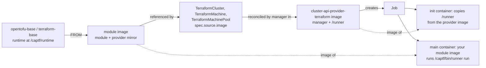

# Repositories and Images

CAPTF lives in twenty-eight repositories in the
[captf-io](https://github.com/captf-io) GitHub organization. This page lists
what each one holds, what it publishes, which container images exist and how
they are tagged, and how the pieces fit together.

## How the pieces fit

A module image is built FROM a base image that supplies the runtime. The
module image is what a `Terraform*` resource names in `spec.source.image`.
The provider runs it as a Kubernetes Job: an init container started from the
provider's own image copies the `/runner` binary into a shared volume, and
the main container runs your module image with that runner as its command.

The init container, the `/captf/bin/runner` path and the rule that the
image's own `ENTRYPOINT` never runs are described in
[Job Environment](environment.md#anatomy-of-a-job). The runner image defaults
to the manager's own image and can be overridden with `--runner-image`; see
[Manager Flags](manager-flags.md) and [The manager image and the runner
image](../operator-guide/installation.md#the-manager-image-and-the-runner-image).
The module image half of the contract is in [Image Contract](../module-author/image-contract.md).

## Repositories

| Repository | Kind | What it holds | What it publishes |
| --- | --- | --- | --- |
| [`cluster-api-provider-terraform`](https://github.com/captf-io/cluster-api-provider-terraform) | Provider | The `manager` (controllers and webhooks), the `runner` (the in-Job driver) and the `tfcapi-lint` linter, with the API types, CRDs, kustomize bases and clusterctl templates. | The manager and runner image, and the clusterctl components, templates and `tfcapi-lint` binaries as release assets. |
| [`opentofu-base`](https://github.com/captf-io/opentofu-base) | Base image | The Dockerfile for the OpenTofu runtime layer of the [image contract](../module-author/image-contract.md). | `ghcr.io/captf-io/opentofu-base`. |
| [`terraform-base`](https://github.com/captf-io/terraform-base) | Base image | The same layer for the Terraform runtime. | `ghcr.io/captf-io/terraform-base`. |
| [`module-images`](https://github.com/captf-io/module-images) | Images | No module code. `sources/versions.tf` pins the release of each module, `images.json` holds the per-image build values and `locks/` the provider lock files. It builds, smoke-tests, lints and publishes the reference module images for every cloud and for no-op. | `ghcr.io/captf-io/module-images/<cloud>-<role>`, with `<cloud>` one of `aws`, `azure`, `gcp`, `noop`, `oci`, `openstack`. |
| [`captf-io.github.io`](https://github.com/captf-io/captf-io.github.io) | Website | The captf.io site: landing page, this docs book and the blog. | The site, deployed to GitHub Pages from `main` by `pages.yml`. |
| [`.github`](https://github.com/captf-io/.github) | Organization | The organization profile and the community health files. | Nothing is built. Its workflow only checks license headers. |

### Terraform module repositories

Each role of each cloud module set is also its own repository, with the
module at the repository root. These repositories hold the module code and
its checks only: no image is built from them. Each is published on the
[Terraform Registry](https://registry.terraform.io/namespaces/captf-io) as
`captf-io/<role>/<provider>`, where `<provider>` is `aws`, `azure`, `google`,
`oci`, `openstack` or `noop`. Repositories are named
`terraform-<provider>-<role>` in the
[captf-io](https://github.com/captf-io) organization. They are the only
place module code lives; [`module-images`](https://github.com/captf-io/module-images)
fetches the tagged releases from the Registry.

| Repository | Role | Registry address | Gate |
| --- | --- | --- | --- |
| [`terraform-aws-cluster`](https://github.com/captf-io/terraform-aws-cluster) | `cluster` | `captf-io/cluster/aws` | `make verify` |
| [`terraform-aws-machine`](https://github.com/captf-io/terraform-aws-machine) | `machine` | `captf-io/machine/aws` | `make verify` |
| [`terraform-aws-machinepool`](https://github.com/captf-io/terraform-aws-machinepool) | `machinepool` | `captf-io/machinepool/aws` | `make verify` |
| [`terraform-azure-cluster`](https://github.com/captf-io/terraform-azure-cluster) | `cluster` | `captf-io/cluster/azure` | `make verify` |
| [`terraform-azure-machine`](https://github.com/captf-io/terraform-azure-machine) | `machine` | `captf-io/machine/azure` | `make verify` |
| [`terraform-azure-machinepool`](https://github.com/captf-io/terraform-azure-machinepool) | `machinepool` | `captf-io/machinepool/azure` | `make verify` |
| [`terraform-google-cluster`](https://github.com/captf-io/terraform-google-cluster) | `cluster` | `captf-io/cluster/google` | `make verify` |
| [`terraform-google-machine`](https://github.com/captf-io/terraform-google-machine) | `machine` | `captf-io/machine/google` | `make verify` |
| [`terraform-google-machinepool`](https://github.com/captf-io/terraform-google-machinepool) | `machinepool` | `captf-io/machinepool/google` | `make verify` |
| [`terraform-oci-cluster`](https://github.com/captf-io/terraform-oci-cluster) | `cluster` | `captf-io/cluster/oci` | `make verify` |
| [`terraform-oci-machine`](https://github.com/captf-io/terraform-oci-machine) | `machine` | `captf-io/machine/oci` | `make verify` |
| [`terraform-oci-machinepool`](https://github.com/captf-io/terraform-oci-machinepool) | `machinepool` | `captf-io/machinepool/oci` | `make verify` |
| [`terraform-openstack-cluster`](https://github.com/captf-io/terraform-openstack-cluster) | `cluster` | `captf-io/cluster/openstack` | `make verify` |
| [`terraform-openstack-machine`](https://github.com/captf-io/terraform-openstack-machine) | `machine` | `captf-io/machine/openstack` | `make verify` |
| [`terraform-noop-cluster`](https://github.com/captf-io/terraform-noop-cluster) | `cluster` | `captf-io/cluster/noop` | `make verify`: format, validate, apply and destroy of `test/root`, license headers. |
| [`terraform-noop-machine`](https://github.com/captf-io/terraform-noop-machine) | `machine` | `captf-io/machine/noop` | `make verify`: format, validate, apply and destroy of `test/root`, license headers. |
| [`terraform-noop-machinepool`](https://github.com/captf-io/terraform-noop-machinepool) | `machinepool` | `captf-io/machinepool/noop` | `make verify`: format, validate, apply and destroy of `test/root`, license headers. |

A release is a signed `vX.Y.Z` tag on `main`, which the Terraform Registry
publishes within a minute. Versions follow the CAPTF release; `0.1.0` is
published for all 17. See [Releasing](../developer-guide/releasing.md).

The module repositories are described together in [Cloud
Modules](../cloud-modules/README.md); their layout is in [Module Repository
Layout](../module-author/repository-layout.md).

## Images

All images are in GitHub Container Registry under `ghcr.io/captf-io/`.

| Image | Published by | Tags | Platforms |
| --- | --- | --- | --- |
| `cluster-api-provider-terraform` | The `publish` workflow: every push to `main`, and a `vX.Y.Z` tag push | `edge` and `sha-<commit>` on a push to `main`; `vX.Y.Z` (or `vX.Y.Z-rc.N`) on a tag. Never `latest`. | `linux/amd64`, `linux/arm64` |
| `opentofu-base`, `terraform-base` | The `build` workflow of each repository: every push to `main`, plus a weekly rebuild | `<version>`, `<major.minor>`, `<version>-YYYYMMDD`, `latest`, where `<version>` is the runtime version. | `linux/amd64`, `linux/arm64` |
| `module-images/aws-<role>`, `module-images/azure-<role>`, `module-images/gcp-<role>`, `module-images/oci-<role>`, `module-images/noop-<role>` with `<role>` one of `cluster`, `machine`, `machinepool` | The `build` workflow of `module-images`, on a merge to `main` | `vX.Y.Z-<runtime>` for module release `vX.Y.Z`, and `<runtime>` for the newest release. `<runtime>` is `opentofu` or `terraform`. | `linux/amd64`, `linux/arm64` |
| `module-images/openstack-<role>` with `<role>` one of `cluster`, `machine` | The `build` workflow of `module-images` | The same scheme as the other clouds. | `linux/amd64`, `linux/arm64` |

What exists today follows from those triggers:

- **The provider image is published by the `publish` workflow** on every
  push to `main` (`:edge` and `:sha-<commit>`) and on every release tag
  (`:vX.Y.Z`); `workflow_dispatch` republishes `:edge`. No release has been
  made yet, so no `:vX.Y.Z` tag exists. Until one does, use `:edge` or pin
  a `:sha-<commit>` tag or a digest. To build your own, use
  `make docker-build` and `make docker-push IMG=...`. A maintainer can fall
  back to `make release` when CI cannot run; see
  [Releasing](../developer-guide/releasing.md#manual-fallback).
- **The base images are published on every push to `main`** and weekly, so
  they exist now. See [Base Images](../module-author/base-images.md#tags-and-pinning)
  for how to pin them.
- **The module images publish when `module-images` merges to `main`.** The
  image version is the module release: `vX.Y.Z-<runtime>` is module release
  `vX.Y.Z`, and `<runtime>` is the newest release. Both tags are rebuilt, with
  a new digest, when the image changes without a module release, for example
  after a base image bump, so pin a digest in anything that must not change.
  There are no `edge-` tags. The names carry the `module-images/` prefix because the old `ghcr.io/captf-io/<cloud>-<role>` packages belong to the archived `<cloud>-modules` repositories and GitHub cannot grant another repository's workflow write access to them; those images stay pullable but get no new builds.

Every pushed module and base image carries an SBOM and provenance
attestations (`mode=max`), and the manifests carry the
`org.opencontainers.image.*` title, description and licence annotations.
The provider image has its own scheme: every pushed digest gets a keyless
cosign signature, a SLSA provenance attestation and an SPDX SBOM attestation,
and its manifests carry the `org.opencontainers.image.*` source, revision,
version, licenses and description annotations and labels. See
[Releasing](../developer-guide/releasing.md#signatures-and-attestations) for
the verification commands.

## Release assets

A provider release, created by the `publish` workflow when a release tag is
pushed, attaches these files to the GitHub release:

| Asset | Source |
| --- | --- |
| `infrastructure-components.yaml` | `config/default` rendered by kustomize, with the manager image pinned by digest. |
| `metadata.yaml` | The file at the repository root: the clusterctl release series. |
| `cluster-template.yaml`, `cluster-template-clusterclass.yaml`, `clusterclass-noop.yaml`, `identity.yaml` | The [`templates/`](https://github.com/captf-io/cluster-api-provider-terraform/tree/main/templates) directory. |
| `tfcapi-lint-<os>-<arch>` and `tfcapi-lint-checksums.txt` | GoReleaser, configured in [`.goreleaser.yaml`](https://github.com/captf-io/cluster-api-provider-terraform/blob/main/.goreleaser.yaml). It builds the linter only, not the image. |
| `provenance.intoto.jsonl` | The provenance attestation bundle for the assets above. Every asset also has a provenance attestation in GitHub. |

The `publish` workflow runs `make release-assets` and `make release-github`
on the tag push; `make release` is the manual fallback. The steps and the checklist are in
[Releasing](../developer-guide/releasing.md#assets). The module, image and base
repositories attach no release assets: their output is the images above.

## Versioning at a glance

| Repository | Version scheme | Owned by |
| --- | --- | --- |
| `cluster-api-provider-terraform` | Tags `vX.Y.Z` and `vX.Y.Z-rc.N`. `metadata.yaml` lists the clusterctl release series, append-only, currently `0.1` on contract `v1beta2`. | [Releasing](../developer-guide/releasing.md) |
| `opentofu-base`, `terraform-base` | Not tagged in git. The image tags follow the runtime version (`1.12.6`, `1.12`), with a date-stamped build tag. | [Tags and pinning](../module-author/base-images.md#tags-and-pinning) |
| `module-images` | Not tagged. An image's version is the release of its module in `sources/versions.tf`; the image tags add the runtime: `vX.Y.Z-opentofu`, `vX.Y.Z-terraform`. | [Releasing a Module](../module-author/releasing.md) |
| `terraform-<provider>-<role>` | Signed tags `vX.Y.Z`, published to the Terraform Registry. Versions follow the CAPTF release. | [Releasing](../developer-guide/releasing.md) |

Which provider, Cluster API and runtime versions are tested together is in
[Compatibility](../operator-guide/compatibility.md).

## Shared across repositories

Every repository carries the same `CONTRIBUTING.md`, `CODE_OF_CONDUCT.md`,
`SECURITY.md` and `LICENSE.md`, and every source file is Apache-2.0 licensed
with a license header that CI checks. The provider also has a
`SECURITY_CONTACTS` file. The [`.github`](https://github.com/captf-io/.github) repository holds the
organization's community health files, and every README is composed from the
same [README components](../developer-guide/readme-components.md). See [Working Across
Repositories](../developer-guide/cross-repo.md) for changes that span
repositories, and [Contributing](../developer-guide/contributing.md) for how
to contribute.

!!! related "See also"

    - [Working Across Repositories](../developer-guide/cross-repo.md)
    - [Releasing](../developer-guide/releasing.md)
    - [Base Images](../module-author/base-images.md)
    - [Releasing a Module](../module-author/releasing.md)
    - [Cloud Modules](../cloud-modules/README.md)
