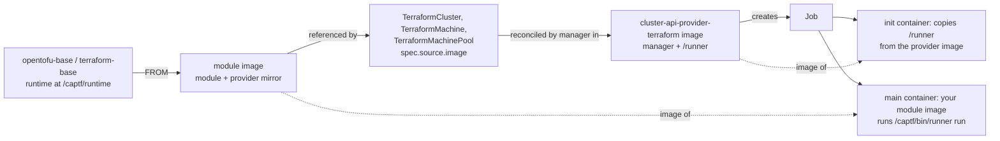

# Repositories and Images

CAPTF lives in eleven repositories in the
[captf-io](https://github.com/captf-io) GitHub organization. This page lists
what each one holds, what it publishes, which container images exist and how
they are tagged, and how the pieces fit together.

## How the pieces fit

A module image is built FROM a base image that supplies the runtime. The
module image is what a `Terraform*` resource names in `spec.source.image`.
The provider runs it as a Kubernetes Job: an init container started from the
provider's own image copies the `/runner` binary into a shared volume, and
the main container runs your module image with that runner as its command.

The init container, the `/captf/bin/runner` path and the rule that the
image's own `ENTRYPOINT` never runs are described in
[Job Environment](environment.md#anatomy-of-a-job). The runner image defaults
to the manager's own image and can be overridden with `--runner-image`; see
[Manager Flags](manager-flags.md) and [The manager image and the runner
image](../operator-guide/installation.md#the-manager-image-and-the-runner-image).
The module image half of the contract is in [Image Contract](../module-author/image-contract.md).

## Repositories

| Repository | Kind | What it holds | What it publishes |
| --- | --- | --- | --- |
| [`cluster-api-provider-terraform`](https://github.com/captf-io/cluster-api-provider-terraform) | Provider | The `manager` (controllers and webhooks), the `runner` (the in-Job driver) and the `tfcapi-lint` linter, with the API types, CRDs, kustomize bases and clusterctl templates. | The manager and runner image, and the clusterctl components, templates and `tfcapi-lint` binaries as release assets. |
| [`opentofu-base`](https://github.com/captf-io/opentofu-base) | Base image | The Dockerfile for the OpenTofu runtime layer of the [image contract](../module-author/image-contract.md). | `ghcr.io/captf-io/opentofu-base`. |
| [`terraform-base`](https://github.com/captf-io/terraform-base) | Base image | The same layer for the Terraform runtime. | `ghcr.io/captf-io/terraform-base`. |
| [`aws-modules`](https://github.com/captf-io/aws-modules) | Modules | Reference `cluster`, `machine` and `machinepool` modules for AWS. | `ghcr.io/captf-io/aws-<role>`. |
| [`azure-modules`](https://github.com/captf-io/azure-modules) | Modules | Reference `cluster`, `machine` and `machinepool` modules for Azure. | `ghcr.io/captf-io/azure-<role>`. |
| [`gcp-modules`](https://github.com/captf-io/gcp-modules) | Modules | Reference `cluster`, `machine` and `machinepool` modules for Google Cloud. | `ghcr.io/captf-io/gcp-<role>`. |
| [`oci-modules`](https://github.com/captf-io/oci-modules) | Modules | Reference `cluster`, `machine` and `machinepool` modules for Oracle Cloud. | `ghcr.io/captf-io/oci-<role>`. |
| [`openstack-modules`](https://github.com/captf-io/openstack-modules) | Modules | Reference `cluster` and `machine` modules for OpenStack. There is no `machinepool`. | `ghcr.io/captf-io/openstack-<role>`. |
| [`noop-modules`](https://github.com/captf-io/noop-modules) | Modules | No-op `cluster`, `machine` and `machinepool` modules that create nothing, for trying CAPTF and for end-to-end tests. | `ghcr.io/captf-io/noop-<role>`. |
| [`captf-io.github.io`](https://github.com/captf-io/captf-io.github.io) | Website | The captf.io site: landing page, this docs book and the blog. | The site, deployed to GitHub Pages from `main` by `pages.yml`. |
| [`.github`](https://github.com/captf-io/.github) | Organization | The organization profile, the community health files and the shared README fragments synced into every repository's README. | Nothing is built. Its workflow only checks license headers. |

The module repositories are described together in [Cloud
Modules](../cloud-modules/README.md); their layout is in [Module Repository
Layout](../module-author/repository-layout.md).

## Images

All images are in GitHub Container Registry under `ghcr.io/captf-io/`.

| Image | Published by | Tags | Platforms |
| --- | --- | --- | --- |
| `cluster-api-provider-terraform` | A maintainer, with `make release` | `vX.Y.Z` (or `vX.Y.Z-rc.N`). | The host platform of the machine running `make release`; `make docker-buildx` builds `linux/amd64` and `linux/arm64` |
| `opentofu-base`, `terraform-base` | The `build` workflow of each repository: every push to `main`, plus a weekly rebuild | `<version>`, `<major.minor>`, `<version>-YYYYMMDD`, `latest`, where `<version>` is the runtime version. | `linux/amd64`, `linux/arm64` |
| `aws-<role>`, `azure-<role>`, `gcp-<role>`, `oci-<role>` with `<role>` one of `cluster`, `machine`, `machinepool` | The `build` workflow of each repository | `edge-<runtime>` on a push to `main`; `vX.Y.Z-<runtime>` and `<runtime>` on a `vX.Y.Z` tag. `<runtime>` is `opentofu` or `terraform`. | `linux/amd64`, `linux/arm64` |
| `openstack-<role>` with `<role>` one of `cluster`, `machine` | The `build` workflow | The same scheme as the other clouds. | `linux/amd64`, `linux/arm64` |
| `noop-<role>` with `<role>` one of `cluster`, `machine`, `machinepool` | The `build` workflow | The same scheme as the cloud modules. | `linux/amd64`, `linux/arm64` |

What exists today follows from those triggers:

- **The provider image is published only by a release**, which is run by a
  maintainer: `make release` builds it, pushes it and reads back its digest.
  The provider's CI builds and scans the image but pushes nothing, and no
  release has been made yet, so no tagged provider image exists. For now,
  build your own with `make docker-build` and `make docker-push IMG=...`.
  The release builds a single-architecture image; see
  [Releasing](../developer-guide/releasing.md).
- **The base images are published on every push to `main`** and weekly, so
  they exist now. See [Base Images](../module-author/base-images.md#tags-and-pinning)
  for how to pin them.
- **The module images publish `edge-<runtime>` from every push to `main`.**
  The `vX.Y.Z-<runtime>` and `<runtime>` tags appear only when a `vX.Y.Z`
  tag is pushed, so before the first module release only the `edge-` tags are
  available. Pin a release tag or a digest in anything you keep.

Every pushed image carries an SBOM and provenance attestations
(`mode=max`) for the module and base images, and the manifests carry the
`org.opencontainers.image.*` title, description and licence annotations.

## Release assets

A provider release attaches these files to the GitHub release:

| Asset | Source |
| --- | --- |
| `infrastructure-components.yaml` | `config/default` rendered by kustomize, with the manager image pinned by digest. |
| `metadata.yaml` | The file at the repository root: the clusterctl release series. |
| `cluster-template.yaml`, `cluster-template-clusterclass.yaml`, `clusterclass-noop.yaml`, `identity.yaml` | The [`templates/`](https://github.com/captf-io/cluster-api-provider-terraform/tree/main/templates) directory. |
| `tfcapi-lint-<os>-<arch>` and `tfcapi-lint-checksums.txt` | GoReleaser, configured in [`.goreleaser.yaml`](https://github.com/captf-io/cluster-api-provider-terraform/blob/main/.goreleaser.yaml). It builds the linter only, not the image. |

The Makefile targets `make release`, `make release-assets` and `make
release-github` build and publish them. The steps and the checklist are in
[Releasing](../developer-guide/releasing.md#assets). The module and base
repositories attach no release assets: their output is the images above.

## Versioning at a glance

| Repository | Version scheme | Owned by |
| --- | --- | --- |
| `cluster-api-provider-terraform` | Tags `vX.Y.Z` and `vX.Y.Z-rc.N`. `metadata.yaml` lists the clusterctl release series, append-only, currently `0.1` on contract `v1beta2`. | [Releasing](../developer-guide/releasing.md) |
| `opentofu-base`, `terraform-base` | Not tagged in git. The image tags follow the runtime version (`1.12.6`, `1.12`), with a date-stamped build tag. | [Tags and pinning](../module-author/base-images.md#tags-and-pinning) |
| `<cloud>-modules`, `noop-modules` | Tags `vX.Y.Z`. Image tags add the runtime: `vX.Y.Z-opentofu`, `vX.Y.Z-terraform`. | [Releasing a Module](../module-author/releasing.md) |

Which provider, Cluster API and runtime versions are tested together is in
[Compatibility](../operator-guide/compatibility.md).

## Shared across repositories

Every repository carries the same `CONTRIBUTING.md`, `CODE_OF_CONDUCT.md`,
`SECURITY.md` and `LICENSE.md`, and every source file is Apache-2.0 licensed
with a license header that CI checks. The provider also has a
`SECURITY_CONTACTS` file. The [`.github`](https://github.com/captf-io/.github) repository holds the
organization's community health files, and its `make
readme` target keeps the banner, status note and footer of each repository's
README identical. See [Working Across
Repositories](../developer-guide/cross-repo.md) for changes that span
repositories, and [Contributing](../developer-guide/contributing.md) for how
to contribute.

!!! related "See also"

    - [Working Across Repositories](../developer-guide/cross-repo.md)
    - [Releasing](../developer-guide/releasing.md)
    - [Base Images](../module-author/base-images.md)
    - [Releasing a Module](../module-author/releasing.md)
    - [Cloud Modules](../cloud-modules/README.md)
