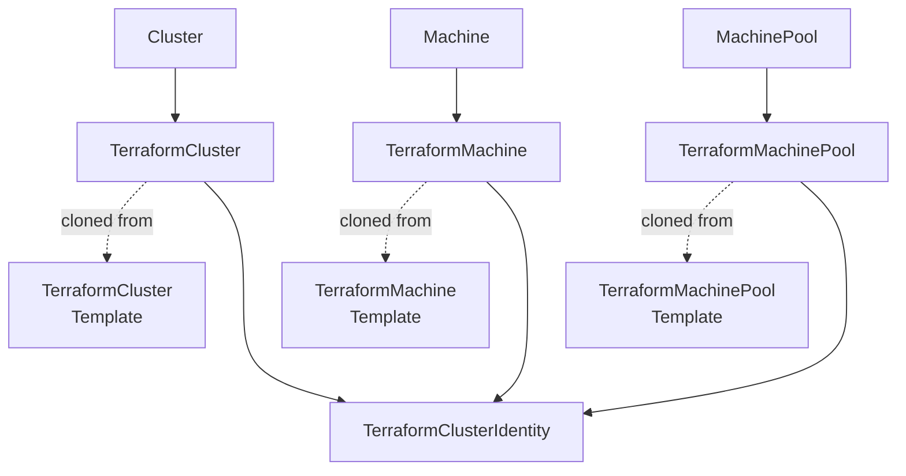

# Custom Resources

CAPTF adds seven kinds to the `infrastructure.cluster.x-k8s.io/v1alpha1`
API group. Three run a Terraform or OpenTofu module, one per role of the
[module contract](../../module-author/contract/v1alpha1/README.md); three
are templates Cluster API clones them from; and one holds the cloud
credentials the others use. Each has its own page here: what it is, a
minimal and a full YAML example, and every field of its spec and status,
with its type, default, validation and what it does.

-   :material-lan:{ .lg .middle } __TerraformCluster__

    ---

    The infrastructure around one workload cluster: runs the cluster role.

    [:octicons-arrow-right-24: TerraformCluster](terraformcluster.md)

-   :material-server:{ .lg .middle } __TerraformMachine__

    ---

    The infrastructure of one `Machine`: runs the machine role.

    [:octicons-arrow-right-24: TerraformMachine](terraformmachine.md)

-   :material-server-network:{ .lg .middle } __TerraformMachinePool__

    ---

    One native scaling group for a `MachinePool`: runs the machinepool role.

    [:octicons-arrow-right-24: TerraformMachinePool](terraformmachinepool.md)

-   :material-key-outline:{ .lg .middle } __TerraformClusterIdentity__

    ---

    Cloud credentials, and the namespaces allowed to use them.

    [:octicons-arrow-right-24: TerraformClusterIdentity](terraformclusteridentity.md)

-   :material-content-copy:{ .lg .middle } __Templates__

    ---

    [TerraformClusterTemplate](terraformclustertemplate.md),
    [TerraformMachineTemplate](terraformmachinetemplate.md) and
    [TerraformMachinePoolTemplate](terraformmachinepooltemplate.md):
    what Cluster API clones the three kinds above from.

-   :material-format-list-bulleted:{ .lg .middle } __Common Fields__

    ---

    The source, identity, Job settings, variables and status fields every module-running kind shares.

    [:octicons-arrow-right-24: Common Fields](common-fields.md)

## The kinds

| Kind | Scope | Runs | Referenced by |
| --- | --- | --- | --- |
| [`TerraformCluster`](terraformcluster.md) | Namespaced | The cluster role | `Cluster.spec.infrastructureRef` |
| [`TerraformMachine`](terraformmachine.md) | Namespaced | The machine role | `Machine.spec.infrastructureRef` |
| [`TerraformMachinePool`](terraformmachinepool.md) | Namespaced | The machinepool role | `MachinePool.spec.template.spec.infrastructureRef` |
| [`TerraformClusterTemplate`](terraformclustertemplate.md) | Namespaced | Nothing; cloned into a `TerraformCluster` | `ClusterClass.spec.infrastructure.templateRef` |
| [`TerraformMachineTemplate`](terraformmachinetemplate.md) | Namespaced | Nothing; cloned into each `TerraformMachine` | `MachineDeployment` and `MachineSet` `spec.template.spec.infrastructureRef`, the control plane's machine template, and `ClusterClass` machine infrastructure `templateRef`s |
| [`TerraformMachinePoolTemplate`](terraformmachinepooltemplate.md) | Namespaced | Nothing; cloned into a `TerraformMachinePool` | `ClusterClass.spec.workers.machinePools[].infrastructure.templateRef` |
| [`TerraformClusterIdentity`](terraformclusteridentity.md) | Cluster | Nothing; its Secret feeds the others' Jobs | The others' `spec.identityRef` |

Every kind is in the `cluster-api` category, so
`kubectl get cluster-api -A` lists them with the Cluster API objects. None
has a short name. For how the kinds relate to Cluster API's objects in
practice, see [The Kinds](../../concepts/kinds.md).

## Reading these pages

- **Field paths** are written in full from the object's root, such as
  `spec.drift.intervalSeconds`. An item of a list is written `[]`:
  `spec.variablesFrom[].secretRef.name`.
- **Each field's description** says what it does, then whether it is
  **Required**, its **Default** and where that default comes from (the
  admission webhook, the controller, or a [manager flag](../manager-flags.md)),
  whether it is **Immutable**, and its **Allowed values** or **Range**.
- **Validation** sections list what the admission webhooks reject. The
  CRDs themselves declare no defaults; every default named here is applied
  by CAPTF.
- **Shared fields.** `TerraformCluster`, `TerraformMachine` and
  `TerraformMachinePool` share their module source, identity, Job
  settings, variables and most of their status. Each kind's page lists
  those fields and links to [Common Fields](common-fields.md), which
  covers them in full.

These pages are kept in step with the provider's API: a check fails when
the CRDs gain or lose a field a page does not name (see
[Writing Documentation](../../developer-guide/documentation.md#checks)).
